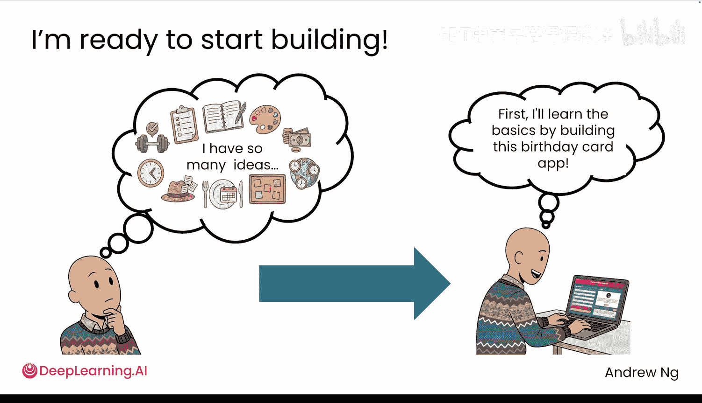

# 001：1.使用AI创建应用

## 概述 📋

在本节课中，我们将学习如何使用人工智能来构建有趣且实用的软件。无论你的背景或训练如何，你都可以跟随本教程开始你的第一个项目。

我是吴恩达，我将向你展示如何利用AI来构建软件。如果你对使用AI或“氛围编程”来构建酷炫的软件感兴趣，但不确定从哪里开始，那么这门课程非常适合你。

## 示例应用：趣味生日贺卡 🎂

首先，让我展示一个有趣的生日贺卡应用。你将在几分钟内学会使用ChatGPT、Gemini或任何其他类似的AI系统来构建它。即使你之前从未写过一行代码。

这个生日贺卡应用是一个被称为“网络应用程序”的计算机程序，这意味着它可以直接在你的网页浏览器中运行。

该应用接收你输入的信息，并当场为你创建一张定制的贺卡。在下一课中，你将通过向AI描述你想要的功能来构建你自己的版本，AI会为你编写所有代码。

以下是该应用的使用方式：你输入一个名字、一个年龄、一个爱好（例如企鹅时装设计）、一个形容词（例如有趣）和一个复数名词（例如歌曲）。然后点击“生成贺卡”，它就会生成一段文字。

例如：“Karen，无论如何，你已经27岁了。你对企鹅时装设计的奉献是传奇的素材，你那可疑的有趣图标Sily说明，大多数人都喜欢你。”这相当有趣。

或者，如果我不想自己填写所有这些词，我可以点击“我感觉很幸运”，让应用自动填充，然后生成一张不同的贺卡。

这次你会得到另一个生日贺卡，一个不同的有趣故事或一张不同的有趣生日贺卡。

请注意，该应用会存储我们生成的所有贺卡。我可以点击任何一张贺卡上的“复制”按钮，生日祝福信息就会复制到我的剪贴板。我可以将这条信息粘贴到电子邮件或短信中，作为生日贺卡发送出去。

## 实践的重要性 🛠️

你可能已经迫不及待地想直接开始构建你自己的创意了。如果是这样，那太好了。

但在开始之前，花一点时间亲自构建这个生日贺卡应用将会大有裨益。这样做会让你更好地了解如何与AI对话，从而真正获得你想要的结果。这个实践过程将培养你对如何塑造AI实际产出的直觉，并且你会更清楚地认识到，即使是很小的调整也可能导致非常不同的结果。

一旦你对这一系列概念更加熟悉，构建你自己的创意就会变得更快、更容易，因为你更懂得如何引导整个过程。

## 总结与展望 🚀

像这样的应用可能看起来构建起来很复杂，但在下一个视频中，我将向你展示如何在几分钟内构建出类似的东西。

本节课中，我们一起学习了AI辅助编程的基本概念，并通过一个生日贺卡应用的例子，了解了从描述需求到生成可运行应用的完整流程。下一节，我们将动手实践，开始构建属于你自己的第一个应用。让我们进入下一个视频吧。