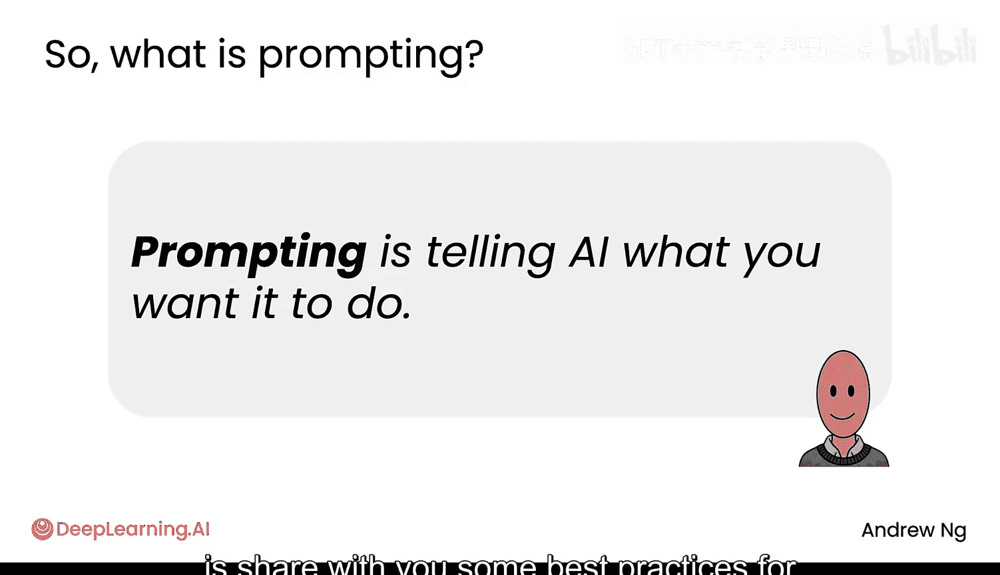
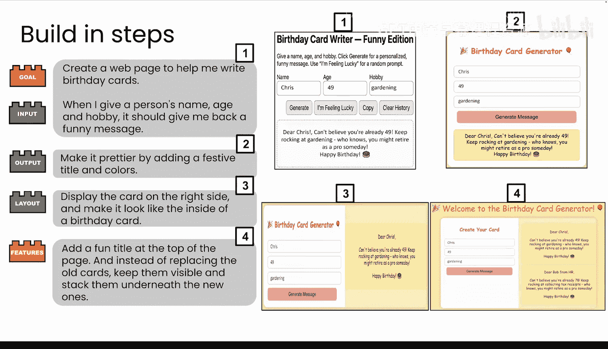
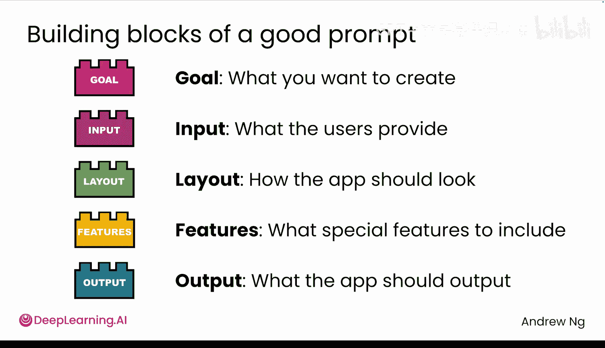
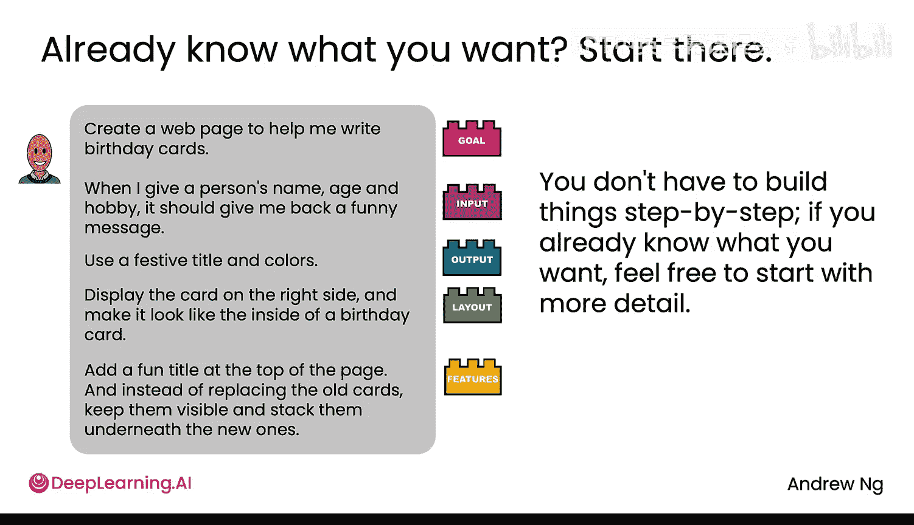
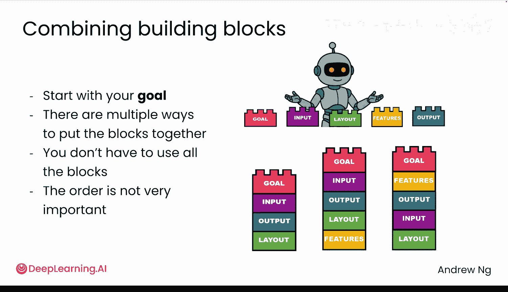
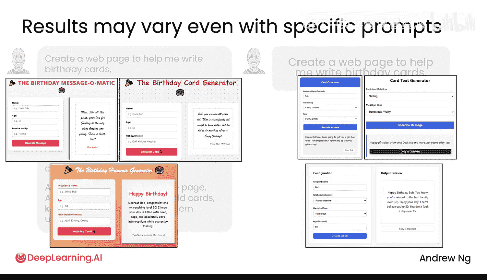
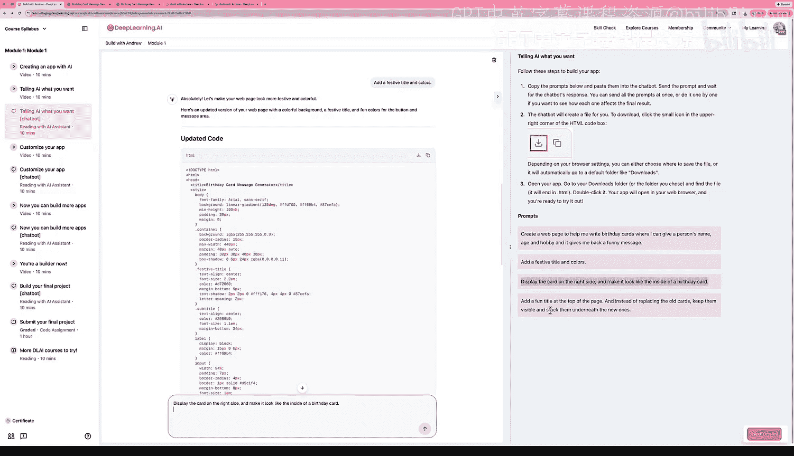
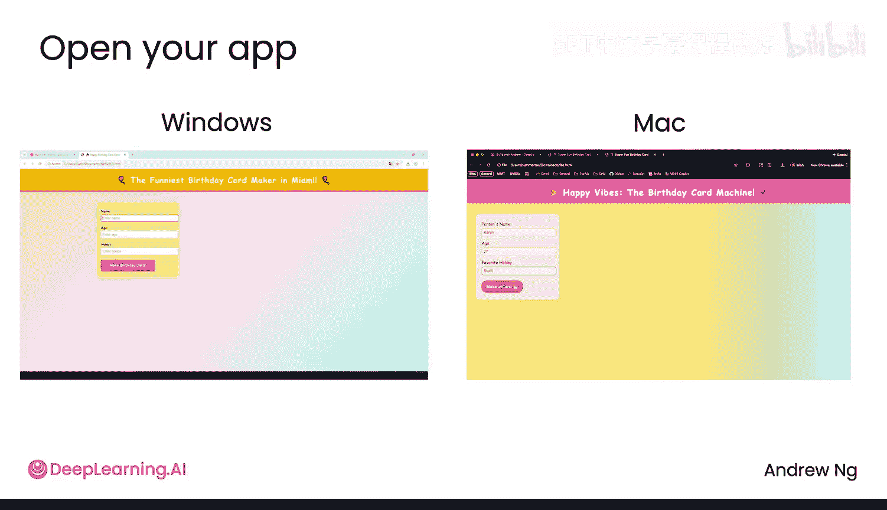
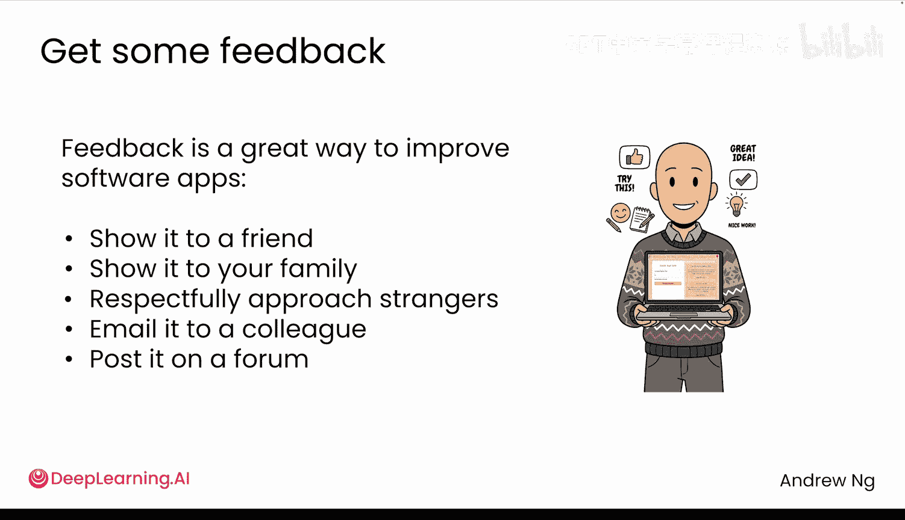

# 002：告诉AI你的需求 🎯

在本节课中，我们将学习如何通过“提示”来告诉AI为我们构建软件。你将了解如何清晰地描述你的需求，以便AI能生成符合预期的代码。

在AI时代，构建软件最简单的方式不再是亲自编写每一行代码。相反，你应该告诉AI为你完成这项工作。告诉AI做什么，这个过程被称为“提示”。

当获得精确的指令时，AI可以为你完成许多事情。

## 一个实践案例 🎂

上一节我们提到了“提示”的概念，本节中我们来看看一个具体的例子。我们将一起通过一个例子来学习如何提示AI为你创建软件，然后你可以自己尝试。

你可以使用任何AI聊天系统，如ChatGPT、Gemini、Claude或本网站内置的系统。要使用这些AI系统，你需要给它一个“提示”或一组指令。

例如，你可以给出这样的提示来告诉它创建一个网页，帮助你写生日贺卡：“创建一个网页来帮我写生日贺卡。当我输入一个人的姓名、年龄和爱好时，你应该返回一条有趣的消息。”

如果你这样做，AI可能会生成一个类似这样的应用，这是一个良好的开端。你可以输入姓名、年龄和爱好，它会生成一条像这样的消息。

如果你对此不满意，可以继续与AI对话，并说：“让它更漂亮，添加一个喜庆的标题和颜色。”这将给你第二个版本的应用，现在看起来好一些了。

如果你仍然不满意，可以说：“在右侧显示贺卡，让生日贺卡看起来像可以打开的样子。”然后你会得到第三个版本。

如果你有更多想法让它变得更好，你可以给出更多指令，比如“在顶部添加一个精美的标题”等等。这就是我在实践中使用AI编写代码的方式。我通常从一组基本指令开始，看看得到什么，然后反复告诉AI我希望如何改进它。

## 提示的构成模块 🧱

事实证明，当你构建软件应用程序时，有几个基本的构成模块你最终可能会包含在提示中。

以下是你在编写提示时可以考虑包含的五个常见部分：

1.  **目标**：这是你想要创建什么。例如，“创建一个网页来帮我写生日贺卡”。
2.  **输入**：用户需要告诉软件什么信息。例如，“姓名、年龄和爱好”。
3.  **输出**：你希望软件输出什么。例如，“一条有趣的消息”。
4.  **布局**：应用程序的各个部分如何排列。例如，“左侧是输入表单，右侧显示生成的贺卡”。
5.  **特殊功能**：你希望包含的任何额外功能。例如，“喜庆的标题和颜色”。

编写好的提示有很多方法，但当你开始让AI为你构建软件的旅程时，我鼓励你考虑这五个构成模块，作为你可能选择包含在提示中的常见部分。

## 两种提示策略：迭代与一次性 📝

在之前的幻灯片中，我们经历了一个来回的过程，我逐步向AI添加指令，告诉它我想要做什么。但如果你已经大致知道你想要构建什么，你也可以在单个提示中指定所有的构成模块。

例如，如果我已经知道我对软件的规格要求，我可以写一个更长的单一提示：“创建一个网页来帮我写生日贺卡。用户需要输入姓名、年龄和爱好。在左侧显示一个输入表单，在右侧显示生成的贺卡。贺卡应有一个喜庆的标题，使用明亮的颜色，并且消息要幽默。”

在这个例子中，我把所有五个构成模块都写进了一个更长的单一提示中。因此，与上一个视频中看到的逐步构建方式不同，你也可以在一个更长的提示中给出所有指令，这可能会给你一个更好的初始版本应用，如果它仍然不完全符合你的要求，你可以进一步优化。

## 构建模块的组合与顺序 🔀

无论你是一次性写一个长提示，还是逐步地一次给出一个构建模块，我通常会先告诉AI我的目标是什么。对于剩下的构建模块，有多种方式可以将它们组合在一起，你不必每次都使用所有构建模块，顺序也不是非常重要。

你可以从目标开始，然后说明输入、输出、布局，也许不列出任何特殊功能。或者你可以以另一种方式组合构建模块，这也能正常工作。你也可以以不同的顺序列出构建模块，AI通常很擅长理解这些不同的排列组合。

如果你觉得“天啊，这太多了”，我想说，别担心。如果你只是告诉AI你脑海中的任何想法，即使它是部分的、不完美的，你也可以与AI来回工作几次，与AI一起将它打磨成你想要的东西。

## 具体化指令的重要性 🎯

随着时间的推移，你将磨练的一项技能是向AI给出更具体指令的能力。因为事实证明，即使你给出相当具体的提示，你得到的结果也可能有所不同。

这里有一个你刚刚看到的详细长提示，指定了所有五个构建模块。如果你多次向同一个AI系统给出这些相同的指令，也许第一次它会给出一个看起来不错的应用，第二次可能会构建出类似这样的东西，第三次又构建出另一种。所有这些看起来都相当不错，你可以看到它们之间存在一些差异。

相比之下，如果有人给出一个不那么具体、不那么清晰的提示，比如一个非常简短的提示，只说“网页，告诉我写生日贺卡”，这是一个相对模糊的提示。如果你多次通过AI系统运行这个提示，得到的结果可能第一次是这样，第二次完全不同，有不同的字段，第三次又与前两次完全不同。

你写的提示越具体、越精确，结果就越可预测。但即便如此，仍会有一点可变性。因此，如果你得到的结果与本视频中展示的略有不同，请不要担心，这是AI系统行为的正常现象。但如果它产生了你非常不喜欢的东西，那也没关系，只需给它额外的指令来引导或推动AI更接近你真正希望它做的事情。

## 动手实践：生成你的第一个网页应用 💻

学习这个的最佳方式是将你的手放在键盘上，亲自尝试使用AI。让我向你展示它会是什么样子。

在本视频之后，我希望你做的是访问网站上的这个部分，并自己完成这个练习。这里有你可以稍后阅读的说明。

这是一个类似于ChatGPT、Gemini、Claude等的AI系统。我将选择并复制粘贴这里的第一个提示，告诉AI“创建一个网页来帮我写生日贺卡”等等，然后点击发送给AI。它会思考一会儿，然后生成一个HTML页面，你可以下载并运行。

请注意，当它还在运行时，这里的下载按钮是灰色的，所以我实际上还不能点击它。但AI系统会花一点时间来编写一些我们称之为HTML页面的代码，这就是将要成为生日贺卡生成器的东西。

现在AI已经生成了所有这些HTML代码，我可以点击这个下载按钮。我在Mac上运行Chrome，稍后我会展示如果你在不同的机器上该怎么做。我可以进入下载菜单，打开文件，这就创建了一个小小的生日贺卡生成器。

我可以输入“Karen, 27, 绘画”，然后点击“创建贺卡”，它会生成一条简单的生日消息。请注意，这实际上是一段用HTML编写的代码，现在正在你的计算机上运行。如果你自己这样做，代码会保存在一个名为 `index.html` 的文件中，并实际保存到我的计算机上。如果你这样做，它也会保存到你的计算机上。

现在，如果你想改进代码，你可以提示它“添加一个喜庆的标题和颜色”。然后它会更新代码，和之前一样，我必须等待它完成编写代码，然后才能下载它。

现在我可以下载它并像之前一样打开它。哇，现在它看起来喜庆多了。所以我希望你做的是亲自尝试一下。你可以使用这第三个提示运行它，或者使用第四个提示，或者如果你愿意，尝试一些其他提示。一次只使用这四个提示中的一个，看看你能得到什么样的生日贺卡生成器，这也是可以的。

## 跨平台适用性与文件处理 🌐

尽管我是在一个网站上向你展示这个过程，但这些相同的提示应该在OpenAI的ChatGPT、Google的Gemini、Anthropic的Claude或任何其他流行的AI系统上给你带来类似的结果。你学习的技能并不局限于任何一个平台，这些技能适用于你选择使用的任何AI系统。

当你点击下载按钮时，你的网络浏览器通常会下载一个名为 `index.html` 的文件，或者AI生成的带有代码的任何文件，到你的下载文件夹。这些视频向你展示了如何在Windows或Mac上导航到下载文件夹以找到该文件。然后，如果你双击它，它应该在网络浏览器中打开，让你看到刚刚生成的代码在网络浏览器中运行时的样子。请尝试一下。

## 获取反馈与持续改进 💬

在你尝试这个过程并生成一个网页应用之后，我希望你拥有的一种心态是：获取反馈通常是构建软件应用程序的重要一步。

每当我编写软件时，我经常会把它展示给朋友、家人看，有时也会礼貌地接近陌生人，询问他们是否愿意看看我正在构建的东西，看看他们是否能告诉我他们的想法，或者通过电子邮件发送给同事，或发布在在线论坛上以获取反馈。因为我发现，当人们看它时，他们通常会对如何让它变得更好提出建议。有时，如果你通过展示一些有趣的东西让朋友笑起来，我也会发现这真的很鼓舞人心，并给我继续前进的能量。

所以，我现在希望你做的是进入本课程的下一个项目，亲自尝试一下。让AI为你生成一些代码，下载HTML文件，看看你得到什么结果。如果你有动力，我也希望你能把它展示给朋友或其他人，以获得他们的反馈。之后，请回到下一个视频，我们将继续完善这个应用，看看如何为生日贺卡应用添加更多功能，让它更有趣。

## 总结 📚

本节课中，我们一起学习了如何通过“提示”来指导AI生成代码。我们了解了提示的五个基本构成模块：**目标**、**输入**、**输出**、**布局**和**特殊功能**。我们探讨了迭代优化与一次性详细说明两种策略，并强调了给出具体指令以获得更可预测结果的重要性。最后，我们通过动手实践，生成了一个生日贺卡网页应用，并认识到获取反馈是持续改进的关键。记住，与AI协作是一个反复对话和打磨的过程。