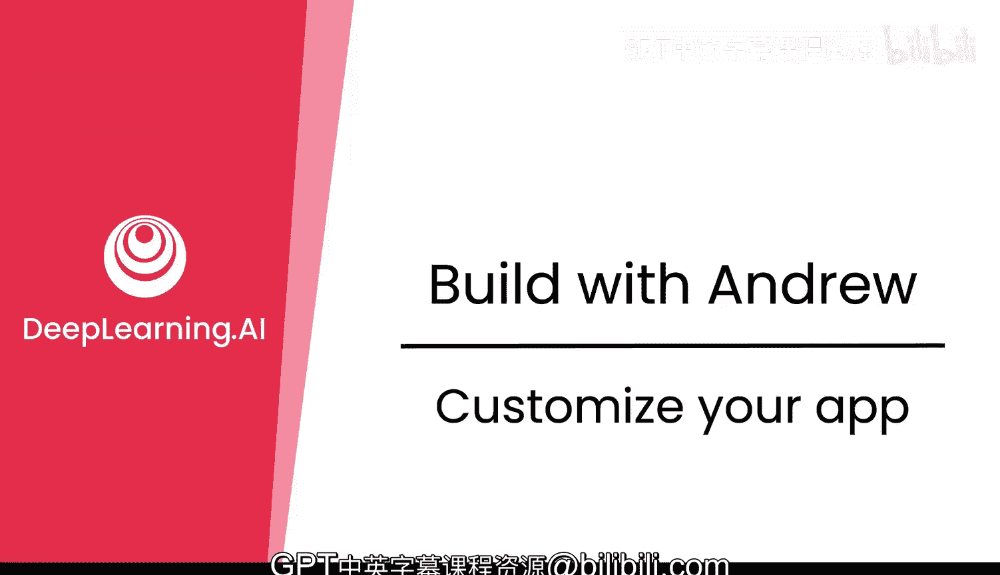
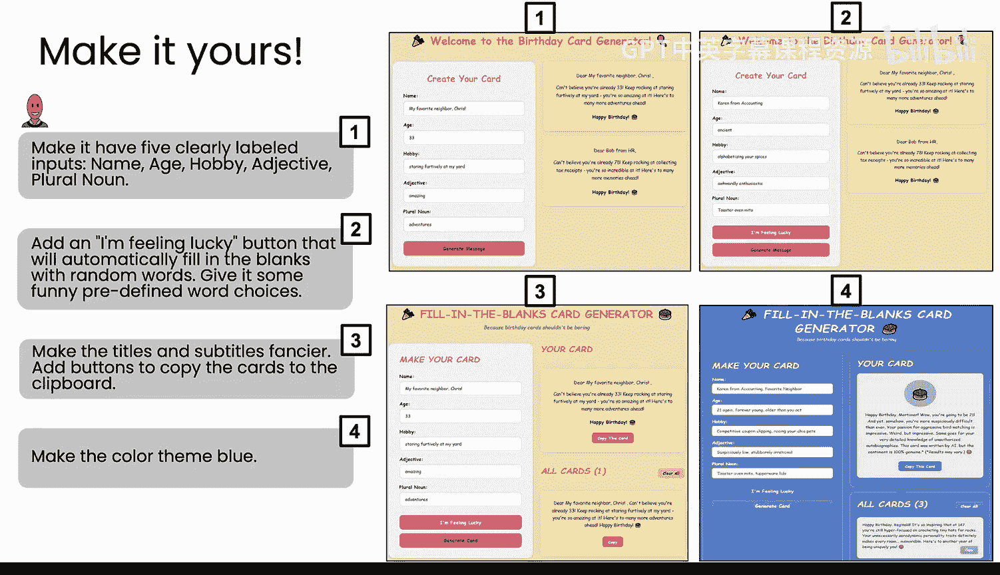
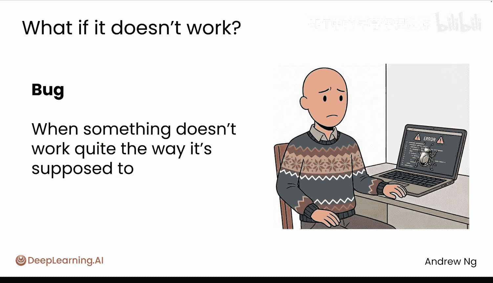
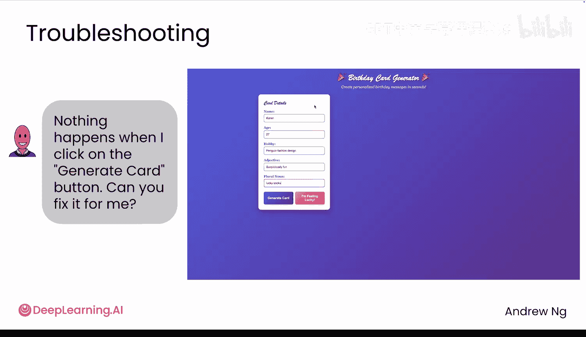
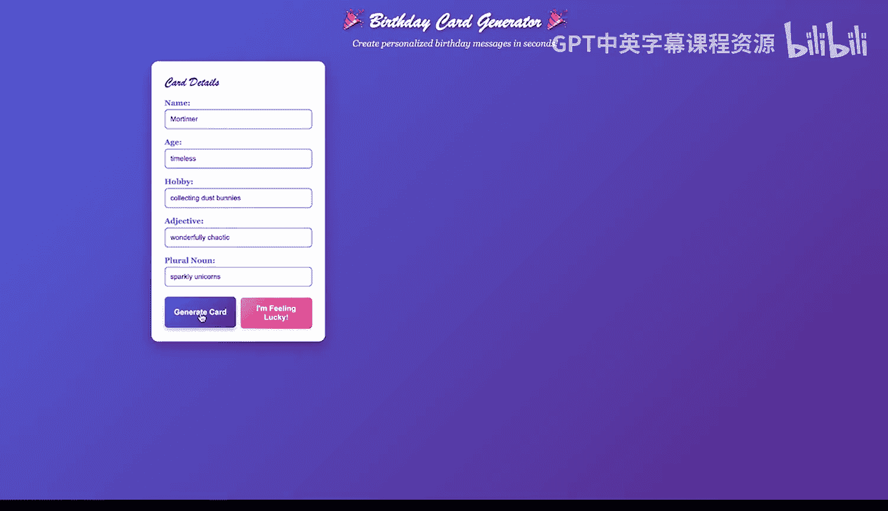
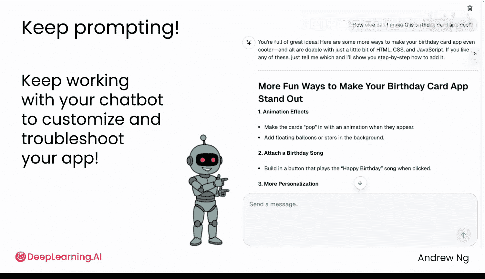

# 003：自定义你的应用 🎨

在本节课中，我们将学习如何为你已经构建的基础生日贺卡应用添加新功能和修改现有设计。我们将重点探讨如何通过编写更具体的提示词来指导AI，以及当应用出现问题时如何进行调试和修复。

## 概述：从基础到个性化

上一节我们构建了一个基础的生日贺卡应用。本节中，我们来看看如何通过添加额外功能来增强它，使其能做更多事情或变得更有趣。

如果你将应用展示给其他人，他们可能也会提出一些添加功能的想法。同时，我也想向你展示，如果AI为你构建的内容出现问题（例如，它的工作方式不符合你的预期）时，你该如何处理。

与之前一样，我们主要通过提示词来告诉AI应用需要哪些功能。理解为何提示词需要具体化非常重要。让我用一个点餐的类比来解释：如果你去餐车只说“给我一个三明治”，没人知道你会得到什么样的三明治。但如果你说得更具体，比如“我想要一个素食三明治”，那么你得到的选项范围就会缩小。或者你说“我想要一个带鹰嘴豆泥和奶酪的素食三明治，用全麦面包”，这个具体的指令会让你得到的结果变得可预测得多。如果你再说“要这样的素食三明治，配一杯饮料，请打包”，那么餐车会给你什么就更加可预测了。在餐车点餐时，要求越具体，你就越可能得到你想要的东西。

对于提示AI也是如此。通过编写更具体的提示词，你更有可能得到你想要的精确结果。

随着你让AI为你编写代码的技能提升，你会更擅长给AI下达更具体的指令，这将带来更好的结果。我之前通过一次或几次来回对话，使用类似这样的提示词构建了一个应用。现在我想做的是添加一些新功能并修改一些现有的功能。

例如，与其只有三个输入字段（姓名、年龄、爱好），也许你想收集五条信息。这样，用户就可以输入五个字段，从而创建更个性化的消息。或者，你可能想要一个“试试手气”按钮，自动为你填写所有字段，这样你就不必每次使用应用时都手动输入所有内容。你也可以更新外观和感觉，例如更改标题，或添加一个将消息复制到剪贴板的按钮，以便轻松地通过电子邮件发送给朋友。你甚至可以重新设计整个配色方案，以更好地匹配你的风格。在构建了基础应用之后，你可以通过决定要添加哪些功能来让应用真正属于你。

因此，你可以通过告诉AI来继续聊天对话，使其拥有五个清晰标记的输入字段：姓名、年龄、爱好、形容词和复数名词。AI会将应用更新成这样。请注意，我在这里写的指令非常具体。我不仅仅是说“添加五个字段”，我还告诉它我想要哪五个字段。

或者，如果我添加一个“试试手气”按钮，我也会尽量具体地告诉它我希望这个按钮做什么：我希望它能自动用随机词填充空白，并且我希望预定义的词选择是有趣的。

在这里，我实际上同时添加了两个功能：我可能会更新标题和副标题，同时添加一个按钮来将内容复制到剪贴板。所以这实际上是上一张幻灯片中两个要点的内容，我同时添加了它们。我喜欢蓝色，所以让我们把配色感觉改成蓝色。

你可以自由尝试这些提示词，或者更好的是，选择一个不同的颜色主题，或者告诉AI实现你拥有的任何其他想法。如果你像我女儿一样喜欢粉色，或者像我儿子一样喜欢绿色，那就使用粉色或绿色的主题，或者根据你想做的进行其他更改。如果你改变了主意，你也可以这样做。所以，在我将颜色主题改为蓝色之后，如果我决定我其实不想要蓝色，而是想要紫色，你可以写一个像这样的提示词，AI会顺从地将其改为紫色。

大多数时候，AI都很擅长准确地完成你要求它做的事情。但有时，它有可能生成一个无法正常工作的HTML页面。在软件中，当某些东西没有按照预期的方式工作时，我们称之为“bug”。这里实际上是一个AI早些时候为我生成的有问题的应用版本，我已经填写了所有这些字段，但如果我点击“生成贺卡”按钮……

……什么也没发生。这有点奇怪。我点击了鼠标，但它实际上并没有生成贺卡。结果我发现“试试手气”按钮是有效的，但“生成贺卡”按钮却没有为我创建任何贺卡。

如果发生这种情况，我鼓励你清楚地告诉AI发生了什么。所以在这里输入：“当我点击生成贺卡按钮时，什么也没有发生。你能为我修复它吗？”如果你这样做，AI通常很擅长发现至少是基本的bug并修复任何错误。

当你这样做时，有时AI会写一些关于哪里出了问题的技术性解释。例如，它可能会说“JavaScript附加按钮点击事件监听器失败”之类的，这有很多技术术语。我想说，就目前而言，你只需接受AI在这里所说的内容，不需要理解这些技术细节。如果你真的好奇，可以问AI这些术语是什么意思，但你不必这样做。让AI去思考技术问题，然后专注于下载新的HTML文件，看看它是否正常工作。

## 实践与探索：让你的应用更酷

我希望你开始修改基础生日贺卡应用，尝试构建我在本视频前面建议的功能，或者你的朋友建议的一些功能，或者你自己的想法。事实上，如果你不确定还要做什么，你也可以向AI征求想法。

所以，如果你问它：“我怎样才能让这个生日贺卡应用更酷？”它可能会给出一些建议，然后你可以选择一个或多个，看看AI的想法如何让你的应用更酷。我在构建软件时，实际上经常使用AI作为头脑风暴伙伴，如果你还没有自己特别想实现的想法，你也应该这样做。

请前往本网站的下一个项目，愉快地添加功能、调整颜色主题或实现任何你想做的事情。

当你回来时，我们将利用你已经学到的技能来构建第二个应用：一个乒乓球游戏。

## 总结

本节课中，我们一起学习了如何通过编写**具体、明确的提示词**来指导AI为你的应用添加新功能（如更多输入字段、自动填充按钮）和修改设计（如更改配色方案）。我们还探讨了当应用出现**bug**（例如按钮点击无响应）时，如何通过**清晰地描述问题**来让AI协助修复。记住，**`prompt = 具体指令`** 是获得理想结果的关键。现在，你可以自由地探索和个性化你的应用了。