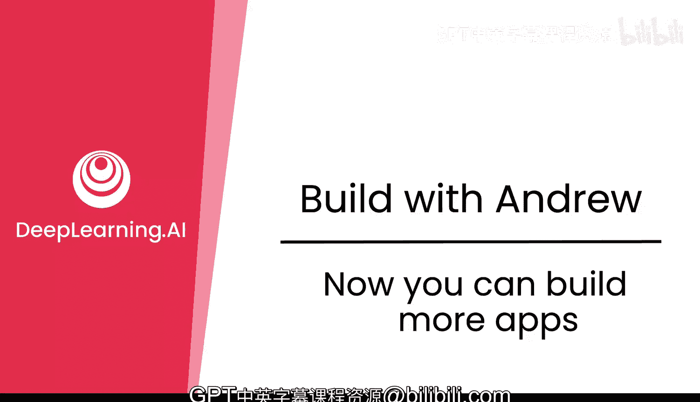
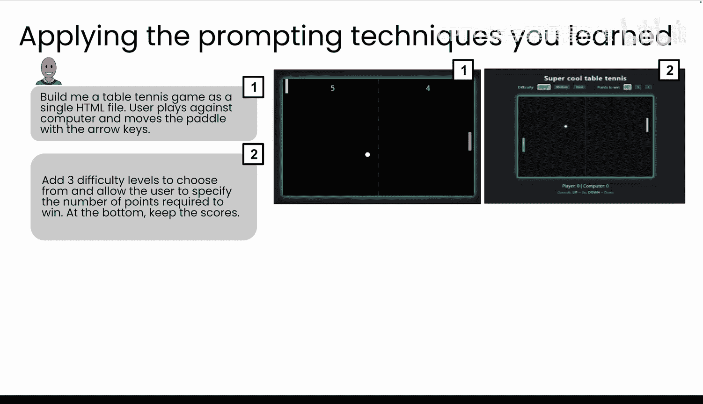
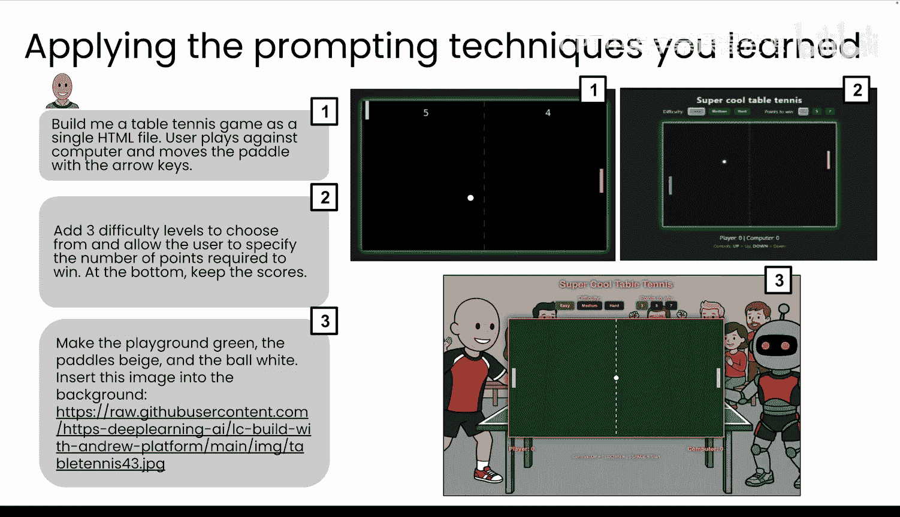
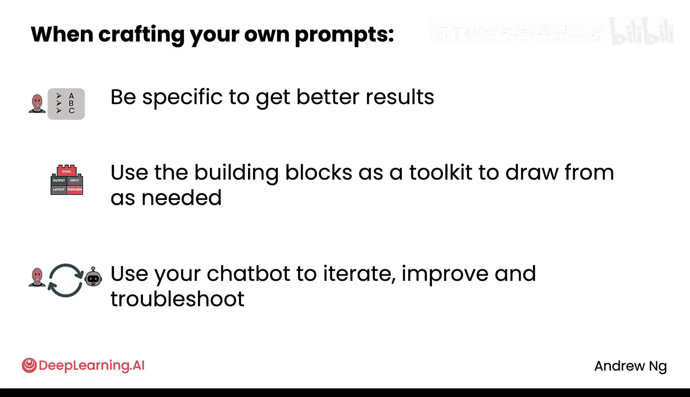

# 004：现在你可以构建更多应用 🎮



在本节课中，我们将运用已掌握的提示技巧，构建另一个应用程序——一个乒乓球游戏。我们将看到，借助AI，有时仅需几分钟就能将一个想法转化为可运行的应用。课程将展示如何通过迭代提示，逐步完善一个简单的乒乓球游戏。

## 从想法到应用：AI的加速作用 ⚡

上一节我们介绍了提示的基本技巧，本节中我们来看看如何将这些技巧应用于实际项目构建。

得益于AI技术的发展，如今从想法到可运行的应用，有时只需要几分钟时间。在计算机历史早期，有一款名为“Pong”的电子游戏，它是一款双人乒乓球游戏。当时，一个团队需要花费数周时间才能构建出来。但现在，借助AI，你可以在几分钟内构建出类似的东西。

## 构建乒乓球游戏：迭代提示实践 🏓

让我们应用已学习的提示技巧。我将从一个中等具体的提示开始。

**初始提示示例：**
```
为我构建一个乒乓球游戏，作为单页应用。玩家使用方向键移动球拍，与电脑对战。
```

执行此提示后，你可能会得到应用的第一版。这是一个良好的开端。

## 添加功能与细节：逐步完善 🛠️

第一版游戏运行后，我希望添加更多功能。以下是我想增加的内容列表：
*   三个难度级别。
*   允许用户指定获胜所需的分数。
*   添加计分功能。

基于这些要求，我给出了第二个提示，从而构建出游戏的第二版。此时，游戏看起来已经很有趣了。

## 优化视觉体验：定制化提示 🎨





接下来，我希望游戏的图形更精美。我给出了更具体的视觉提示。

**视觉定制提示示例：**
```
将玩家球拍改为绿色，电脑球拍改为米色，球改为白色。并将[图片URL]插入为背景图像。
```

最终，我得到了一个视觉效果更佳的游戏版本。球在屏幕间来回弹跳，游戏体验相当有趣。

## 核心提示技巧回顾 📝

需要记住的是，在编写提示时越具体，得到的结果就越好。你可以回顾我使用的提示，它在颜色、分数等诸多细节上都相当具体。

如果你不确定在提示中应包含哪些内容，可以思考以下构建模块：
*   **目标**：你希望实现什么？
*   **输出**：最终形式是什么？（如：单页Web应用）
*   **输入**：用户如何交互？（如：使用方向键）
*   **布局**：视觉元素如何安排？
*   **功能**：需要包含哪些特性？

将这些作为考虑包含的事项清单。最后，利用你的聊天机器人进行迭代改进和故障排除。你不需要第一次就做到完美。你可以告诉AI你已有的想法，查看得到的结果，然后利用该结果进一步优化你对AI的指令。



## 总结与练习 🚀

本节课中我们一起学习了如何通过迭代和具体的提示，快速构建并完善一个乒乓球游戏应用。关键在于：从基础提示开始，根据结果逐步增加细节和功能，并善用AI进行迭代。

实际上，我很享受现实中的乒乓球运动。现在，你也可以构建一个游戏，在电脑上体验它。

请进入下一个学习单元亲自尝试。此外，除了构建完美的汽车生成器或乒乓球游戏，如果你有其他想尝试构建的想法，尽管去试试。它可能成功，也可能不成功，但正是通过这种练习和探索，我们所有人才能更擅长构建事物。