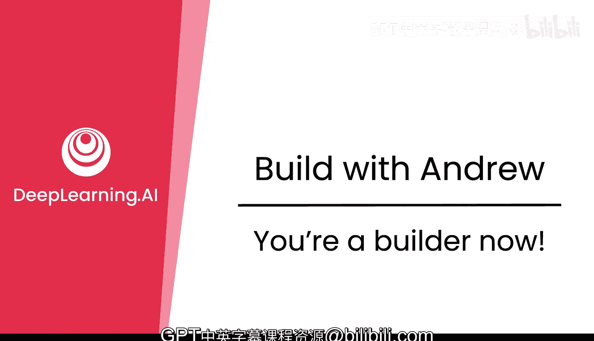
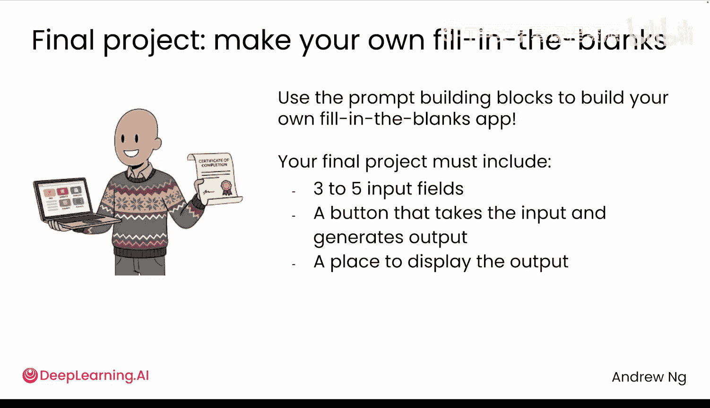
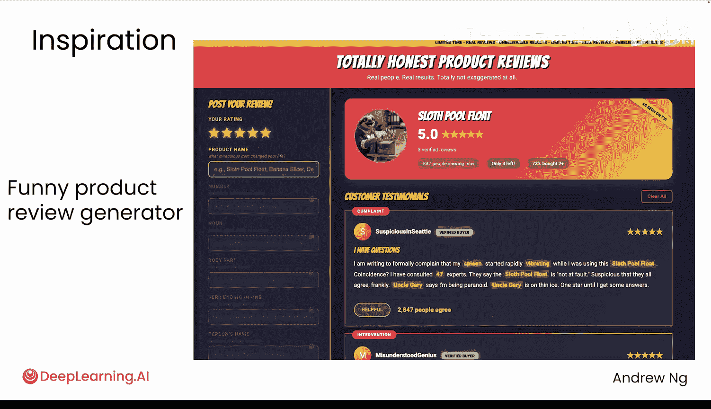
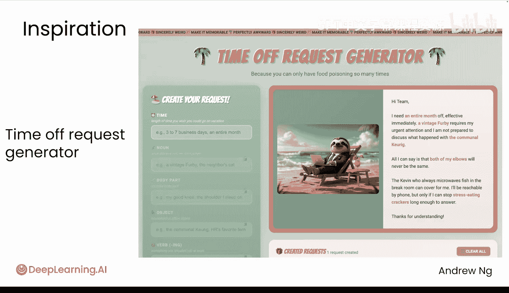
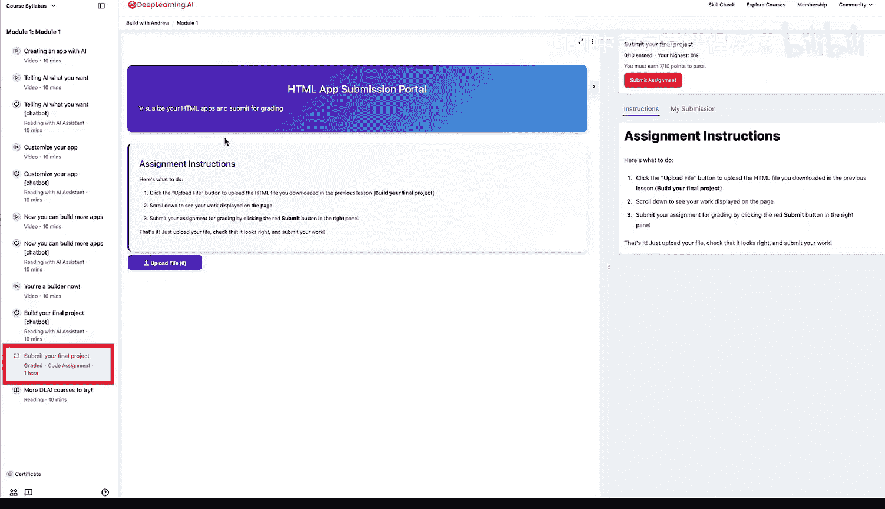
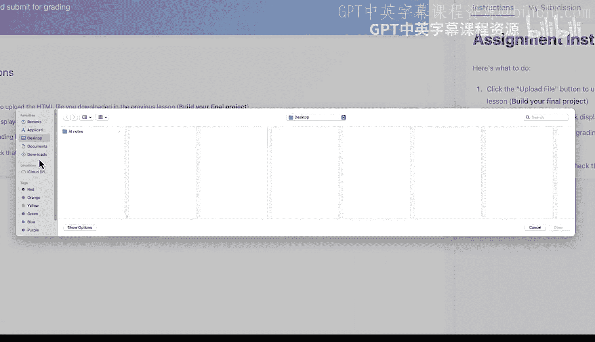
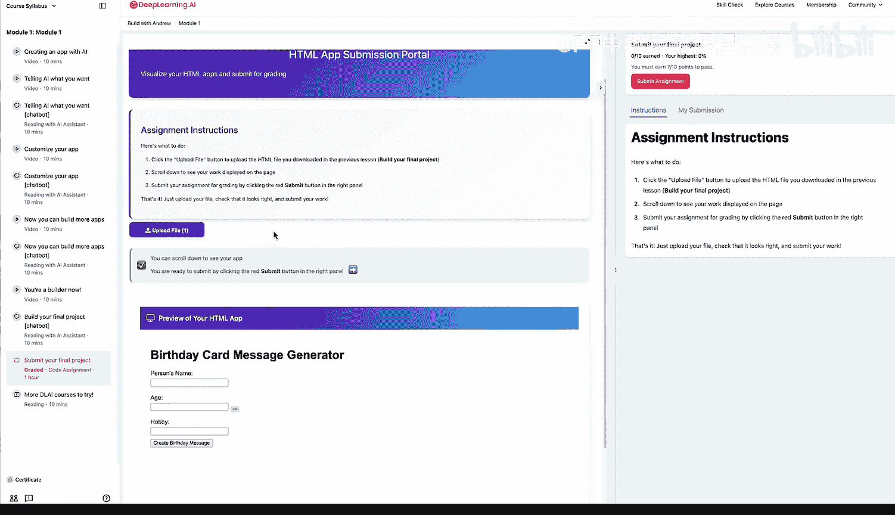

# 005：现在你是一名构建者了 🎉

在本节课中，我们将完成课程的最后一步，你将通过一个最终项目来巩固所学知识，并获得结业证书。我们将指导你如何构建一个“填空故事生成器”应用，并提交项目以获取认证。

---

如果你已经学习到这里，那么恭喜你。

你现在是一名AI构建者了。我遇到过一些人，他们显然已经构建软件和AI应用数月，却仍在怀疑自己是否算得上真正的构建者。我在此明确告诉你：是的，你就是。我将你视为我们的一员，一名构建者。

我希望你完成最后一项活动，并获取本课程的证书。

## 最终项目：构建你的填空故事生成器

最终项目是制作你自己的填空故事生成器。我希望你使用之前学到的构建模块来构建这个应用。

你的项目必须包含以下核心组件：
*   **三到五个输入视图**：用于收集用户填写的信息。
*   **一个按钮**：用于接收输入并触发生成输出。
*   **一个输出显示区域**：用于展示生成的故事。

你已经见过生日贺卡应用的例子。以下是一些其他灵感，或许能给你启发。

这是一个有趣的产品评论生成器，其空白处需要填写产品名称、数字、名词、身体部位等，然后生成产品评论。

它声称生成的是完全诚实的产品评论，看起来像这样。你可以暂停视频阅读这条评论，我个人非常喜欢这个创意。

或者，这里是另一个例子。😊

这是一个请假条生成器，你需要指定想休假的时间、一个名词、一个身体部位和一个物体。然后它会生成诸如“我需要立即休假[时长]，因为一个[名词]需要紧急关注我的[身体部位]”这样的句子。

无论是生日贺卡、产品评论、请假条还是其他类型的故事生成器，请编写你自己的提示词，并用它在网站上生成一个类似的应用。

## 如何构建与提交项目

当你进入下一个学习项目时，会看到常用的聊天机器人界面。你可以用它来编写提示词，以获取一个HTML文件，并将其下载到你的电脑上。

请按照以下步骤操作：
1.  使用我们的网站，或者也可以使用外部网站（如ChatGPT或Gemini）来生成你的HTML文件。
2.  完成项目构建后，请访问最终的提交页面（加载可能需要几秒钟）。
3.  点击“上传文件”按钮。
4.  在弹出的窗口中，导航并选择你下载的HTML文件。

上传后，你会看到你生成的应用预览。

当你准备好后，点击“提交作业”。我们的AI将检查你的HTML文件，判断其是否能正确运行，并给出反馈。

😊，假设一切正常，这将带你完成课程的最后一个练习，并为你赢得证书。

## 持续学习与构建

最高效的构建者会持续学习课程，同时也坚持构建项目。

我发现，如果一个人只构建而不学习，他常常会不了解核心概念，最终可能花费数月时间重复造轮子，或者更糟，以非常奇怪的方式做事。

但反过来，如果一个人只学习课程，那么他最终会只有理论知识，却不知道如何应用。

因此，**构建**和**学习课程**两者都至关重要。请继续构建任何你喜欢的应用。

我也将在下一个学习项目中为你推荐一些额外的课程供你考虑。

请继续与朋友分享你的应用程序，以获得反馈，或者只是博他们一笑。

成为一名构建者是世界上最有趣的事情之一。

我很高兴能和你一起开启这段旅程，并希望我们能继续一起构建和学习。😊

---

**本节课总结**：我们一起完成了构建者身份的确认，明确了最终项目“填空故事生成器”的要求与构建步骤，并学习了如何提交项目以获得证书。最后，我们探讨了持续学习与动手实践相结合的重要性，为你的持续成长指明了方向。