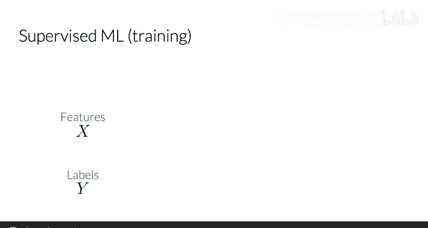
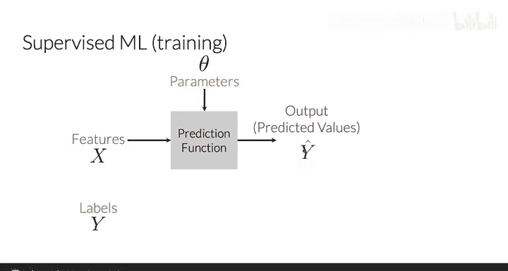
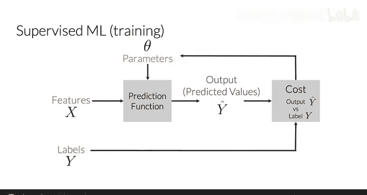
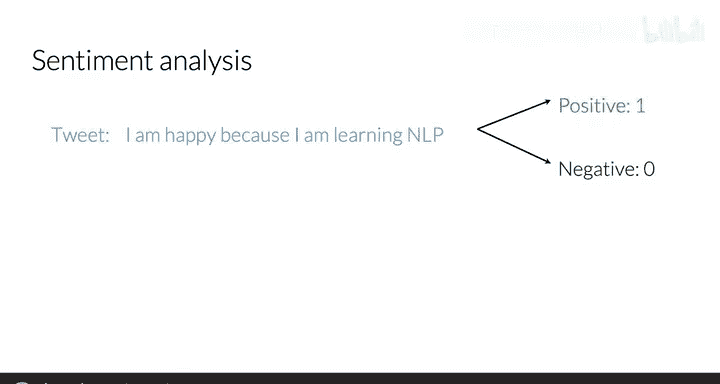
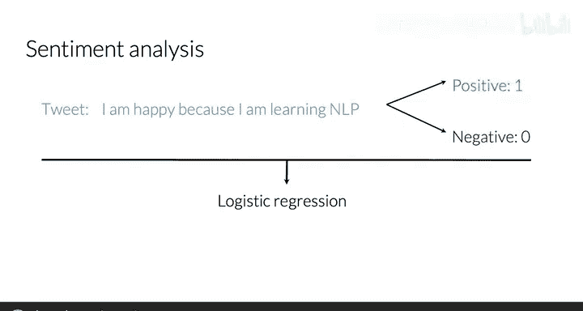
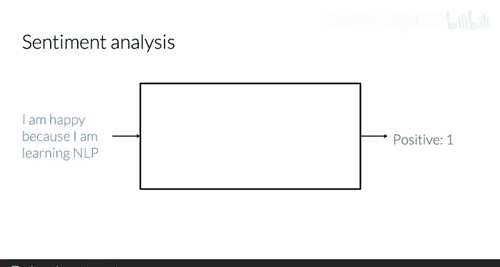
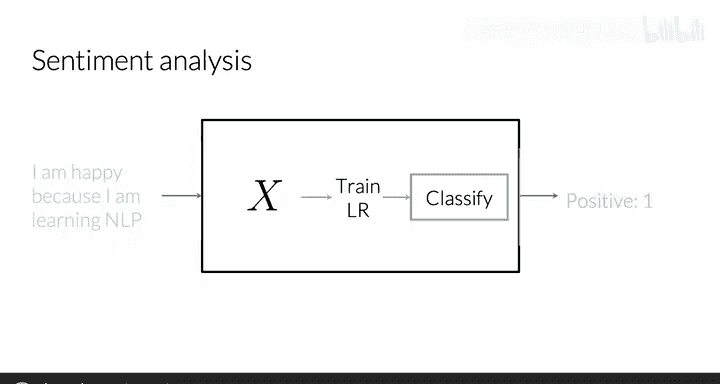

#  004：监督机器学习与情感分析 🧠

在本节课中，我们将学习监督机器学习，特别是逻辑回归算法。我们将了解如何通过一系列步骤实现逻辑回归，并将其应用于情感分析任务，即判断一条推文的情感是积极还是消极。

---

## 监督机器学习概述

在监督机器学习中，我们拥有输入特征 **X** 和对应的标签 **Y**。为了确保基于数据做出最准确的预测，我们的目标是尽可能降低错误率或成本。

为实现这一目标，我们将运行预测函数。该函数接收参数和数据，将特征映射到预测输出 **Ŷ**。当期望值 **Y** 与预测值 **Ŷ** 之间的差异最小时，就实现了从特征到标签的最佳映射。

成本函数通过比较输出 **Ŷ** 与标签 **Y** 的接近程度来实现这一目标。然后，我们可以更新参数并重复整个过程，直到成本最小化。

---

## 情感分析：一个分类任务

上一节我们介绍了监督机器学习的基本框架，本节中我们来看看一个具体的应用：情感分析。

在这个例子中，我们有一条推文：“I‘m happy because I’m learning NLP. 😊”。此任务的目标是预测一条推文的情感是积极的还是消极的。

我们将从一个训练集开始，其中具有积极情感的推文标签为 **1**，具有消极情感的推文标签为 **0**。

对于此任务，我们将使用逻辑回归分类器，它将观察结果分配到两个不同的类别中。接下来，我将展示如何做到这一点。

---

## 构建情感分析分类器的步骤

为了构建一个能够预测任意推文情感的逻辑回归分类器，我们需要遵循以下步骤。

以下是实现分类器的三个主要阶段：

1.  **特征提取**：首先，处理训练集中的原始推文并提取有用的特征。
    

2.  **模型训练**：然后，在最小化成本的同时训练你的逻辑回归分类器。

3.  **进行预测**：最后，你将能够使用训练好的模型进行预测。
    

---

## 总结

本节课中，我们一起学习了如何对给定推文进行分类，判断其情感是积极还是消极。为了实现这一目标，你首先需要提取特征，然后训练模型，最后基于训练好的模型对推文进行分类。

在下一个视频中，你将学习如何提取这些特征。让我们一起来看看具体如何操作。