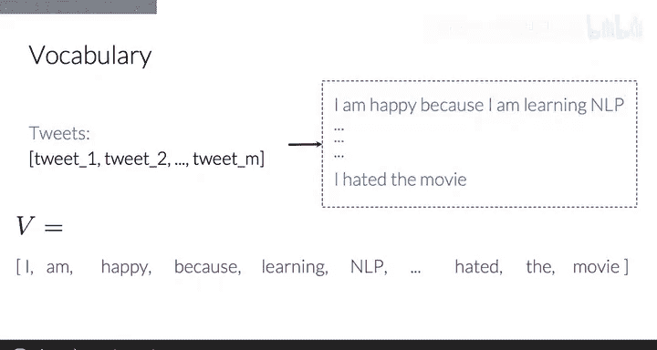
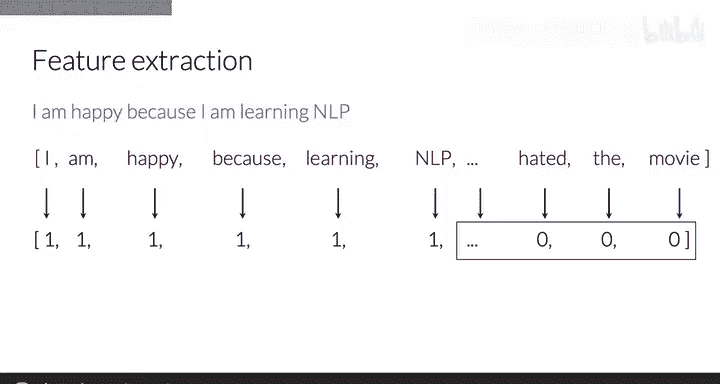
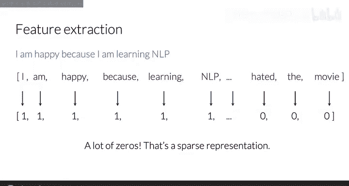
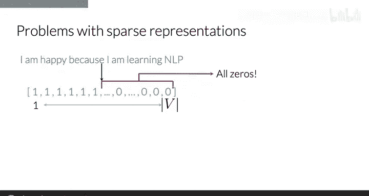
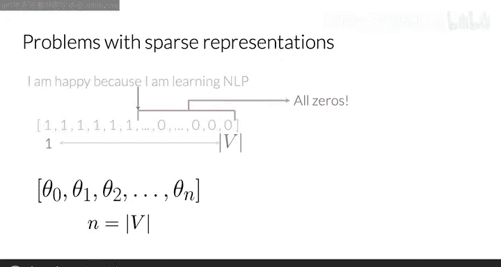
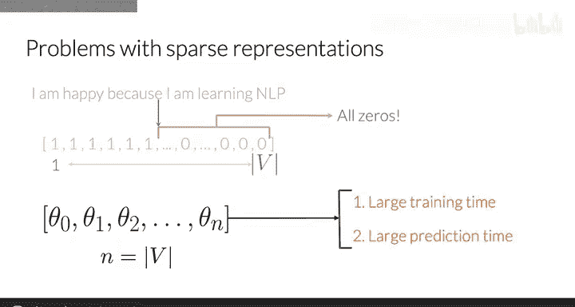

#  005：吴恩达《自然语言处理》P5 - 词汇特征提取 📚

在本节课中，我们将学习如何将一段文本（例如一条推文）表示为一个数字向量。这是自然语言处理中的一项基础且关键的技术，为后续的文本分类、情感分析等任务奠定基础。

## 构建词汇表 📖

上一节我们介绍了文本向量化的目标，本节中我们来看看实现它的第一步：构建词汇表。

想象一个推文列表，它看起来是这样的。你的词汇表 **V** 将是这个推文列表中所有独特单词的集合。为了得到这个列表，你需要遍历所有推文中的所有单词，并保存搜索过程中出现的每一个新单词。

在这个例子中，你会得到单词 “I”，然后是 “am” 和 “happy”，接着是 “because”，以此类推。但请注意，单词 “I” 和 “am” 不会在词汇表中重复出现。

## 基于词汇表提取特征 🔍

现在，让我们使用你的词汇表来为一条具体的推文提取特征。

以下是具体步骤：
1.  检查词汇表中的每一个单词是否出现在这条推文中。
2.  如果出现，例如单词 “I”，则为该特征赋值为 **1**。
3.  如果不出现，则赋值为 **0**。

在这个例子中，你的推文表示向量将包含六个 **1** 和许多个 **0**。这些 **0** 对应着词汇表中所有未出现在这条推文里的独特单词。

## 稀疏表示与模型参数 🧮

现在，让我们更仔细地观察这条推文的向量表示。

这种非零值相对较少的表示类型被称为**稀疏表示**。这种表示的特征数量等于整个词汇表的大小。对于每一条推文，它都会有大量特征值为 **0**。

使用这种稀疏表示，一个逻辑回归模型将需要学习 **n + 1** 个参数，其中 **n** 等于你的词汇表大小。

## 大规模词汇表带来的挑战 ⚠️

你可以想象，对于大规模的词汇表，这会带来问题。训练你的模型将需要过多的时间，进行预测所需的时间也会远超必要。

## 课程总结 ✨

本节课中我们一起学习了如何将给定文本表示为一个维度为 **V** 的向量。具体来说，我们针对一条推文进行了操作，并成功构建了一个维度为 **V** 的词汇表。

随着 **V** 变得越来越大，你将面临某些挑战。在下一个视频中，你将学习如何识别这些问题。