#  006：负频率与正频率 📊

在本节课中，我们将学习如何生成词频统计，并将其作为特征输入到逻辑回归分类器中。具体来说，我们将学习如何统计每个单词在积极类别和消极类别中出现的次数，并利用这些统计信息构建特征。

---

## 概述

我们将通过一个简单的例子，展示如何为情感分析任务构建正频率和负频率表。这些频率表将帮助我们理解每个单词在不同情感类别中的分布情况。

---

## 构建词汇表

首先，我们需要一个语料库和对应的词汇表。假设我们有一个包含四条推文的语料库，词汇表由其中所有不重复的单词组成。

例如，我们的词汇表可能包含以下8个单词：`happy`, `sad`, `good`, `bad`, `love`, `hate`, `great`, `terrible`。

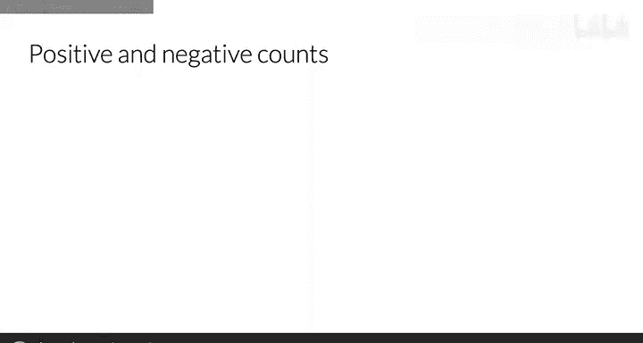

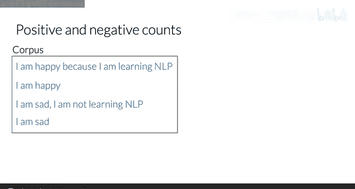

---

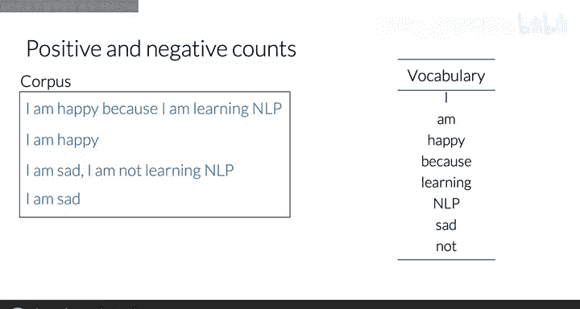

## 区分积极与消极类别

在情感分析中，我们通常有两个类别：积极情感和消极情感。假设我们的语料库中，有两条推文属于积极类别，另外两条属于消极类别。

以下是积极类别的推文示例：
1. "I am happy and love this."
2. "This is good and great."

以下是消极类别的推文示例：
1. "I am sad and hate this."
2. "This is bad and terrible."


---

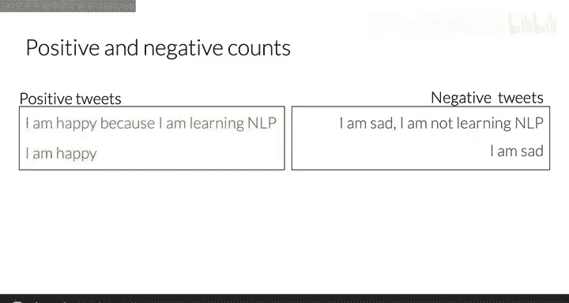

## 计算正频率

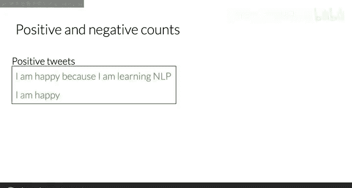

正频率是指每个单词在积极类别推文中出现的次数。我们逐一检查词汇表中的每个单词，并统计它在积极推文中的出现次数。

例如，单词 `happy` 在第一句积极推文中出现一次，在第二句积极推文中没有出现，因此它的正频率为1。

以下是计算正频率的步骤：
1. 初始化一个空字典，用于存储每个单词的正频率。
2. 遍历每条积极推文。
3. 对推文进行分词处理。
4. 对于每个单词，如果它已经在字典中，则将其计数加一；否则，将其添加到字典中并设置计数为一。

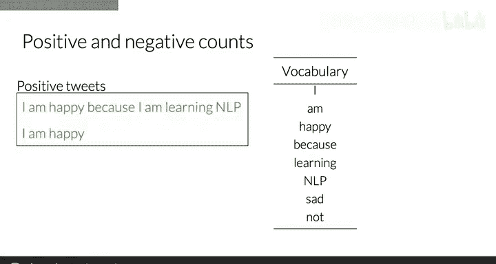

通过这种方法，我们可以得到每个单词的正频率表。

---

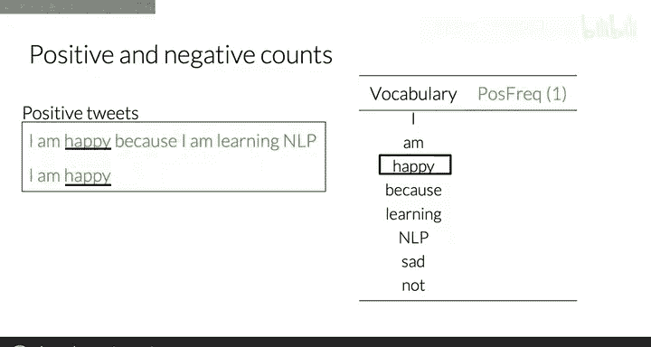

## 计算负频率

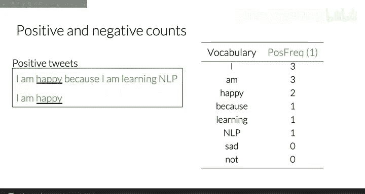

负频率是指每个单词在消极类别推文中出现的次数。计算负频率的方法与计算正频率类似，只是我们遍历的是消极推文。


例如，单词 `sad` 在第一句消极推文中出现一次，在第二句消极推文中没有出现，因此它的负频率为1。

以下是计算负频率的步骤：
1. 初始化一个空字典，用于存储每个单词的负频率。
2. 遍历每条消极推文。
3. 对推文进行分词处理。
4. 对于每个单词，如果它已经在字典中，则将其计数加一；否则，将其添加到字典中并设置计数为一。

通过这种方法，我们可以得到每个单词的负频率表。

---

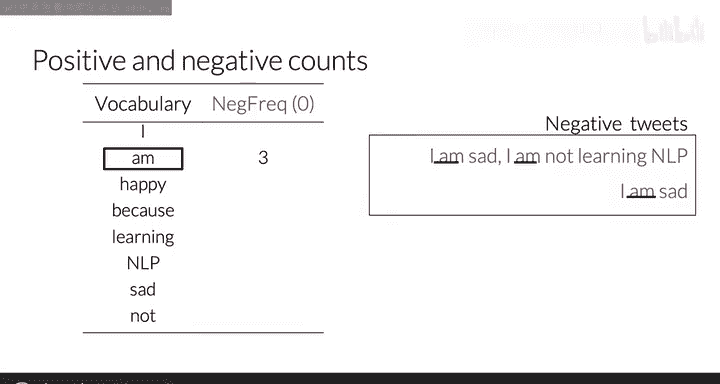

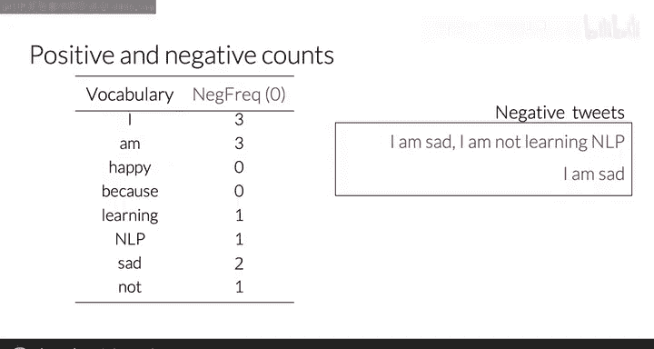

## 构建频率字典

在实际编程中，我们通常会将正频率和负频率合并到一个频率字典中。这个字典的键是 `(单词, 类别)` 对，值是该单词在对应类别中出现的次数。

例如，频率字典可能如下所示：
```python
freq_dict = {
    ('happy', 'positive'): 2,
    ('sad', 'negative'): 1,
    ('good', 'positive'): 1,
    ('bad', 'negative'): 1,
    ('love', 'positive'): 1,
    ('hate', 'negative'): 1,
    ('great', 'positive'): 1,
    ('terrible', 'negative'): 1
}
```

这个频率字典为我们提供了每个单词在不同情感类别中的分布情况，是后续特征提取的基础。

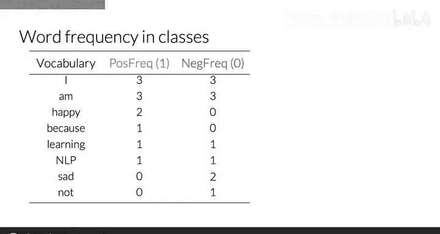

---

## 总结

本节课中，我们一起学习了如何构建正频率和负频率表，以及如何将它们合并成一个频率字典。这些频率统计信息将作为特征输入到逻辑回归分类器中，帮助我们进行情感分析任务。

在下一节课中，我们将学习如何利用这个频率字典来表示一条推文，并提取有效的特征用于分类。