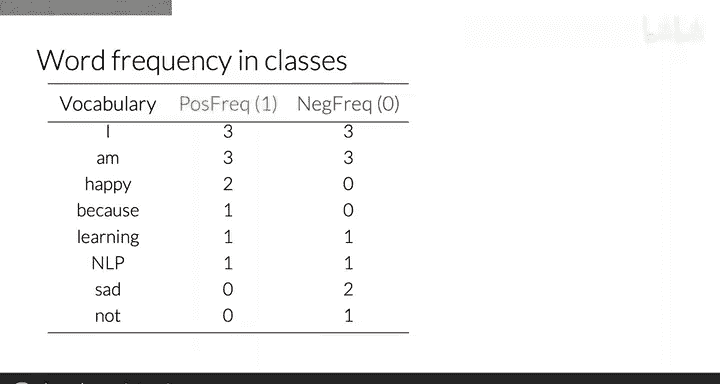
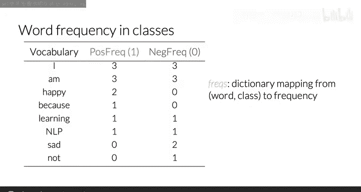
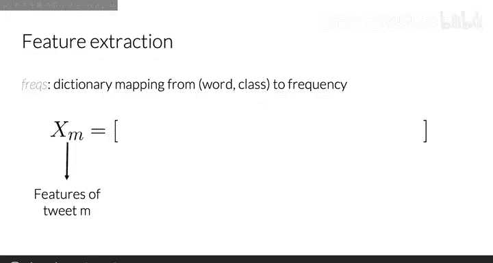
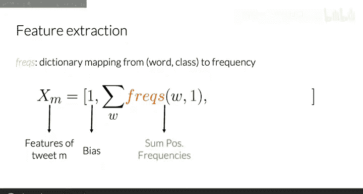
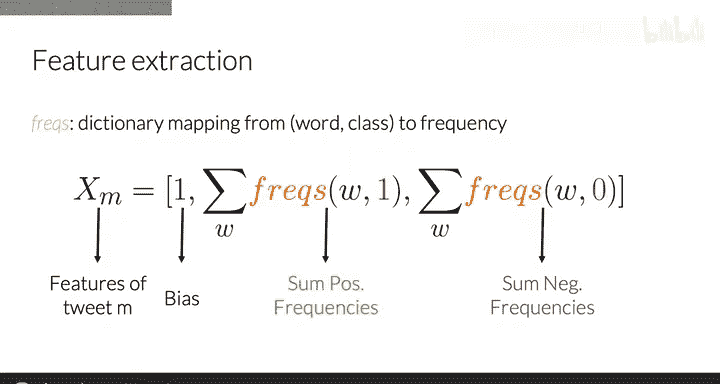
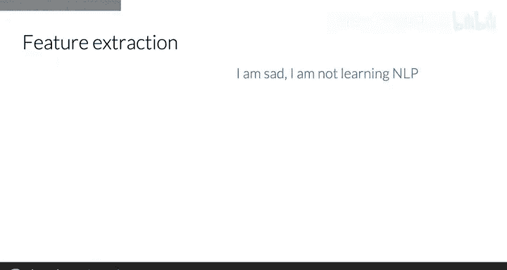
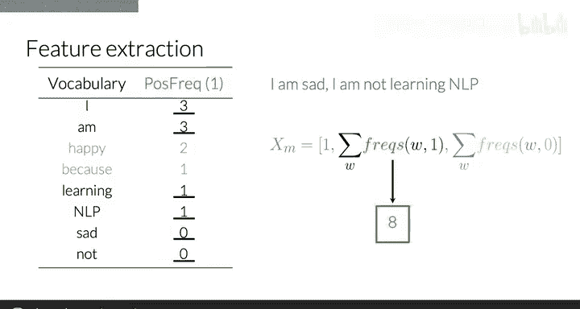
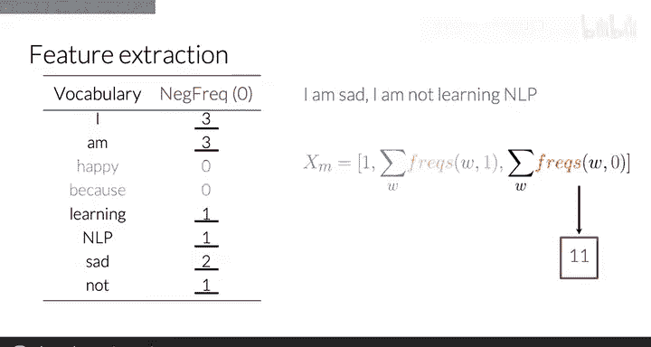
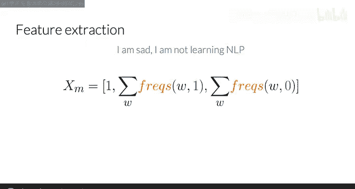

#  007：使用频率进行特征提取 📊

在本节课中，我们将学习如何利用词频将一条推文表示为仅包含三个特征的向量。这种方法能显著提升逻辑回归分类器的训练速度，因为模型需要学习的特征数量从词汇表大小 `V` 减少到了仅3个。

## 从词汇表向量到频率向量 🔄

上一节我们介绍了如何将推文编码为维度为 `V` 的向量。本节中，我们来看看如何将其转换为一个维度仅为3的向量表示。

## 构建频率字典 📖

频率字典记录了每个词在特定情感类别（积极或消极）的推文中出现的次数。它本质上是一个映射，将 `(词语, 类别)` 对关联到对应的频率值。

以下是构建频率字典的步骤：
1.  遍历已标注情感的训练数据集。
2.  对于每条推文中的每个词，根据推文的情感标签，在对应的 `(词语, 类别)` 计数上加一。

## 提取三维特征向量 🧮

现在我们已经有了频率字典，接下来看看如何用它为情感分析提取特征。特征向量包含三个部分。

以下是特征向量的三个组成部分：
1.  **偏置单元**：始终为1，表示为 `x_bias = 1`。
2.  **积极频率和**：推文中所有**独特词汇**在积极类别下的频率值之和。
3.  **消极频率和**：推文中所有**独特词汇**在消极类别下的频率值之和。

因此，一条推文 `M` 的特征向量可以表示为：
`x = [1, sum(positive_freq(word) for word in unique(M)), sum(negative_freq(word) for word in unique(M))]`

## 特征提取实例 ✍️

让我们通过一个具体例子来理解这个过程。假设我们有以下推文：
> “I am happy because I am learning.”

假设从上一讲中我们得到了如下积极类别的频率表：

| 词语 | 积极频率 |
| :--- | :--- |
| I | 3 |
| am | 3 |
| happy | 2 |
| because | 1 |
| learning | 2 |

首先，识别推文中的独特词汇：`{I, am, happy, because, learning}`。其中，`happy` 和 `because` 未出现在上表的词汇中（仅为示例假设，实际应从完整字典查找）。

**计算第二个特征（积极频率和）**：
我们需要对推文中出现的、在频率字典里存在的词的积极频率进行求和。
`sum = freq(I) + freq(am) + freq(learning) = 3 + 3 + 2 = 8`

**计算第三个特征（消极频率和）**：
类似地，我们需要查找这些词在消极类别下的频率并求和。假设其消极频率如下：

| 词语 | 消极频率 |
| :--- | :--- |
| I | 3 |
| am | 4 |
| learning | 4 |

`sum = freq_neg(I) + freq_neg(am) + freq_neg(learning) = 3 + 4 + 4 = 11`

**最终特征向量**：
因此，这条推文最终的三维特征向量表示为：`[1, 8, 11]`。

## 总结与预告 🎯

本节课中我们一起学习了如何利用词频字典，将推文从高维的词汇表表示压缩成一个仅包含三个数值的特征向量。这种方法的核心在于**求和**推文中独特词汇在积极和消极两类中的出现频率。

你已经掌握了如何用三维向量表示一条推文。在下一个视频中，我们将学习如何对推文进行预处理，预处理后的词汇将构成我们频率字典的基础，从而使特征提取更加有效和准确。