#  008：文本预处理 🧹

在本节课中，我们将学习自然语言处理中的两个核心预处理概念：词干提取与停用词移除。我们将通过一个具体的推文处理示例，详细讲解如何应用这些技术来清理和简化文本数据，为后续的机器学习任务做好准备。

---

## 概述：文本预处理的目标 🎯

文本预处理的目标是清理原始文本数据，移除冗余或无关的信息，同时保留核心语义内容。这能帮助机器学习模型更高效、更准确地学习文本特征。本节将重点介绍两种关键技术：**停用词移除**和**词干提取**。


---

## 停用词与标点符号移除 🗑️

首先，我们需要移除那些对文本情感或核心含义贡献不大的词语，即“停用词”，以及标点符号。以下是具体步骤。

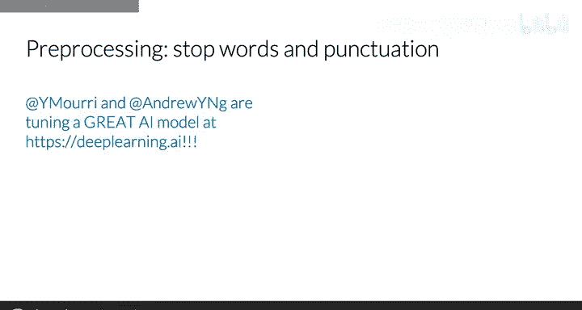

### 停用词移除

停用词通常包括常见的功能词，如“and”、“is”、“at”等。在实际操作中，你需要将文本与一个预定义的停用词列表进行比较，并移除所有匹配的词语。

例如，对于推文：
```
I am tuning up an AI model at the lab!
```
移除停用词“I”、“am”、“an”、“at”、“the”后，得到：
```
tuning up AI model lab!
```

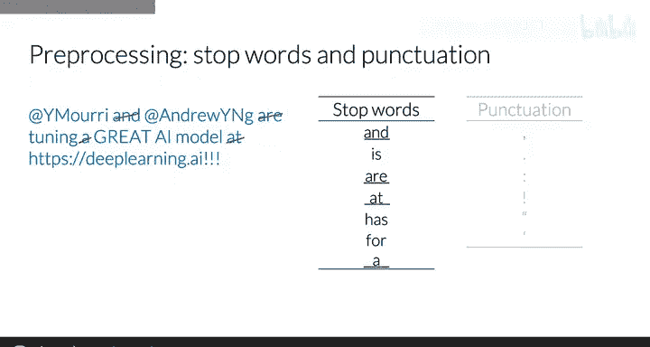

**代码示例**（伪代码）：
```python
stop_words = ["i", "am", "an", "at", "the"]
filtered_words = [word for word in tweet_words if word not in stop_words]
```

### 标点符号移除

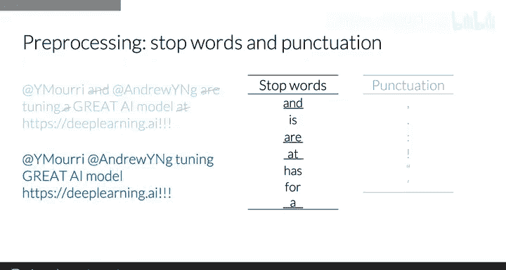

接下来，移除标点符号。在本例中，我们移除了感叹号。

处理后的文本为：
```
tuning up AI model lab
```

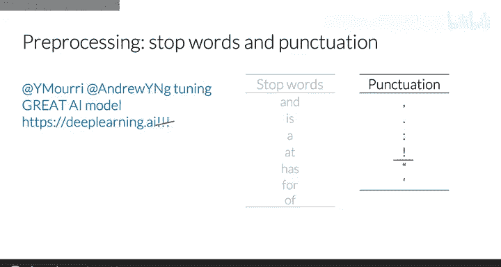

**注意**：在某些自然语言处理任务中，标点符号可能包含重要信息（如情感强度）。因此，是否移除标点需根据具体任务决定。

---

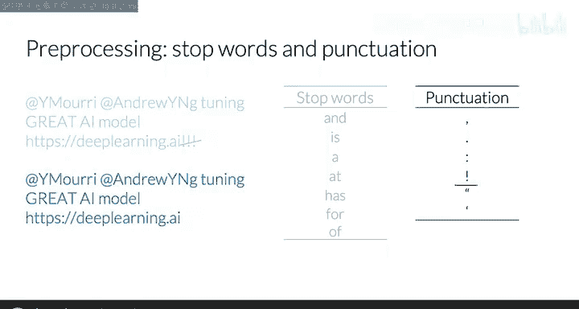

## 处理用户名与URL 🔗

在社交媒体文本（如推文）中，常包含用户名（以@开头）和URL链接。对于情感分析等任务，这些元素通常不提供有价值的信息，可以移除。

例如，移除“@hindsite”和“http://example.com”后，文本进一步简化为只包含核心内容的词语。

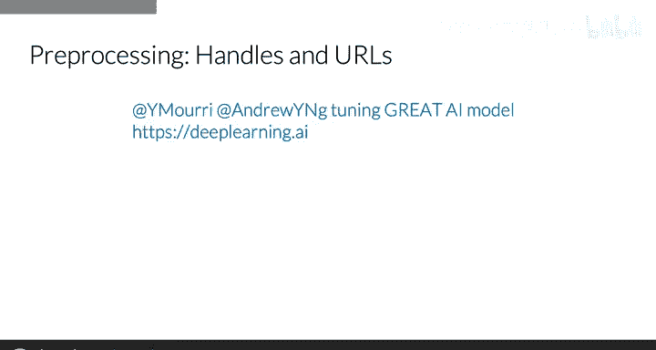

---

## 词干提取 🌱

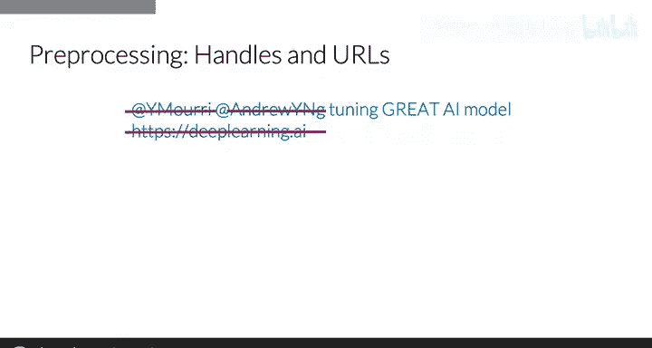

上一节我们清理了文本中的冗余元素，本节中我们来看看如何通过词干提取来进一步规范化词汇。

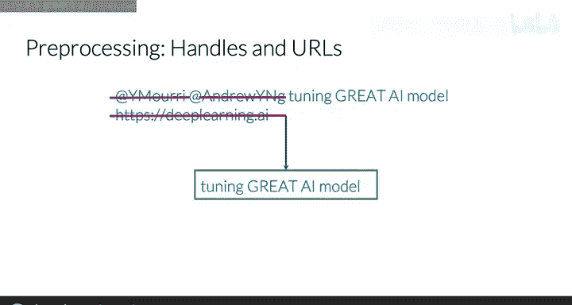

词干提取是将词语转换为其基本形式（词干）的过程。词干是构成该词及其衍生词的基础字符集合。

### 词干提取示例

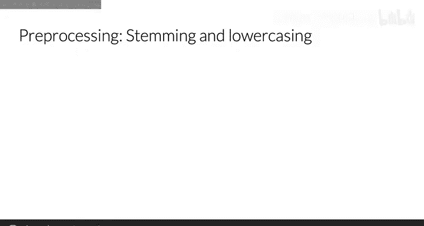

以词语“tuning”为例：
- 词干为 **tun**
- 添加字母“e”形成“tune”
- 添加后缀“ed”形成“tuned”
- 添加后缀“ing”形成“tuning”

通过对整个语料库进行词干提取，像“tune”、“tuned”、“tuning”这样的词都会被归约为同一个词干“tun”。这能显著缩小词汇表规模，而不损失关键信息。

**公式化描述**：
```
stem(“tuning”) = “tun”
stem(“tuned”) = “tun”
stem(“tune”) = “tun”
```

### 统一小写

为了进一步缩减词汇表，通常还将所有词语转换为小写。这样，“Great”、“great”和“GREAT”就会被视为同一个词。

---

## 预处理流程总结 📝

以下是整个预处理流程的总结，从原始推文到最终处理后的单词列表：

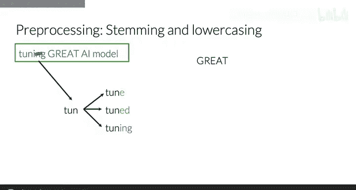

1.  **移除停用词**：过滤掉常见功能词。
2.  **移除标点符号**：根据任务需求决定是否移除。
3.  **移除用户名与URL**：清理社交媒体特有的无关元素。
4.  **词干提取**：将所有词语还原为其词干形式。
5.  **统一小写**：将所有字符转换为小写。

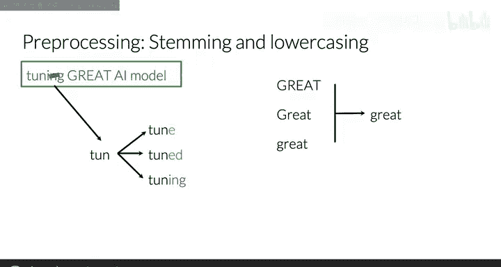

最终，推文“I am tuning up an AI model at the lab!”经过预处理后，会得到一个简洁的单词列表：`['tun', 'up', 'ai', 'model', 'lab']`。

---

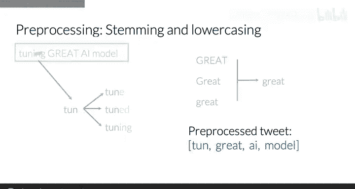

## 总结 🎓

本节课中，我们一起学习了自然语言处理中文本预处理的两个核心步骤：**停用词移除**和**词干提取**。我们通过一个推文示例，演示了如何逐步清理文本、移除无关信息，并将词汇规范化，为构建有效的文本特征表示打下基础。掌握这些预处理技术，是进行后续情感分析、文本分类等高级自然语言处理任务的关键第一步。

在接下来的课程中，你将学习如何利用这些预处理后的文本来构建特征矩阵，以供机器学习模型使用。