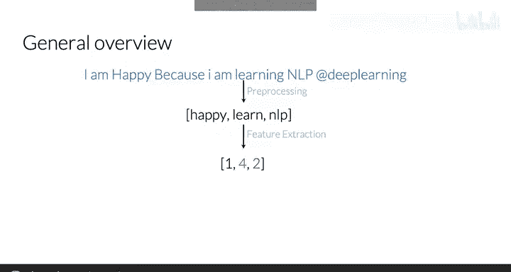
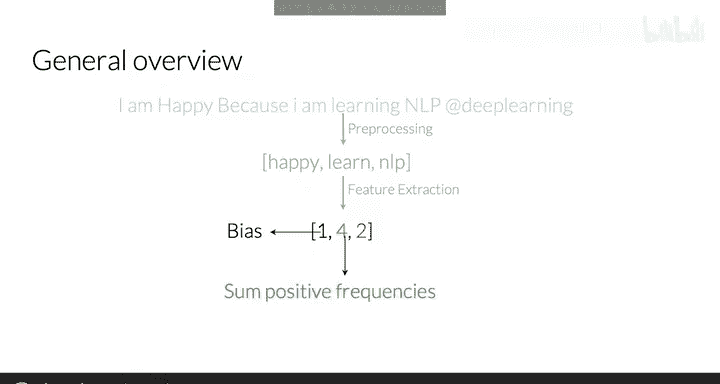
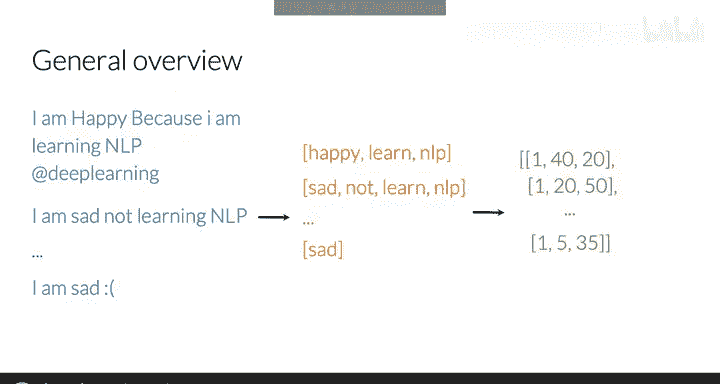
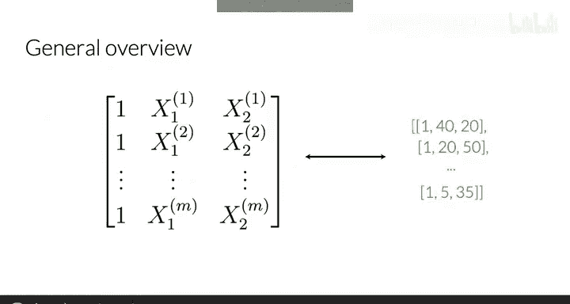
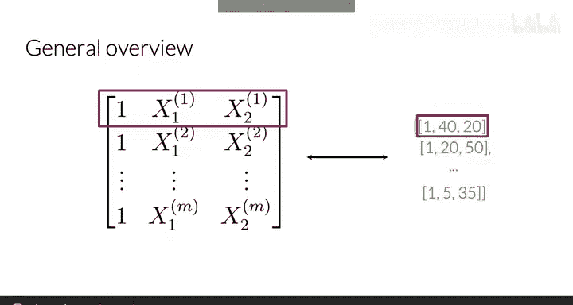
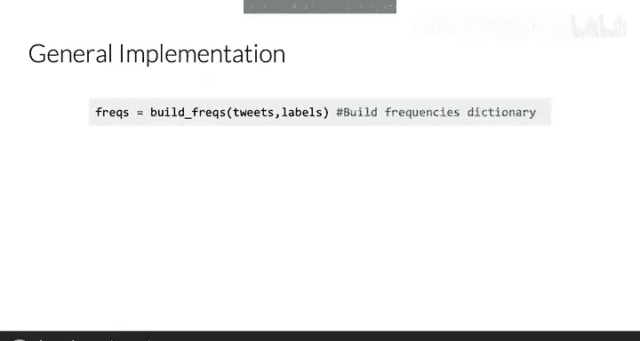
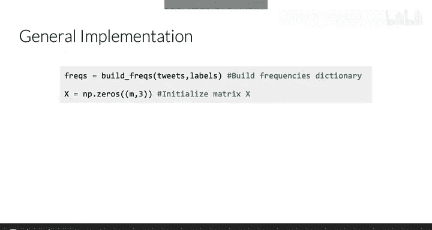
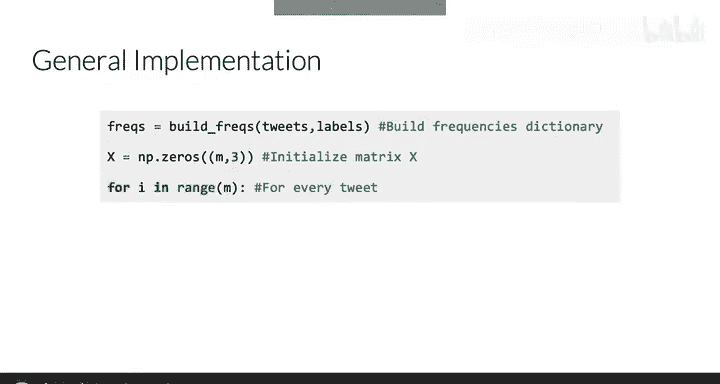
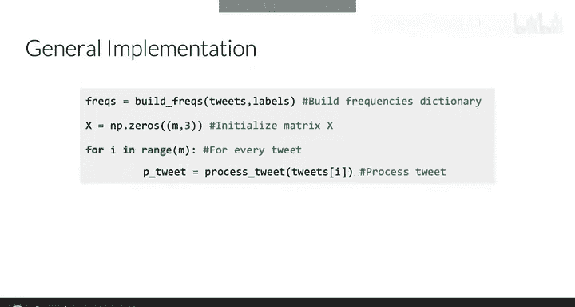
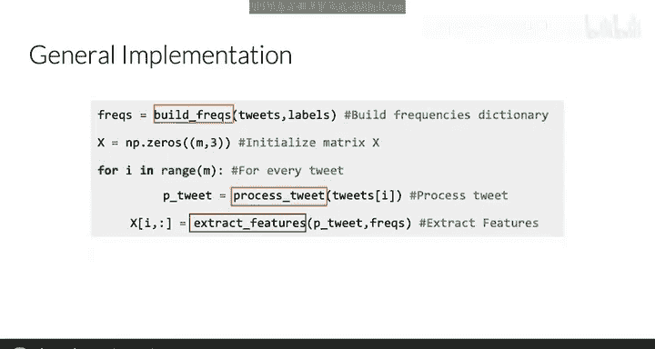

#  009：整合所有内容 🧩

在本节课中，我们将学习如何整合之前学到的所有自然语言处理步骤，为情感分析任务构建一个特征矩阵。我们将从单条推文的处理开始，逐步扩展到处理整个数据集，最终生成可用于逻辑回归分类器的输入矩阵。

---

上一节我们介绍了如何为单条推文提取特征。本节中，我们来看看如何为整个训练集的所有推文构建特征矩阵。

具体来说，我将引导你完成一个算法，该算法允许你生成这个 **X** 矩阵。让我们看看如何构建它。



首先，回顾一下处理单条推文的过程。你会预处理一条推文，得到一个包含所有相关信息的单词列表。利用这个单词列表，你可以通过频率字典映射得到一个良好的表示，最终得到一个向量。这个向量包含一个偏置单元和两个附加特征：处理后的推文中每个单词在积极推文中出现次数的总和，以及在消极推文中出现次数的总和。



在实践中，你需要对一组 **M** 条推文执行此过程。因此，给定一组原始推文，你需要逐一预处理它们，得到一组单词列表（每条推文对应一个列表）。最后，你能够使用频率字典映射来提取特征。

最终，你将得到一个具有 **M** 行和三列的矩阵 **X**，其中每一行包含你每条推文的特征。



以下是构建特征矩阵 **X** 的通用实现步骤：



1.  **构建频率字典**：首先，你需要构建一个频率字典。
    ```python
    freqs = build_freqs(tweets, labels)
    ```



2.  **初始化矩阵**：然后，初始化矩阵 **X** 以匹配你的推文数量。
    ```python
    X = np.zeros((m, 3))
    ```



3.  **遍历并处理推文**：之后，你需要仔细遍历你的推文集。
    ```python
    for i in range(m):
        tweet = tweets[i]
    ```





4.  **预处理每条推文**：对每条推文进行预处理，包括删除停用词、词干提取、删除URL和句柄、以及转换为小写。
    ```python
        processed_tweet = process_tweet(tweet)
    ```



5.  **提取特征**：最后，通过累加推文中单词的积极和消极频率来提取特征。
    ```python
        X[i, :] = extract_features(processed_tweet, freqs)
    ```

对于本周的作业，我们提供了一些辅助函数，例如 `build_freqs` 和 `process_tweet`。然而，你需要自己实现从单条推文中提取特征的函数。

虽然涉及不少代码，但至少现在你有了自己的 **X** 矩阵。在下一个视频中，我们将展示如何将这个 **X** 矩阵输入到你的逻辑回归分类器中。让我们看看如何操作。

---



本节课中我们一起学习了如何整合预处理、特征提取等步骤，为整个数据集构建特征矩阵 **X**。我们回顾了从单条推文到多条推文的处理流程，并概述了实现这一过程的关键代码步骤。掌握这一整合过程是将自然语言处理技术应用于实际情感分析任务的核心。