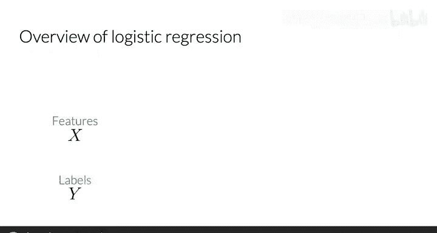
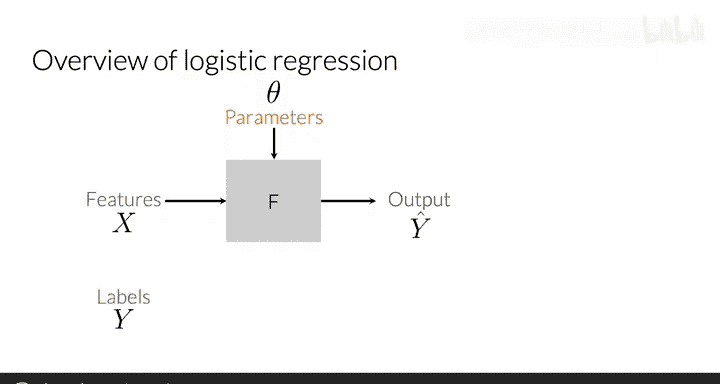
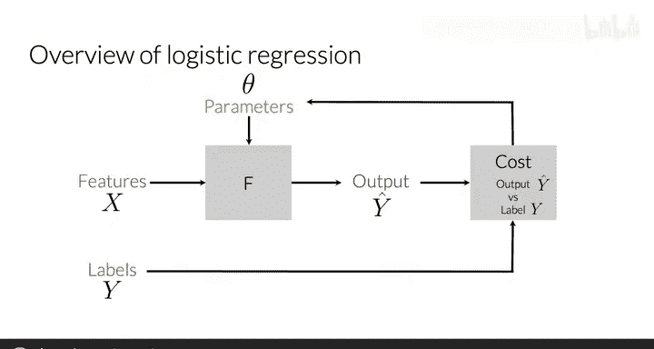
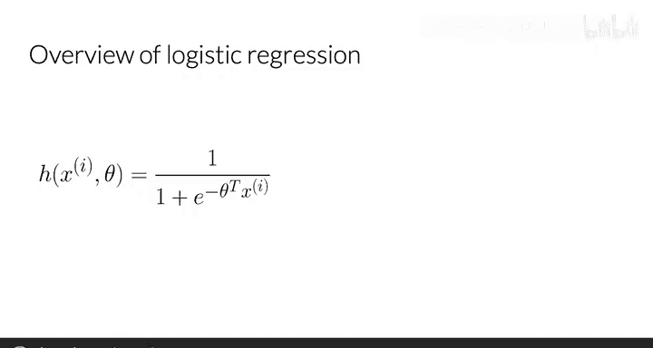
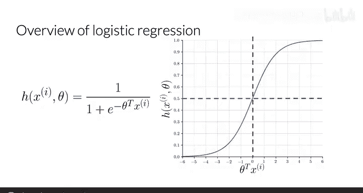
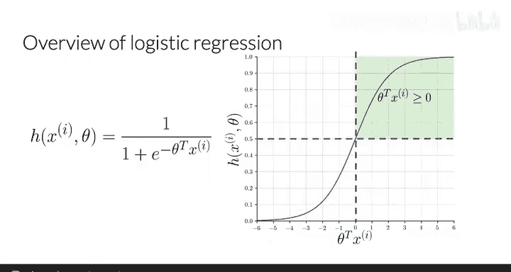
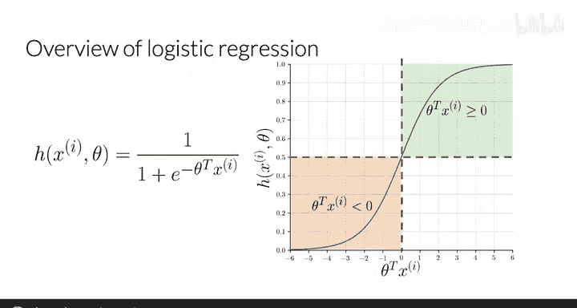
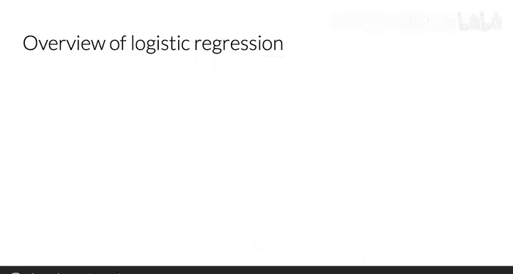
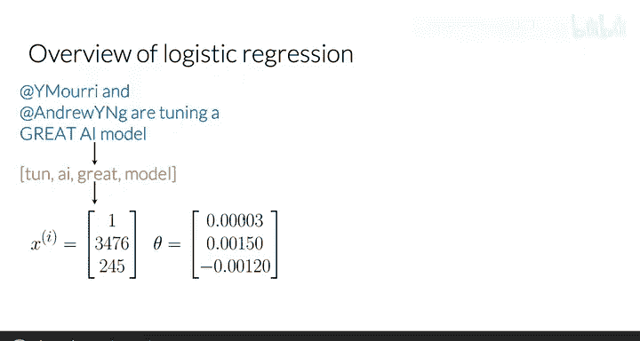

#  010：逻辑回归概述 📊

在本节课中，我们将学习逻辑回归的基本概念。逻辑回归是一种用于分类任务的监督学习算法，特别是在情感分析中，它可以帮助我们判断一条推文的情感是积极的还是消极的。我们将了解其核心函数、工作原理以及一个简单的应用示例。

---

## 监督学习回顾 🔄

上一节我们介绍了特征提取。本节中，我们来看看如何利用这些提取的特征进行预测。

在监督机器学习中，我们拥有输入特征和一组标签，目标是基于数据做出预测。我们使用一个带有参数的函数，将特征映射到输出标签。为了获得从特征到标签的最佳映射，我们需要最小化一个成本函数。该函数通过比较预测输出 **Ŷ** 与数据中的真实标签 **Y** 的接近程度来工作。之后，参数被更新，并重复此过程，直到成本被最小化。

---

## 逻辑回归函数 🧮

对于逻辑回归，这个函数 **F** 就是 **Sigmoid 函数**。

用于逻辑回归分类的函数 **h** 是 Sigmoid 函数。它依赖于参数向量 **θ** 和特征向量 **x⁽ⁱ⁾**，其中 **i** 用于表示第 **i** 个观测值或数据点（在推文语境中，就是第 **i** 条推文）。

Sigmoid 函数的形式如下：

**h(x⁽ⁱ⁾, θ) = 1 / (1 + e^(-θᵀ x⁽ⁱ⁾))**

当 **θᵀ x** 趋近于负无穷时，该函数值趋近于 0；当 **θᵀ x** 趋近于正无穷时，函数值趋近于 1。

---

## 分类与阈值 ⚖️

对于分类任务，需要一个阈值。通常该阈值设置为 **0.5**，这个值对应于 **θᵀ x** 等于 **0** 的情况。

因此，每当点积 **θᵀ x** 大于或等于 0 时，预测为积极情感。

每当点积 **θᵀ x** 小于 0 时，预测为消极情感。

---

## 应用示例：推文情感分析 🐦

让我们在熟悉的推文情感分析语境中看一个例子。

观察以下推文：
> “I am happy because I am learning NLP”

经过预处理后，你会得到一个如下列表：
`[‘i’， ‘happy’， ‘learn’， ‘nlp’]`
请注意，句柄被删除，所有字母转为小写，并且单词被还原为其词干。

然后，给定一个频率字典，你能够提取特征，并得到一个类似于以下向量的特征向量：
`x = [1, 8.0, 4.0]`
其中包含一个偏置单元，以及两个特征：处理后的推文中所有单词的积极频率总和与消极频率总和。

现在，假设你已经拥有一个最优的参数集 **θ**：
`θ = [0.05, 0.1, -0.2]`

你将能够计算出此情况下的 Sigmoid 函数值，最终预测为积极情感。

---

## 总结 📝

本节课中我们一起学习了逻辑回归的概述。我们回顾了监督学习的基本流程，介绍了逻辑回归的核心——Sigmoid 函数及其公式，解释了分类阈值的作用，并通过一个推文情感分析的例子演示了从特征提取到最终预测的完整过程。

现在你已经了解了逻辑回归的表示方法，在接下来的课程中，你将学习如何训练这样一个逻辑回归分类器。