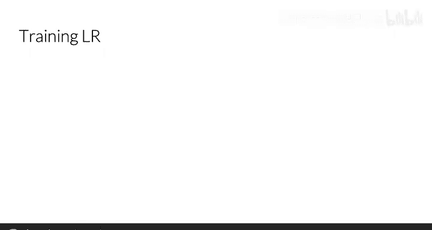
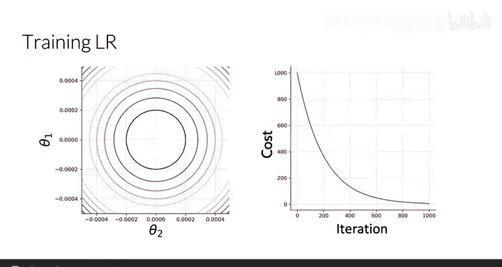
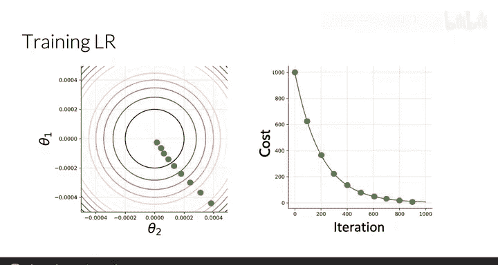
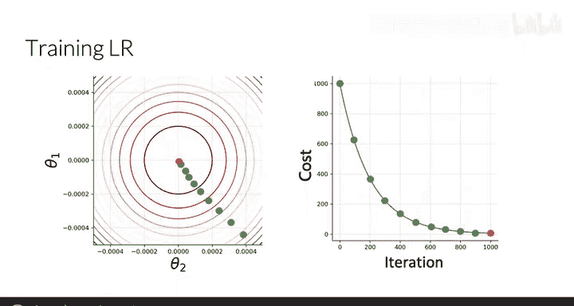
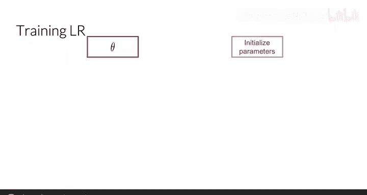
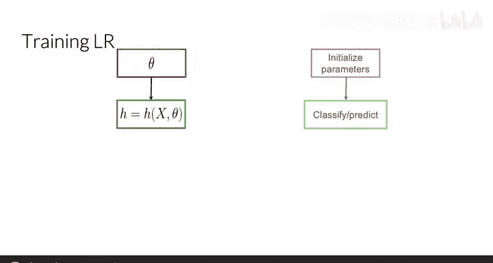
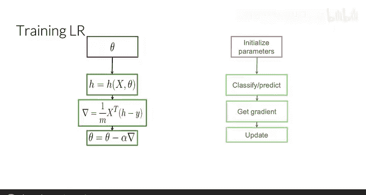
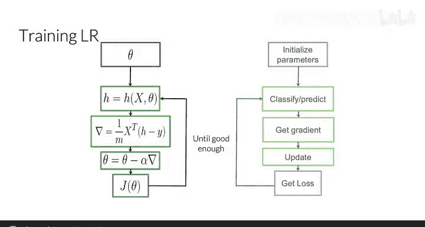

#  011：逻辑回归训练 🧠

在本节课中，我们将学习如何从零开始训练一个逻辑回归分类器。具体来说，我们将深入探讨一个算法，该算法能让我们找到最优的参数向量 `θ`，从而最小化模型的成本函数。

---

## 梯度下降算法概述

上一节我们介绍了如何使用给定的参数 `θ` 对推文进行情感分类。本节中，我们来看看如何从零开始学习我们自己的 `θ` 参数。

训练逻辑回归分类器的核心是迭代寻找一组能最小化成本函数的参数 `θ`。这个过程通常通过梯度下降算法实现。

假设你的损失函数仅依赖于参数 `θ1` 和 `θ2`，那么成本函数的等高线图可能如左图所示。右图则展示了在迭代过程中成本函数值的变化趋势。

首先，你需要初始化参数 `θ`。然后，沿着成本函数梯度的方向更新参数。经过100次迭代后，你可能到达图中某个点；经过200次迭代后，到达另一个点，依此类推。

经过多次迭代后，你将收敛到接近最优成本的点，此时训练完成。

---

## 训练过程的详细步骤

让我们更详细地审视这个过程。

以下是训练逻辑回归模型的标准步骤：

1.  **初始化参数向量 `θ`**：通常将参数初始化为零或小的随机值。
2.  **计算预测值**：对于每个观测样本，使用逻辑函数（Sigmoid函数）计算预测值。公式为：
    `h_θ(x) = g(θ^T x) = 1 / (1 + e^{-θ^T x})`
3.  **计算梯度**：计算成本函数 `J(θ)` 关于参数 `θ` 的梯度。梯度指明了使成本下降最快的方向。
4.  **更新参数**：沿着梯度的反方向更新参数 `θ`。更新公式通常为：
    `θ_j := θ_j - α * ∂J(θ)/∂θ_j`
    其中 `α` 是学习率。
5.  **计算成本**：根据更新后的参数计算当前的成本 `J(θ)`。
6.  **判断收敛**：根据预设的停止条件（如成本变化小于某个阈值，或达到最大迭代次数）判断是否需要继续迭代。

正如你在其他课程中可能见过的，这个算法被称为**梯度下降**。

---

## 模型评估

一旦你通过训练得到了参数 `θ`，下一步就是评估你的模型。这意味着你需要判断：当把 `θ` 代入你的 Sigmoid 函数时，你得到的是一个好的分类器还是一个差的分类器。

在下一节视频中，我们将展示如何进行模型评估。

---

本节课中，我们一起学习了逻辑回归模型的训练过程。我们了解了梯度下降算法是如何通过迭代更新参数 `θ` 来最小化成本函数的，并熟悉了训练流程中的关键步骤：初始化、预测、计算梯度、更新参数和判断收敛。掌握这个过程是构建有效分类器的基础。