#  012：逻辑回归模型测试 🧪

在本节课中，我们将学习如何使用训练好的逻辑回归模型对新数据进行预测，并评估模型的泛化能力。具体来说，我们将介绍如何计算模型在验证集上的准确率。

上一节我们介绍了逻辑回归模型的训练过程，本节中我们来看看如何评估模型的性能。

## 模型预测过程

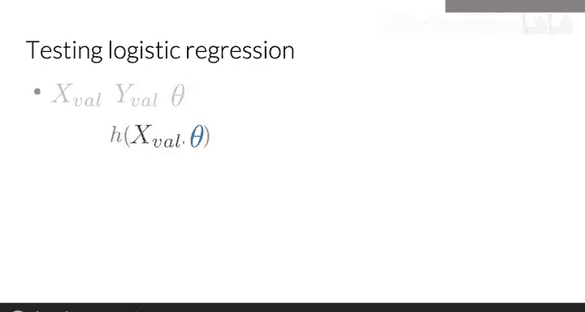

首先，你需要使用在训练阶段预留的验证集数据 `X_val` 和 `Y_val`，以及通过训练得到的最优参数 `theta`。

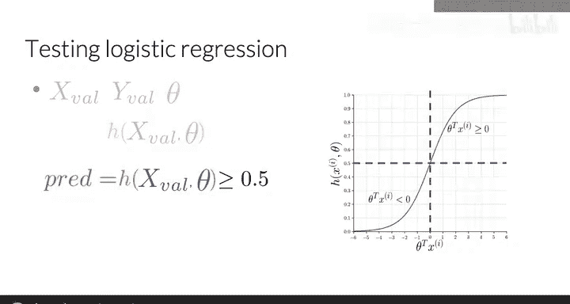

第一步是计算验证集特征 `X_val` 在参数 `theta` 下的Sigmoid函数值。

**公式：**
`h_theta = sigmoid(X_val * theta)`

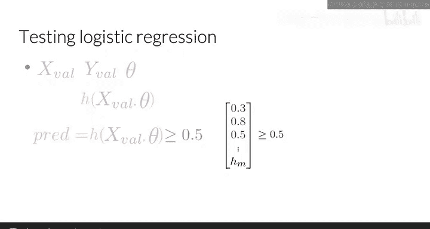

然后，你需要判断每个 `h_theta` 值是否大于或等于一个阈值，该阈值通常设置为0.5。

**公式：**
`prediction = (h_theta >= 0.5)`

以下是具体步骤：
1.  将 `h_theta` 向量中的每个值与0.5进行比较。
2.  如果值大于等于0.5，则预测该样本为正类（标记为1）。
3.  如果值小于0.5，则预测该样本为负类（标记为0）。

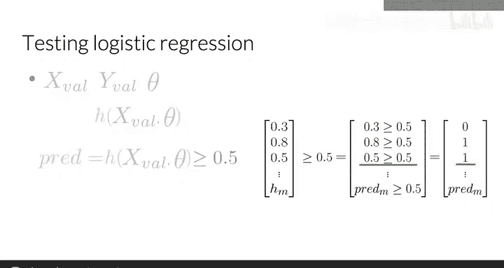

最终，你将得到一个由0和1组成的预测向量，分别代表对负类和正类样本的预测。

## 计算模型准确率

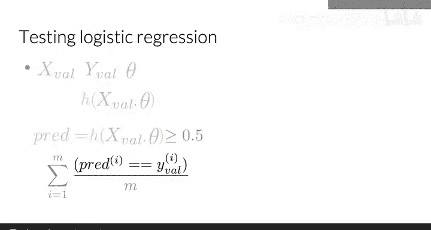

得到预测向量后，你可以通过比较预测值与验证集真实标签 `Y_val` 来计算模型的准确率。

计算方法是：统计预测正确的样本数量，然后除以验证集的总样本数 `m`。

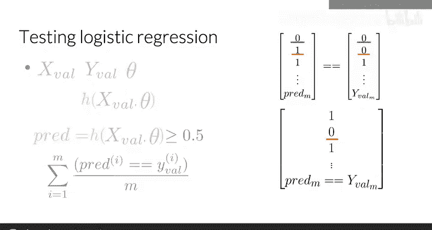

**公式：**
`accuracy = (sum(prediction == Y_val)) / m`

这个指标可以估计你的逻辑回归模型在未见数据上正确工作的概率。例如，准确率为0.5意味着模型预计在50%的情况下表现良好。

以下是计算示例：
假设对于5个样本，你的真实标签 `Y_val` 和预测向量如下所示：

**代码：**
```
Y_val = [0, 1, 0, 1, 1]
prediction = [0, 1, 1, 1, 1]
```

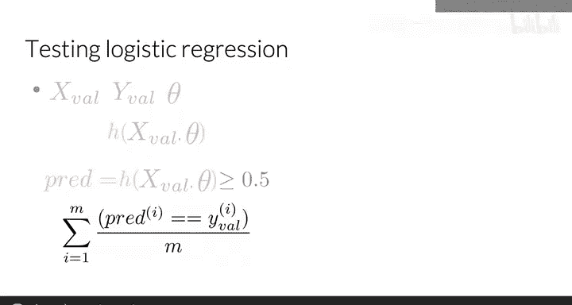

你需要逐个比较它们的值是否一致。

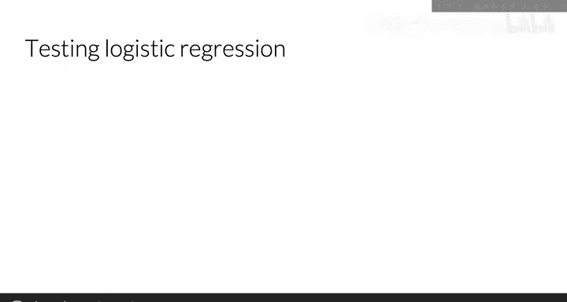

比较后会得到一个由1（正确）和0（错误）组成的向量，在本例中，第三个样本的预测与标签不一致。

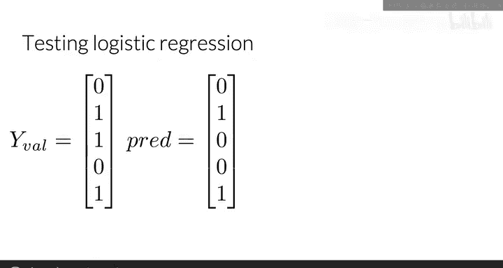

**代码：**
```
comparison = [1, 1, 0, 1, 1]
```

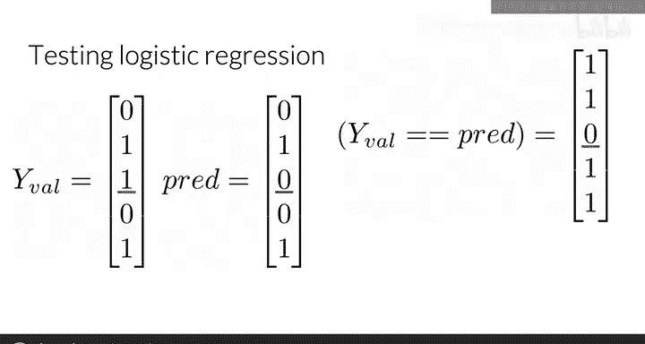

接下来，将预测正确的次数相加，再除以验证集中的总观测数。

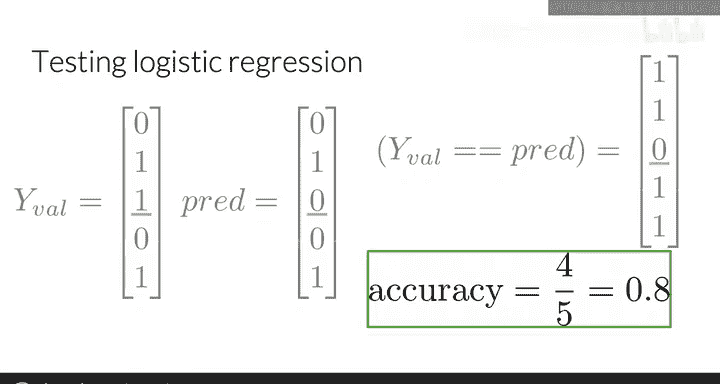

**计算：**
`accuracy = (1+1+0+1+1) / 5 = 0.8`

因此，你得到的准确率等于80%。

---

本节课中我们一起学习了如何对逻辑回归模型进行测试。我们掌握了使用Sigmoid函数和阈值进行预测的方法，并学会了通过比较预测结果与真实标签来计算模型的准确率，从而评估模型的泛化性能。

恭喜你完成本周的学习！本周你掌握了许多概念：首先学习了如何预处理文本，然后学习了如何从文本中提取特征，接着学习了如何使用这些特征训练模型，最后在本节课学习了如何测试模型。在本周的编程练习中，你将有机会实践我们讨论的所有概念。你可以自由地开始进行编程练习。

本周最后还有一个可选视频，讲解了逻辑回归成本函数背后的直观原理。如果你不想观看该视频，可以直接进入下周的学习，在那里你将了解一种新的分类算法——朴素贝叶斯。