#  013：逻辑回归成本函数 🧮

在本节课中，我们将要学习逻辑回归成本函数的设计原理。我们将深入理解为什么成本函数被设计成特定的形式，并分析当预测正确和错误时，成本函数如何变化。

---

## 成本函数公式解析 🔍

上一节我们介绍了逻辑回归的基本概念，本节中我们来看看其成本函数的具体构成。虽然成本函数的公式初看起来有些复杂，但将其分解为各个组成部分后，其实相当直观。

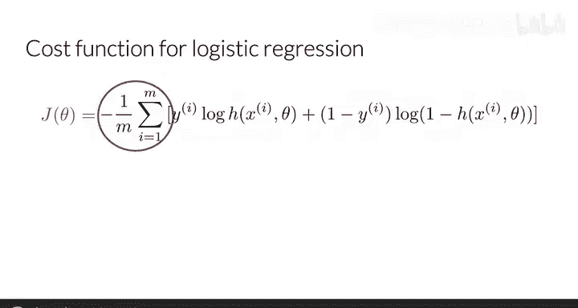

逻辑回归的成本函数公式如下：

$$J(\theta) = -\frac{1}{m} \sum_{i=1}^{m} \left[ y^{(i)} \log(h_\theta(x^{(i)})) + (1 - y^{(i)}) \log(1 - h_\theta(x^{(i)})) \right]$$

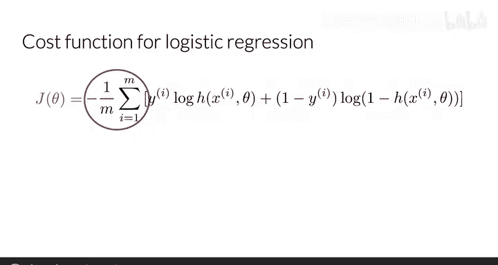

让我们逐一分析这个公式的各个部分。

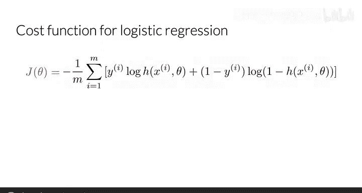

### 公式的整体结构

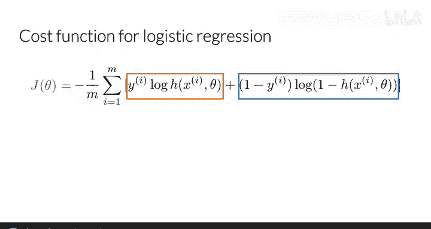

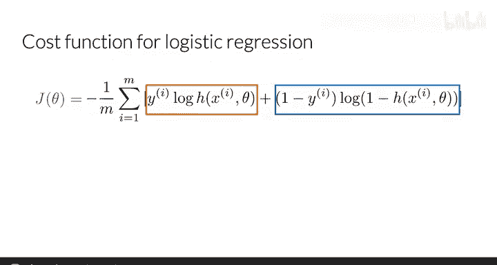

以下是公式的整体结构解析：

*   **求和符号 $\sum_{i=1}^{m}$**：表示对训练集中所有 $m$ 个训练样本的成本进行求和。
*   **系数 $-\frac{1}{m}$**：与求和结合后，表示计算的是所有样本的平均成本。负号确保了最终的成本值 $J(\theta)$ 总是一个正数，这一点我们稍后会看得更清楚。
*   **方括号内的两项**：这是成本函数的核心，包含两个相加的项。每一项都对应着一种标签情况（$y=1$ 或 $y=0$）下的损失计算。

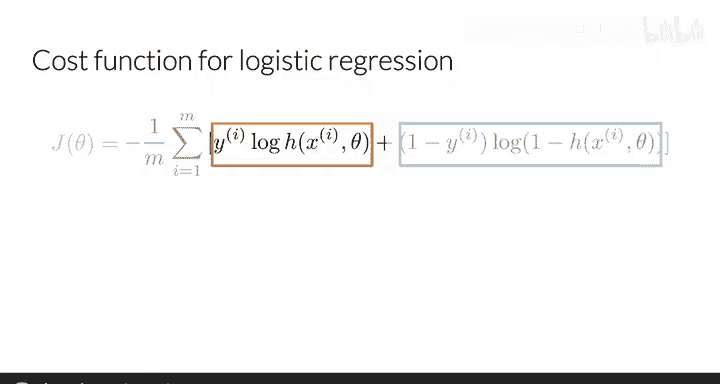

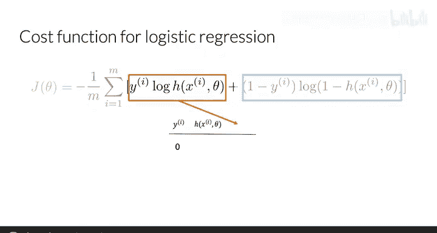

为了理解每一项如何为每个训练样本的成本做出贡献，我们接下来将它们分开来看。

---

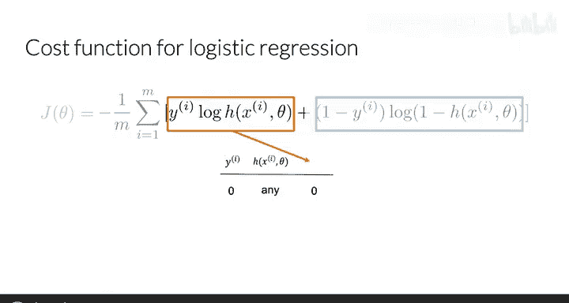

## 第一项：当真实标签 $y=1$ 时 📈

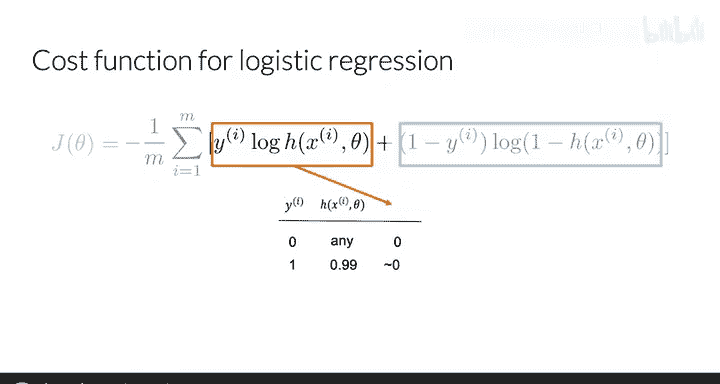

现在，我们重点分析公式中的第一项：$y^{(i)} \log(h_\theta(x^{(i)}))$。

这一项是真实标签 $y^{(i)}$ 与预测值 $h_\theta(x^{(i)})$ 的对数的乘积。

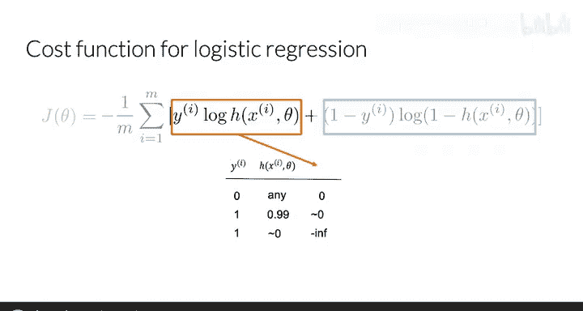

*   **当真实标签 $y=0$ 时**：无论逻辑回归函数 $h_\theta(x)$ 返回什么值，由于 $0$ 乘以任何数都是 $0$，因此整个第一项的结果为 $0$。这意味着当标签为 $0$ 时，第一项对总成本没有贡献。
*   **当真实标签 $y=1$ 时**：这一项简化为 $\log(h_\theta(x^{(i)}))$。
    *   如果模型的**预测值 $h_\theta(x)$ 接近 $1$**（即预测正确），那么 $\log(1) = 0$，该项的值接近 $0$，损失很小。
    *   如果模型的**预测值 $h_\theta(x)$ 接近 $0$**（即预测错误），那么 $\log(0)$ 会趋近于负无穷大。直观上，这意味着当标签为 $1$ 但预测为 $0$ 时，成本会变得极高。

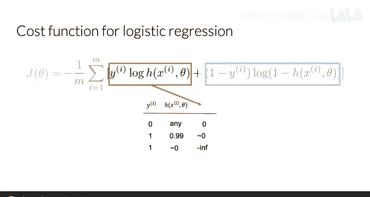

由此可见，**第一项专门负责处理真实标签 $y=1$ 的情况**。当预测与标签一致时，损失小；当预测与标签不一致时，损失急剧增大。

---

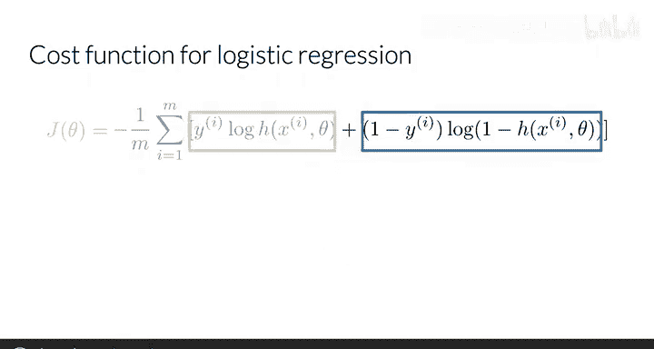

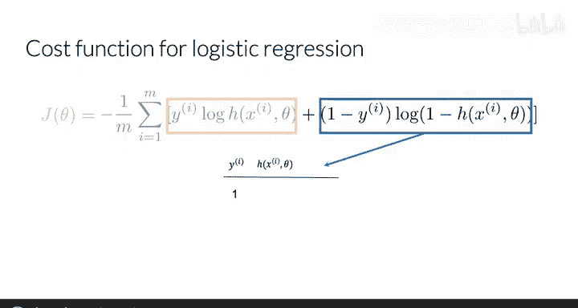

## 第二项：当真实标签 $y=0$ 时 📉

理解了第一项后，我们再来看看成本函数公式中的第二项：$(1 - y^{(i)}) \log(1 - h_\theta(x^{(i)}))$。

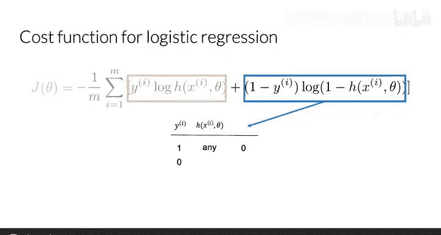

*   **当真实标签 $y=1$ 时**：$(1-y)$ 项变为 $0$，因此无论 $h_\theta(x)$ 返回何值，整个第二项的结果都是 $0$。这意味着当标签为 $1$ 时，第二项对总成本没有贡献。
*   **当真实标签 $y=0$ 时**：这一项简化为 $\log(1 - h_\theta(x^{(i)}))$。
    *   如果模型的**预测值 $h_\theta(x)$ 接近 $0$**（即预测正确），那么 $\log(1-0) = \log(1) = 0$，该项的值接近 $0$，损失很小。
    *   如果模型的**预测值 $h_\theta(x)$ 接近 $1$**（即预测错误），那么 $\log(1-1) = \log(0)$ 会趋近于负无穷大。这意味着当标签为 $0$ 但预测为 $1$ 时，成本会变得极高。

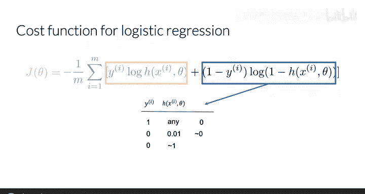

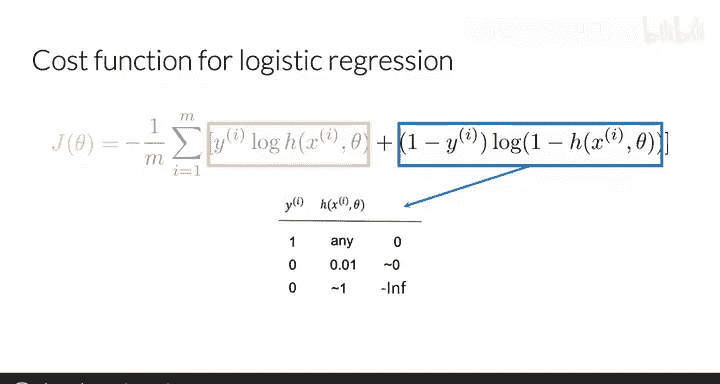

由此可见，**第二项专门负责处理真实标签 $y=0$ 的情况**。其行为模式与第一项对称。

---

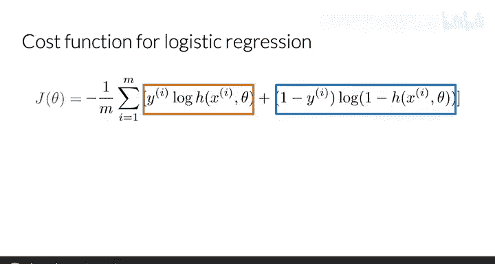

## 成本函数的直观理解 🎯

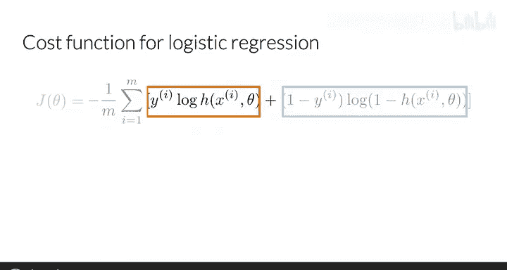

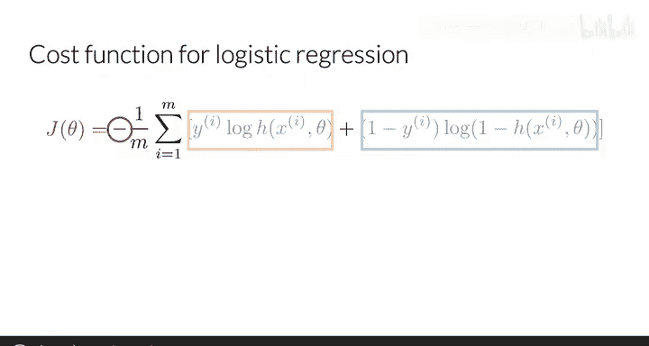

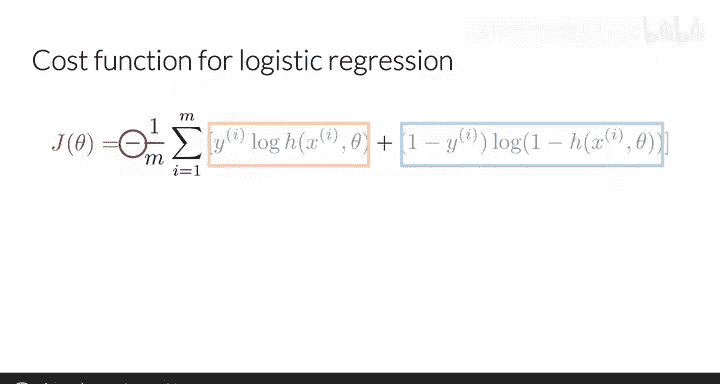

通过以上分析，我们可以看到，成本函数中有一项专门对应标签 $y=1$，另一项专门对应标签 $y=0$。在每一项中，我们都在计算一个介于 $0$ 和 $1$ 之间的值的对数，其结果总是一个负数。公式最前面的负号确保了最终的平均成本 $J(\theta)$ 总是一个正数。

现在，让我们从图形上看看对于标签 $0$ 和 $1$，成本随预测值变化的情况。

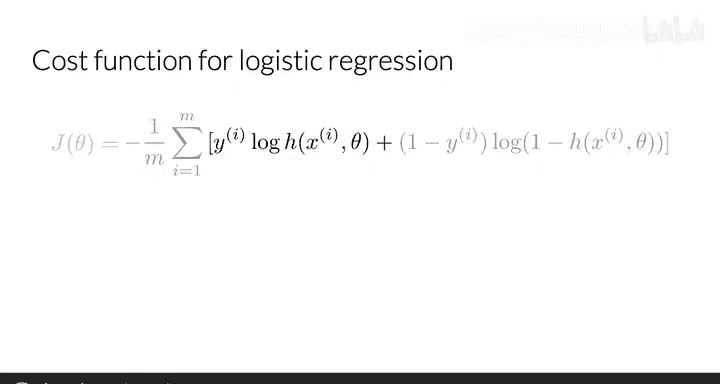

### 当真实标签 $y=1$ 时

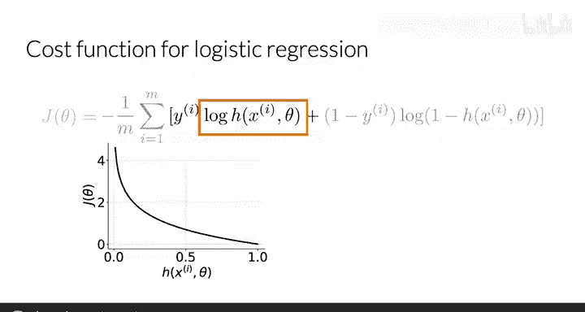

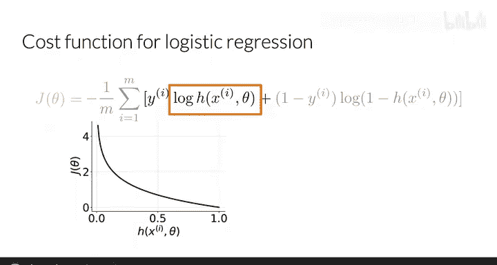

此时，单个样本的成本简化为 $J(\theta) = -\log(h_\theta(x))$。
*   **当预测值 $h_\theta(x)$ 接近 $1$**：损失接近 $0$，因为预测与标签高度一致。
*   **当预测值 $h_\theta(x)$ 接近 $0$**：损失趋近于无穷大，因为预测与标签严重不符。

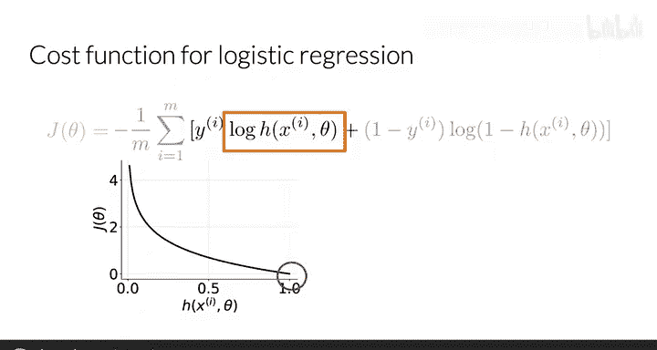

### 当真实标签 $y=0$ 时

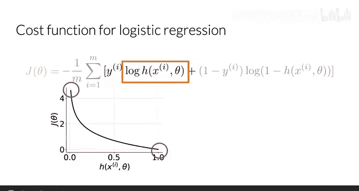

此时，单个样本的成本简化为 $J(\theta) = -\log(1 - h_\theta(x))$。
*   **当预测值 $h_\theta(x)$ 接近 $0$**：损失接近 $0$，因为预测与标签高度一致。
*   **当预测值 $h_\theta(x)$ 接近 $1$**：损失趋近于无穷大，因为预测与标签严重不符。

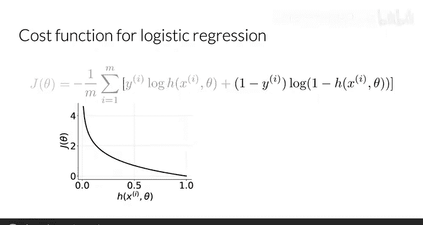

---

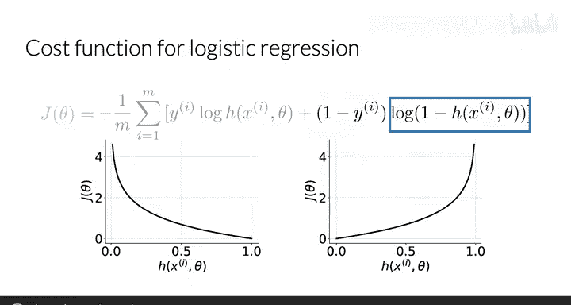

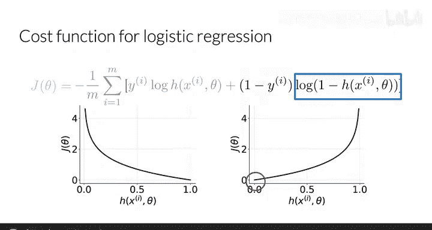

## 总结 ✨

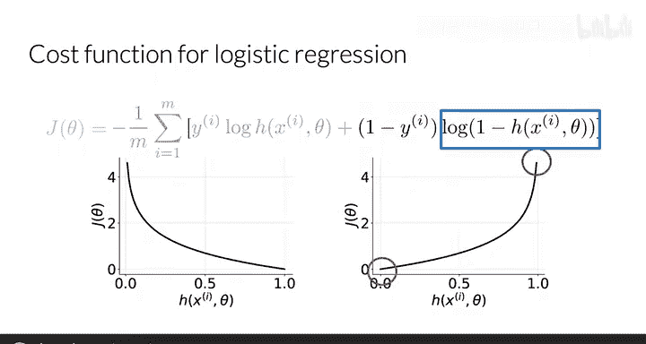

本节课中我们一起学习了逻辑回归成本函数的工作原理。

我们看到了当预测值 $\hat{y}=1$ 而真实标签 $y=1$ 时会发生什么，也看到了当预测值 $\hat{y}=0$ 而真实标签 $y=0$ 时会发生什么。成本函数通过这种巧妙的设计，为正确预测分配很低的成本，为错误预测分配很高的成本，从而驱动模型在训练过程中学习到正确的参数。

在接下来的课程中，你将学习朴素贝叶斯算法，这是另一种分类算法，同样可以用于预测一条推文的情感是积极的还是消极的。