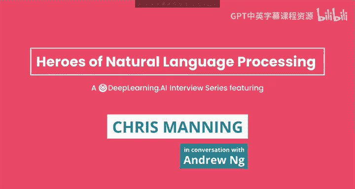
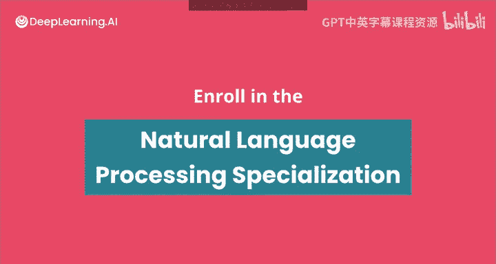

#  015：自然语言处理先驱访谈 - 克里斯·曼宁 🧠💬

在本节课中，我们将跟随吴恩达（Andrew Ng）的访谈，深入了解斯坦福大学教授、人工智能实验室主任克里斯·曼宁（Chris Manning）的学术生涯、研究思想以及对自然语言处理（NLP）领域的深刻见解。我们将探讨他从语言学转向计算语言学的历程、在深度学习应用于NLP方面的开创性工作，以及对未来研究方向的展望。

---

## 学术生涯的起点：从语言学走向AI 🤔➡️💻

上一节我们介绍了本次访谈的背景，本节中我们来看看克里斯·曼宁教授是如何开启他的AI研究之路的。

我的背景在某种意义上并非始于人工智能领域。本科时，我主修计算机科学和数学，但也对语言学产生了浓厚兴趣，并完成了语言学的专业和荣誉学位。因此，我的出发点很大程度上是认知科学的视角。人类语言令人着迷，这些小小的人类个体似乎在不那么出色的认知能力时期就掌握了它。人类语言学习是如何发生的？在语言学领域，20世纪下半叶的主导思想是诺姆·乔姆斯基（Noam Chomsky）的思考。乔姆斯基是语言学界的杰出人物，就像20世纪上半叶的R.A.费希尔（R.A. Fisher）在统计学领域一样。乔姆斯基持有非常坚定的立场，认为人类不可能仅从数据中学习语言，人类大脑中必然存在先天的机制来支持语言学习。这是一个很大的话题。即使在那个时候，考虑到人类语言是进化史上极其晚近的产物，这对我来说也似乎难以置信。我对如何学习语言的想法很感兴趣，这引导我开始关注机器学习。

那是在20世纪80年代末，我本科即将毕业的时候。如今，机器学习是一个庞大且占主导地位的领域，以至于人工智能和机器学习这两个术语几乎可以互换，因为AI中的绝大部分内容都是机器学习。但在当时，情况完全不同。机器学习只是AI中一个非常边缘、几乎无人涉足的分支。当时只有卡内基梅隆大学（CMU）的赫希（Heime）、卡博内尔（Carbonell）和汤姆·米切尔（Tom Mitchell）编辑的两三本书，汇集了一些关于机器学习和早期决策树算法（如ID3算法）的论文。机器学习几乎不存在，但我对这些关于计算机如何学习的想法很感兴趣。正是这个切入点，引导我最终成为了一名AI研究员。

在当时，使用数据来学习语言，而不是手工编写像上下文无关语法（CFG）这样的规则来理解语言，并非直观的选择，而这正是当时人们试图做的事情。

---

## 早期信念：机器学习在NLP中的应用 ✅

上一节我们了解了曼宁教授进入AI领域的契机，本节中我们来看看他早期对机器学习在NLP中应用的坚定信念。

即使在那个时候，我就是NLP中机器学习的早期信奉者。

绝对如此。目前，基于Transformer的架构确实已成为神经网络中的主导力量。我们在这里的讨论顺序可能有些跳跃，也许我们应该稍后再回到这个话题。但Transformer架构有趣的一点在于，它围绕注意力（attention）机制构建。你可以将注意力视为一种**软树结构**，它允许你将一个词指向另一个词，从而构建树状结构。我们，尤其是我的博士生约翰·休伊特（John Hewitt），做了一些非常有趣的工作，研究当Transformer模型在数十亿词的人类语言数据上训练时，它们学到了什么。实际上，你可以证明这些模型学到了关于语言结构的各种知识。例如，它们会学习一些共指（co-reference）事实，比如“她”指代“苏珊”，“它”指代“瓶子”。它们也确实从纯文本的词序列中，学到了语言的这种**层次化的上下文无关语法结构**。这实际上是一个非常简洁的发现，因为语言可以被合理地描述为这种嵌套的、类似树状结构的上下文无关语法。一个大型神经网络或Transformer网络仅从数据中就发现了这方面的特性。

事实上，在现代Transformer观点形成之前，你的斯坦福团队做了一些非常有影响力的早期工作。我知道在深度学习时代之前，你在统计机器翻译方面做了大量工作。随着深度学习开始进入NLP领域，你和你的博士生张长（音译，Tng Long？）实际上发表了关于神经机器翻译（NMT）的最早论文之一，并帮助奠定了现代Transformer模型的一些基础，特别是双线性注意力矩阵（bilinear attention matrix）。请谈谈这方面。

---

## 从统计机器翻译到神经机器翻译的演进 🔄

上一节我们提到了曼宁教授在神经机器翻译方面的早期贡献，本节中我们来详细看看这个演进过程。

当然。实际上，在重新开始研究神经网络之前，我在90年代确实做过一点点神经网络工作，那时戴夫·鲁梅尔哈特（Dave Rumelhart）在斯坦福。但我几乎没有深入。所以在21世纪的头十年，我所做的一切都是使用概率建模技术，将概率置于符号结构之上来描述人类语言，这是那个十年中占主导地位的方法。我花了大约十年时间研究的一部分工作是构建机器翻译模型。当时的主导模型被称为**基于短语的统计机器翻译**。在那个时期，很多技术都发展得相当成熟。有一个相当完善的架构，即因子分解的机器翻译模型，其中一部分是短语表（phrase tables），它给出了将一种语言的短语翻译成另一种语言短语的概率。它们处理翻译的局部部分，然后与所谓的**语言模型**结合。语言模型是NLP中一个非常占主导地位的专业术语，指的是为语言中的词序列提供概率分布的东西。这一直是NLP中一个非常强大且占主导地位的思想，因为它让你在任何需要词接词的地方，知道哪些词是可能或不可能的。语言模型这个基本思想被用于上下文敏感的拼写纠正（比如谷歌根据上下文漂亮地纠正你的拼写）、语音识别系统，以及这些机器翻译系统。我们有了架构，并且它们运行得相当好。

当谷歌首次推出基于机器学习、从数据中学习的机器翻译系统时，他们使用的就是这些基于短语的统计机器翻译系统。稍微回溯一下故事，当谷歌首次推出机器翻译时，他们授权了一个非常传统的、基于规则的旧机器翻译系统，这个系统最初由Systran公司开发，其根源可以追溯到20世纪50年代最早的机器翻译探索。但他们用了几年后，看到了概率模型在机器翻译方面取得的所有进展，于是转向了那个方向，然后情况变得好多了。我记得弗朗茨·奥赫（Franz Och）是真正的思想领袖，他帮助谷歌将传统模型扩展到海量数据上进行训练，并显著提高了谷歌翻译的性能。

是的，绝对如此。在那个时候，弗朗茨·奥赫是进行基于短语的统计机器翻译模型研究的领军人物之一。他去了谷歌，领导了一个团队，使谷歌拥有了领先的大规模统计短语机器翻译模型实现。它们实际上运行得相当合理，已经实现了这样的目标：你可以输入任何网页和几十种语言，得到大约三分之二可理解的内容，基本上能弄清楚它在说什么话题。这对于2007年到2010年来说很不错。但在2010年到2014年期间，也就是我和吴恩达刚刚讨论树递归神经网络的那个时期，基于短语的统计机器翻译基本上停滞了，没有真正的好想法来取得进一步进展。通过投入更多数据只取得了一点进展。更多数据确实有帮助，这在现代机器学习中仍然成立，但当时的模型容量不足，帮助有限。人们，包括我在那些年里，投入大量精力研究的一个想法是：解决方案肯定是要更多地利用人类语言的语法结构来改进机器翻译系统。因此，主导的研究领域是尝试进行基于句法的机器翻译系统。

这似乎是个好主意，但基本上几乎从未奏效。结果就是，对于某些语言对，它根本不起作用，不比基于短语的统计机器翻译系统更好。而对于其他一些语法结构差异更大的语言对，比如英中机器翻译，它确实有所帮助，可以显示出一些真正的增益。但最终的解决方案，结果证明是少关注句法，多关注数据。

正确。当人们开始探索使用神经方法进行机器翻译时，那项工作基本上就被淘汰了。这真的是……我本来想说这是神经方法在NLP中的第一个巨大成功。这取决于你是否将语音视为NLP的一部分，因为语音识别确实是神经网络方法应用于人类语言问题的第一个巨大成功。但对于基于文本的工作来说，第一个令人震撼的成果确实是构建神经机器翻译系统。这是一个非常成功的领域，因为这里有大量的数据可用，你可以开始训练大型神经网络模型。这项工作最初由谷歌的伊利亚·苏茨克韦尔（Ilya Sutskever）和几位同事完成。对于任何序列（如词序列或DNA序列）的建模，主导模型是**循环神经网络**。RNN是处理简单序列的模型，并以有限的方式记住之前看到的内容。它有点像连续神经版本的隐马尔可夫模型。他们本质上表明，如果你完全不利用人类语言的结构——这有点颠覆了所有基于句法模型的工作——仅仅构建非常大的、深的循环神经网络，就能给你一个相当不错的机器翻译系统。在当时，NLP中的大多数神经网络建模，如果我们有两层，就称之为“深”，如果有三层或四层，我们就是在真正推进了。而他们立即将其推到了八层深的循环神经网络。这时你开始遇到系统问题，需要在一台配备八个GPU的机器上运行——这个趋势一直延续，我们或许可以多谈谈。他们表明，一个更大的神经网络，仅仅训练两个序列模型（一个是编码源语言的编码器，另一个是生成目标语言词序列的生成器），就能给出一个相当好的机器翻译系统。虽然当时还没有达到最先进的水平，但已经足够接近，显得非常诱人，因为他们所做的只是将两个神经网络连接起来。

如果你不计算循环神经网络单元（特别是LSTM，长短期记忆单元）的库代码，这类工作非常有影响力，使得这项工作得以实现。你只需要围绕神经网络库编写大约500行Python代码，就能拥有一个几乎是最先进的机器翻译系统，这看起来超级有趣。但他们也看到了其中存在一些粗糙和缺失的部分。

因此，在那之后不久，在蒙特利尔与约书亚·本吉奥（Yoshua Bengio）一起工作的Kyunghyun Cho（以及我应该提到的论文第一作者Dzmitry Bahdanau，当时是蒙特利尔的一名年轻学生）提出了可以构建基于注意力的模型的想法。在任何序列点，你都可以计算与其他词（可能在同一个序列，也可能在不同序列）的连接，然后利用这种注意力，你可以计算一个新的向量来影响接下来发生的事情。特别是在机器翻译的上下文中，你可能已经开始翻译，你的翻译开始说“飞行员”，然后你计算注意力回到另一种语言的源语句，并根据你已翻译的内容，确定接下来要翻译源句中的哪些词。这样，你就不必在当前神经网络状态中记住整个源句，而是可以做人类翻译者实际做的事情：动态地回看源句，并确定接下来翻译什么。因此，注意力这个想法是具有变革性的。它也被越来越多地用于视觉系统、知识图谱系统和其他神经网络工作领域。

他们做到了这一点。那么，在Cho和Bahdanau的论文之后不久，你和张长（音译）写了一篇关于双线性注意力的论文，这是怎么来的？

---

## 双线性注意力与GloVe的简洁之美 ✨

上一节我们探讨了注意力机制的引入，本节中我们来看看曼宁教授团队在注意力机制和词向量表示方面的简化与创新。

在更早的工作中，实际上始于另一位学生丹尼尔·陈（Daniel Chen？），我们研究了神经张量网络（neural tensor networks）的想法，我们希望能够组合向量并让它们相互影响产生另一个向量，我们通过在它们之间放置一个张量（矩阵的多维推广）来实现。这个想法当时在我小组的其他工作中也在进行。但在这里，我们只是想得到一个注意力分数。在Bahdanau和Cho的工作中，他们所做的是说：我们想要这两个向量之间的注意力分数，让我们通过一个小型神经网络（一个小型多层感知机）来获得一个注意力分数。而在我看来，等等，我可以只做这个简单的事情：双线性注意力，即我有这两个向量，如果我在它们之间放一个矩阵，然后进行向量乘以矩阵再乘以向量的运算，我就能直接得到一个数字。这就是**双线性注意力**，现在有时也被称为**乘法注意力**。

这是一个更简单、更直接可解释的注意力概念，因为在某种意义上，注意力的最简单想法是说：你有两个向量，只需将它们点积在一起，就能得到一个相似性分数。但这太死板了，因为你可能只想关注向量的某些部分，或者想知道一个向量的顶部是否与另一个向量的底部相似。因此，通过在中间插入一个矩阵，你可以调节相似性计算。这是一种自然的相似性度量，并且在神经网络中非常容易学习。在某种意义上，这是一个普遍现象。想法如何发展和传播总是很复杂，任何时候都有很多想法在流传。但在某种意义上，现代基于Transformer的模型中占主导地位的做法，本质上就是建立在这个概念之上，但在其之上增加了一个额外的想法。这是一个类似的想法，如果你在中间使用一个巨大的矩阵，这需要很多参数，但如果你使用该矩阵的低秩近似，那就非常接近现代Transformer模型了。

完全正确。在我们最初的工作中，我们只是在中间使用了一个满秩矩阵。但问题是，一个满秩矩阵有很多参数。减少参数的明显方法是说：不，我可以把这个矩阵看作是两个低秩矩阵的乘积。一旦你有了这个想法，与其将它们相乘，你可以说，我可以将这两个低秩矩阵分别应用到两边的向量上，这在计算上更高效。这正是现代Transformer模型所做的：取两个向量，分别乘以一个低秩矩阵，然后取它们之间的点积。这完全等同于说：我通过乘以两个低秩矩阵来形成矩阵，然后进行我的向量-矩阵-向量乘积，但以更高效的方式完成。

事实上，我觉得这在你职业生涯中并非第一次通过观察矩阵乘法来引领领域。如果我看你们团队在词嵌入GloVe方面的工作，我觉得这个想法的核心也是将相对复杂的一套神经网络类的东西简化为一组矩阵运算。请谈谈这个。我至今仍觉得GloVe是一篇非常优雅的论文，因为它真正简化了之前学习词嵌入的一套非常复杂的想法，变成了更简单的形式，比如取词嵌入之间的内积。

谢谢。我确实认为GloVe论文在某种意义上，其主要贡献之一是提供了更好的理解。我的意思不是说它比当时最近开发的其他方法效果更好，但它很有趣，让我们试着思考这里发生了什么，以及这些方法如何与探索过的其他事物联系起来。

是的，所以我们这里的总主题是词向量，即提出一个向量（实数向量）表示，给出词的含义。现在，在你的NLP深度学习课程中，这通常是第一个真正看到的概念，因为它是一个非常有用的、相当简单的概念。在2010年至2013年左右的几年里，有几项工作相当成功地做到了这一点，但都是以非常机械的神经网络方式完成的：这是架构和算法，运行它，在那些日子里通常要运行数周，因为我们还没有非常快的并行计算机，最后会弹出很好的词向量。我们感兴趣的是——这是与博士后杰弗里·彭宁顿（Jeffrey Pennington）的合作——我们实际上试图从这些模型的数学角度更好地理解发生了什么。我们着迷的一点是，实际上有一个更古老的传统，即LSA（潜在语义分析）传统，它利用经典线性代数来获得词义的向量表示。LSA模型在线性代数术语中，无非就是**奇异值分解**，或者说是对词-词共现计数矩阵使用奇异值分解，然后通过去掉小的奇异值来降维。这很有趣。

---

## 模型规模的扩张与未来展望 📈🤔

上一节我们回顾了词向量表示的发展，本节中我们来看看NLP模型规模不断扩大的趋势以及曼宁教授对此的看法。

一个贯穿你多年来观察和参与的所有工作的趋势是NLP模型的规模化。NLP模型似乎变得越来越大，比如GPT-3，但实际上，在序列中还有许多模型。你认为这种趋势会持续多久？你认为有一天，我们是否会回过头来构建更小的模型？

2018年，BERT问世，它表明你可以在一系列任务上做得非常出色，包括问答、自然语言推理、文本分类、命名实体识别、句法分析等，利用了这个预训练的大型语言模型。你只是在一个几十亿词的文本上训练一个大型Transformer来预测句子中被遮蔽的词，但仅仅做这个简单的任务，就为你提供了这些非常好的语言表示，然后可以非常简单地与像softmax分类器这样的东西一起使用，为下游NLP任务提供出色的解决方案。这是一个惊人的成功。我们许多人谈论了大约十年的表示学习（representation learning）思想，就是说在神经网络中，它是关于学习这些有用的中间表示。这真正展示了这对于构建语言表示是有效的，然后可以非常容易地应用于更高的自然语言理解下游任务。

但BERT已经使用了大量的数据和计算。它是在数十亿词的语言上训练的，并且在大量计算机上训练了很长时间。自BERT以来，已经有了很多进一步的进展，但本质上只是来自于越来越多地扩大计算规模。我总是会遗漏一些东西，也有一些新的想法，比如相对注意力（relative attention）改进了效果。但粗略地说，真正推动进步的是投入越来越多的计算资源，在更多数据上运行更大的模型。

是的，所以吴恩达经常在你的一些演讲中使用“AI是新电力”的口号。在最近讨论这种模型越来越大趋势的一些演讲中，我把它反过来，说“电力是新AI”。因为如果你看看正在发生的事情，人们现在训练的模型不仅仅是比BERT模型大10倍或100倍，而是大1000倍、10000倍。训练这些模型所需的计算和能源需求也相应增加。这当然推动了进步。我认为这种趋势不可能持续太久。部分原因是我们快要用尽文本数据，也快要用尽计算机来训练越来越大的模型。尽管从BERT到GPT-3，我记得计算规模大幅扩大，而数据规模扩大得相对温和。所以也许我们有足够的文本数据，我们只需要再增加1000倍或10000倍的大规模计算机？

我不这么认为。你说得对，计算规模的扩大远远大于数据规模的扩大。但尽管如此，现在使用的数据量实际上相当可观。当然有更多数据，但他们实际上使用了相当数量的高质量数据。但是，是的，在某种程度上，聪明的系统人员可以给我们的GPU带来三个数量级的更多算力，即使没有更多文本数据，这些模型也会变得更好，并且可能在未来的几年里变得更好。但我最终不相信这是通往人工智能的道路，也不是进一步改进自然语言处理的有趣途径。毫无疑问……让我问一个可能略有争议的问题。几周前，我们的一位共同朋友评论了这个方向，说：“哦，也许规模化是通往AGI（通用人工智能）的捷径？”你参与了那次对话，我们的一位共同朋友发表了那个评论。你对此有何看法？

---

## 对通用人工智能（AGI）路径的思考 🧩

上一节我们讨论了模型规模化的极限，本节中我们来看看曼宁教授对规模化是否通向通用人工智能的看法。

我认为这个想法有其来源。OpenAI最近发布的GPT-3模型真正酷的地方在于，他们随后的工作受到了这个发现的启发：使用这些真正庞大的语言模型，它们实际上可以实现一种通用性，能够用于各种任务，而无需实际训练它们执行任何特定任务。你知道，传统上，如果我们想用神经网络做不同的任务，我们只需获取该任务的数据并训练一个模型。有了像BERT这样的大型预训练语言模型，我们达到了一种中间状态：我们有一个预训练好的、非常好的语言表示基线，但我们仍然需要为每个不同的任务进行微调。我们将其微调为问答模型，然后重新开始，为其他任务（如摘要等）进行微调。

他们在GPT-3中发现，实际上你不再需要这样做了。相反，你可以通过给出几个例子来提示模型你想要它做什么。你会说：好的，我对翻译感兴趣，所以这里有一个句子，我希望你生成的是这个句子的西班牙语翻译。如果你给它几个你希望它做什么的例子，模型