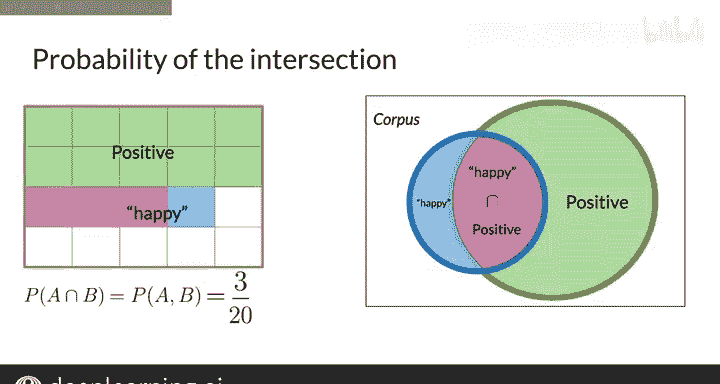

#  017：概率与贝叶斯规则 🎲

在本节课中，我们将学习概率论的基础知识，特别是条件概率和贝叶斯规则。这些概念是自然语言处理（NLP）中许多应用（如情感分析）的核心。我们会从简单的概率定义开始，逐步推导出贝叶斯规则，并了解其重要性。

## 概率与条件概率概述

概率是许多NLP应用的基础。本节中，我们将回顾概率和条件概率是什么，它们如何运作，以及如何用数学公式表达。

想象你有一个庞大的推文语料库，每条推文都可以被归类为表达积极或消极情绪，但不能同时属于两者。在这个语料库中，“happy”这个词有时出现在积极推文中，有时出现在消极推文中。让我们探究一下这种情况发生的原因。

### 概率的计算方式

思考概率的一种方式是计算事件发生的频率。

假设你将事件A定义为一条推文被标记为积极情绪。那么事件A的概率，在此处表示为 **P(A)**，其计算公式为语料库中积极推文的数量除以语料库中推文的总数。

**公式：P(A) = (积极推文数量) / (推文总数)**

在这个例子中，假设总共有20条推文，其中13条是积极的，那么这个数字就是13除以20，等于0.65。你也可以将这个值表示为百分比，即65%的推文是积极的。

值得注意的是，这里的互补概率，即推文表达消极情绪的概率，**P(消极)**，正好等于1减去积极情绪的概率。

**公式：P(消极) = 1 - P(A)**

要使这个等式成立，所有推文必须被归类为要么积极，要么消极，不能同时属于两者。

### 联合概率

让我们以类似的方式定义事件B，即计算包含“happy”这个词的推文数量。在这个例子中，包含“happy”的推文总数（在此表示为“unhappy”）是4。

以下是另一种看待问题的方式。请看图表中推文被标记为积极**并且**包含“happy”这个词的部分。

在这个图表的背景下，一条推文被标记为积极**并且**包含“happy”这个词的概率，仅仅是交集部分的面积除以整个语料库的面积之比。

换句话说，如果语料库中有20条推文，其中3条被标记为积极**并且**包含“happy”，那么相关的概率就是3除以20，等于0.15。

**公式：P(A ∩ B) = (同时满足A和B的推文数量) / (推文总数)**

## 从条件概率到贝叶斯规则

上一节我们介绍了基本概率和联合概率。本节中，我们来看看条件概率，并从中推导出在NLP等领域广泛应用的贝叶斯规则。

### 条件概率

条件概率是指在已知另一个事件（B）发生的情况下，某个事件（A）发生的概率。记作 **P(A|B)**，读作“在B发生的条件下A的概率”。

其数学定义基于联合概率：

**公式：P(A|B) = P(A ∩ B) / P(B)**， 其中 P(B) > 0

这个公式的意思是：在事件B发生的“世界”里，事件A也发生的比例。

### 贝叶斯规则的推导

贝叶斯规则可以从条件概率的定义直接推导出来。我们知道：
1.  **P(A|B) = P(A ∩ B) / P(B)**
2.  同样，**P(B|A) = P(A ∩ B) / P(A)**

从第二个公式解出联合概率 **P(A ∩ B)**，我们得到：
**P(A ∩ B) = P(B|A) * P(A)**

现在，将这个表达式代入第一个公式中的 **P(A ∩ B)**：
**P(A|B) = [P(B|A) * P(A)] / P(B)**

这就是**贝叶斯规则**的标准形式：

**公式：P(A|B) = [P(B|A) * P(A)] / P(B)**

贝叶斯规则的意义在于，它允许我们利用“逆”条件概率 **P(B|A)** 和先验概率 **P(A)**、**P(B)** 来计算我们可能更关心的条件概率 **P(A|B)**。

## 贝叶斯规则在NLP中的应用

理解了贝叶斯规则背后的理论后，你就可以用它来执行具体任务，例如对推文进行情感分析，这将是本周的编程作业。在后续课程中，你还将使用其基本形式来实现自动更正功能。

现在你已经知道如何计算一个词（即“happy”）与积极情绪同时出现的联合概率了。在下一个视频中，我们将讨论朴素贝叶斯方法，它是贝叶斯规则在文本分类中的直接应用。

## 课程总结

本节课中，我们一起学习了：
1.  **基本概率**：通过事件发生频率来计算概率，例如 **P(A) = 计数(A)/总数**。
2.  **联合概率**：两个事件同时发生的概率 **P(A ∩ B)**。
3.  **条件概率**：在已知一个事件发生的情况下，另一个事件发生的概率 **P(A|B) = P(A ∩ B) / P(B)**。
4.  **贝叶斯规则**：一个强大的公式 **P(A|B) = [P(B|A) * P(A)] / P(B)**，它使我们能够从“逆”条件中推断概率。

这些概念是理解后续更高级NLP模型（如朴素贝叶斯分类器）的基石。请确保你理解了这些基础，以便顺利完成本周的情感分析作业。