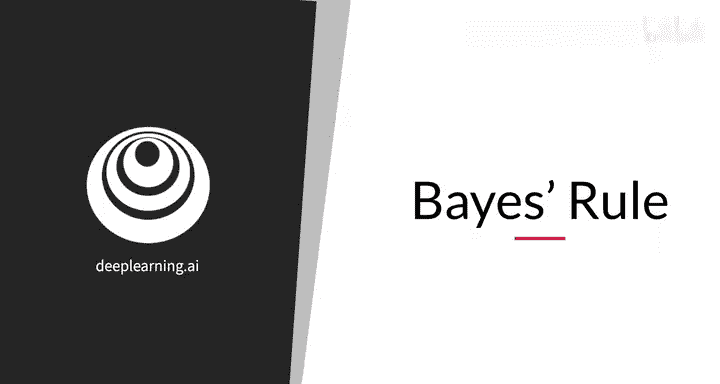
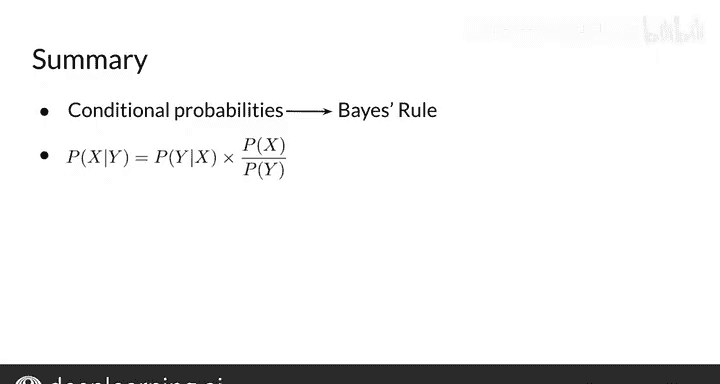

#  018：贝叶斯规则 🧮

在本节课中，我们将学习条件概率，并以此为基础推导和理解贝叶斯规则。贝叶斯规则是概率论中的一个核心定理，在自然语言处理等领域有广泛应用。

---

## 概述

我们将从条件概率的概念出发，通过一个情感分析的例子，逐步推导出贝叶斯规则。理解这个规则能帮助我们计算在已知某些信息（条件）下，事件发生的概率。

---

## 条件概率简介

上一节我们提到了概率的基本概念。本节中我们来看看**条件概率**。

条件概率可以理解为：在已知事件A已经发生的前提下，事件B发生的概率。或者说，当我们只考虑属于集合A的元素时，该元素也属于集合B的概率。

用一个情感分析的例子来说明：假设我们有一个推文语料库，其中一些是正面情感，一些包含“开心”这个词。

如果我只让你猜天气情况，你可能很难猜准。但如果我告诉你“我们现在在加州，并且是冬天”，那么你就能做出准确得多的猜测。这就是条件信息的作用。

---

## 推导贝叶斯规则

为了推导贝叶斯规则，我们首先需要仔细看看条件概率的计算。

现在，考虑一种情况：我们不再看整个语料库，而只考虑那些包含“开心”这个词的推文。这相当于说，**给定**一条推文包含“开心”这个词。

这就意味着我们只考虑蓝色圆圈内的推文，其中许多正面推文被排除在外了。

在这种情况下，**一条推文是正面情感的概率，给定它包含‘开心’这个词**，就简单地等于：
*   既是正面、又包含“开心”的推文数量
*   除以包含“开心”的推文总数。

通过这个计算可以看到，如果你的推文包含“开心”这个词，它有75%的可能性是正面情感。

我们可以对正面推文做同样的分析。紫色区域表示**一条正面推文包含‘开心’这个词的概率**。

在这种情况下，概率是3除以13，等于0.231。

---

## 条件概率的公式化

以上关于满足特定条件概率的讨论，都是在谈**条件概率**。

条件概率可以解释为：
*   在已知事件A已经发生的情况下，结果B发生的概率。
*   或者，**给定**我正在查看集合A中的一个元素，该元素也属于集合B的概率。

用之前见过的维恩图来看是另一种方式。

使用之前的例子：
*   一条推文是正面情感的概率，**给定**它包含“开心”这个词。
*   等于正面推文和包含“开心”的推文两者的**交集**的概率。
*   除以从语料库中随机抽取一条推文包含“开心”这个词的概率。

用公式表示为：
`P(正面 | 开心) = P(正面 ∩ 开心) / P(开心)`

---

## 交换条件

让我们仔细看看上一张幻灯片的方程。

你可以通过简单地交换两个条件的位置，写出一个类似的方程。

现在，你得到的是**一条推文包含‘开心’这个词的概率，给定它是一条正面推文**。

公式为：
`P(开心 | 正面) = P(正面 ∩ 开心) / P(正面)`

掌握了这两个方程，你现在就可以推导贝叶斯规则来组合它们了。

请注意，**交集代表相同的量**，无论怎么写。知道这一点后，你可以将它从等式中移除。

经过一些代数运算，你就能得到这个方程：
`P(正面 | 开心) = P(开心 | 正面) * P(正面) / P(开心)`

这就是在之前情感分析问题背景下的**贝叶斯规则**表达式。

---

## 贝叶斯规则的一般形式

更普遍地说，贝叶斯规则表明：
**给定y时x的概率**，等于**给定x时y的概率**乘以**x的概率与y的概率的比值**。

用公式表示为：
`P(x|y) = P(y|x) * P(x) / P(y)`

就是这样。你已经得到了贝叶斯规则的基本公式，做得很好。

---

## 总结与展望

本节课中我们一起学习了如何从条件概率表达式推导出贝叶斯规则。

在本课程的后续部分，你将把贝叶斯规则用于自然语言处理的各种应用中。

目前的主要收获是：
1.  贝叶斯规则基于条件概率的数学公式。
2.  利用贝叶斯规则，如果你已经知道`P(y|x)`以及`P(x)`和`P(y)`的比值，你就可以计算出`P(x|y)`。

恭喜！你现在对贝叶斯规则有了很好的理解。在下一个视频中，你将看到如何开始将贝叶斯规则应用于一个称为**朴素贝叶斯**的模型，这将使你能够仅使用概率来开始构建你的情感分析分类器。