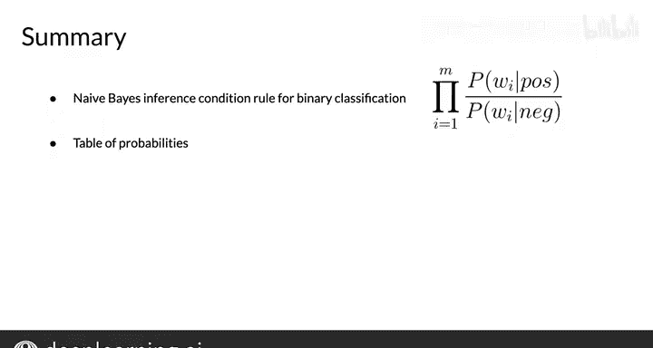

#  019：朴素贝叶斯介绍 🧮

在本节课中，我们将学习如何使用一种名为“朴素贝叶斯”的方法来解决文本分类问题。这是一种在文本分类任务中常用且高效的基线方法，其核心概念将在后续课程中反复应用。

上一周我们学习了如何使用逻辑回归对推文进行分类。本节中，我们将看看如何使用朴素贝叶斯方法解决相同的问题。

## 概述

朴素贝叶斯是监督式机器学习的一个例子，与之前作业中使用的逻辑回归方法有许多相似之处。它之所以被称为“朴素”，是因为该方法假设用于分类的所有特征都是相互独立的，而这在现实中很少成立。然而，你将看到，它作为一种简单的情感分析方法，效果依然很好。

## 构建词汇表与词频统计

与之前一样，你需要从两个语料库开始：一个用于正面推文，一个用于负面推文。

以下是构建过程：
1.  首先，需要提取词汇表，即语料库中出现的所有不同单词及其计数。
2.  分别统计每个单词在正面语料库和负面语料库中出现的次数。
3.  接着，计算正面语料库中所有单词的总数，并对负面语料库进行同样的操作。例如，正面推文总共有13个单词，负面推文总共有12个单词。

这是朴素贝叶斯的第一步，它非常重要，因为它允许你计算给定类别下每个单词的条件概率。

## 计算条件概率

现在，将每个单词在某个类别中的频率除以其所在类别的单词总数。

以下是计算示例：
*   对于单词“I”，其在正面类别中的条件概率为 `3/13`，约等于 `0.24`。
*   对于单词“I”，其在负面类别中的条件概率为 `3/12`，等于 `0.25`。

将此过程应用于词汇表中的每个单词，即可完成条件概率表的构建。该表的一个关键属性是，对每个类别的所有概率求和，结果将为 `1`。

## 分析概率表

让我们进一步分析这个表格，看看这些数字的含义。

首先，注意有多少单词具有几乎相同的条件概率，例如“I”、“am”、“learning”和“NLP”。有趣的是，这些概率相等的单词对情感判断没有贡献。

与这些中性词相反，看看其他一些单词，如“happy”、“sad”和“not”。它们的概率之间存在显著差异。这些是你的“强力词”，倾向于表达一种或另一种情感，在判断推文情感时具有很大权重。

现在看看“because”。如你所见，它只出现在正面语料库中，因此其在负面类别中的条件概率为 `0`。当这种情况发生时，你无法在两个语料库之间进行比较，这会给计算带来问题。为了避免这个问题，你需要对概率函数进行**平滑处理**。

## 应用朴素贝叶斯进行分类

假设你收到朋友的一条新推文：“I‘m happy today. I’m learning.” 你想使用概率表来预测整条推文的情感。

这个表达式称为**朴素贝叶斯二元分类推理条件规则**。它表示，你将计算推文中每个单词在正面类别的概率与负面类别的概率之比，然后将所有这些比值相乘。

让我们为这条推文计算这个乘积。

对于每个单词，从表中选取其概率：
*   “I”：正面概率 `0.2`，负面概率 `0.2`，比值为 `0.2/0.2`。
*   “am”：同样为 `0.2/0.2`。
*   “happy”：`0.14/0.10`。
*   “today”：表中未找到此单词，意味着它不在你的词汇表中，因此不计入分数。
*   第二个“I”：再次为 `0.2/0.2`。
*   第二个“am”：再次为 `0.2/0.2`。
*   “learning”：`0.10/0.10`。

现在，注意推文中所有中性词如“I”和“am”在表达式中相互抵消了。最终你得到 `0.14/0.10`，等于 `1.4`。这个值大于 `1`，意味着总体而言，推文中的单词更可能对应正面情感。因此，你得出结论：该推文是正面的。

## 总结

本节课中，我们一起学习了朴素贝叶斯分类法。我们创建了一个表格来存储词汇表中单词的条件概率，并应用朴素贝叶斯推理条件规则对一条推文进行了二元分类。接下来，我们将探讨此实现中的一些问题及其解决方法，并在实现前简化计算过程。