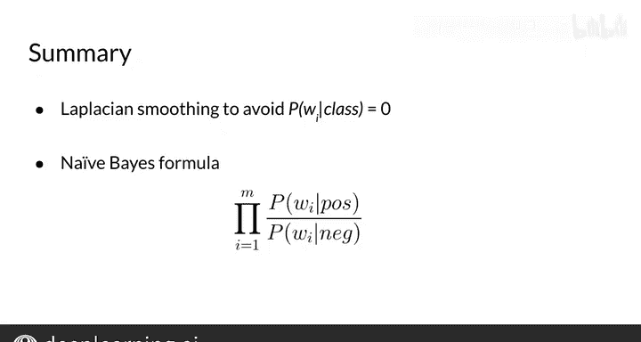

#  020：拉普拉斯平滑 📊

在本节课中，我们将要学习一种称为“拉普拉斯平滑”的技术。这项技术主要用于解决在计算概率时可能出现的零概率问题，确保我们的模型在处理未见过的数据组合时依然能够有效工作。

---

## 概述

在自然语言处理中，我们经常需要计算一个词在给定类别（如正面或负面情感）下出现的概率。其基本公式是统计该词在该类别中出现的次数，然后除以该类别中所有词的总数。然而，如果某个词在训练数据中从未出现在某个类别里，这个概率就会变为零，进而可能导致整个序列的概率为零。拉普拉斯平滑通过微调计算公式，为所有可能的事件分配一个非零的概率，从而巧妙地解决了这个问题。

上一节我们介绍了朴素贝叶斯分类中的基本概率计算，本节中我们来看看当遇到零概率时，如何通过拉普拉斯平滑来修正。

---

## 拉普拉斯平滑的原理

拉普拉斯平滑的核心思想是对原始的计数公式进行微小的调整。具体做法是在分子和分母上同时加上一个值。

原始的、未平滑的条件概率计算公式为：
`P(word | class) = count(word, class) / N_class`

其中：
*   `count(word, class)` 是词在特定类别中出现的次数。
*   `N_class` 是该类别中所有词的总数。

应用拉普拉斯平滑后，公式变为：
`P_smoothed(word | class) = (count(word, class) + 1) / (N_class + V)`

其中：
*   我们在分子上加了 **1**，这确保了即使 `count(word, class)` 为0，概率也不会是零。
*   为了平衡分子增加的部分，使所有词的概率之和仍然为1，我们在分母上加上了 **V**。**V** 代表词汇表中**唯一词**的数量。

这个过程就是拉普拉斯平滑。

---

## 应用示例

让我们通过一个具体的例子来理解这个过程。假设我们有一个简单的词汇表和计数。

首先，我们需要确定词汇表中唯一词的数量 **V**。在这个假设的例子中，我们有8个不同的词。

以下是应用平滑公式计算每个词在“正面”类别中概率的步骤：

1.  **计算分母**：`N_class + V`。假设正面类别的总词数 `N_positive` 是13，那么分母就是 `13 + 8 = 21`。
2.  **为每个词计算平滑概率**：
    *   对于词 “I”，假设它在正面类别中出现3次。平滑概率为 `(3 + 1) / 21 ≈ 0.19`。
    *   对于词 “because”，假设它在正面类别中出现0次。平滑概率为 `(0 + 1) / 21 ≈ 0.048`。

> **注意**：示例中的数字经过了四舍五入。通过这个方法，原本概率为零的词“because”现在有了一个小的非零概率，并且表中所有词的概率之和仍然为1。

---

## 总结

本节课中我们一起学习了拉普拉斯平滑。我们了解到，直接使用词频计算概率可能导致零概率问题，这会破坏模型的预测能力。拉普拉斯平滑通过在分子加1、分母加词汇表大小V的方式，为所有事件分配了一个小的概率，从而有效避免了零值，并保证了概率分布的合法性。这是构建健壮的概率模型，特别是朴素贝叶斯分类器时，一个非常关键且实用的技巧。

在接下来的视频中，你将学习关于对数似然（log likelihood）的知识，它可以帮助我们更稳定地处理多个微小概率的连乘运算。