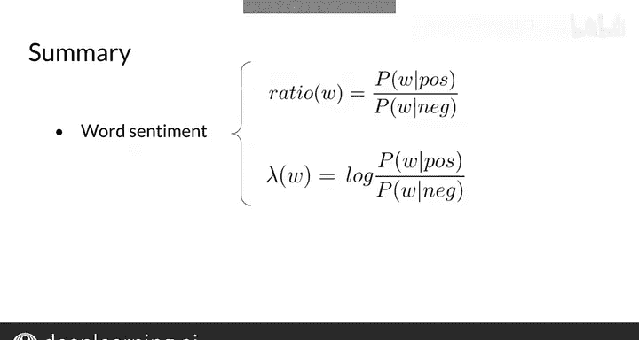

#  021：对数似然第一部分 📊

在本节课中，我们将学习对数似然的概念。这是对上一节课程中计算出的概率取对数，但它在深度学习和自然语言处理中应用起来更为方便。

---

## 概述

上一节我们介绍了如何计算单词在积极和消极情感下的条件概率。本节中，我们来看看如何利用这些概率的比值来量化单词的情感倾向，并引入对数似然来解决实际计算中的数值问题。

## 单词情感比值

首先，我们回顾一下包含单词条件概率的表格。单词的情感含义可能很复杂，但为了情感分类，我们可以将其简化为三类：中性、积极和消极。这些类别可以通过计算条件概率的比值来进行数值估计。

以下是计算词汇表中单词比值的方法：

*   **单词 “I”**：比值为 0.2 / 0.2 = 1。
*   **单词 “am”**：比值为 0.2 / 0.2 = 1。
*   **单词 “happy”**：比值为 0.14 / 0.1 = 1.4。
*   **单词 “sad” 和 “not”**：比值为 0.1 / 0.15 ≈ 0.67。

通过观察这些比值，我们可以总结出规律：

*   **中性词**的比值等于 **1**。
*   **积极词**的比值**大于 1**。比值越大，单词的积极程度越高。😊
*   **消极词**的比值**小于 1**。比值越小，单词的消极程度越高。

在本周的练习中，你将实现一个根据单词的积极性或消极性进行过滤的函数，上述比值表达式将非常有帮助。

## 朴素贝叶斯分类公式

这些比值是朴素贝叶斯进行二元分类的核心。我们通过一个之前的例子来说明原因。

回忆一下，我们曾使用以下规则对推文进行分类：如果推文中每个单词对应比值的**乘积**大于1，则推文为积极；如果小于1，则推文为消极。这个乘积被称为**似然**。

如果考虑积极推文与消极推文数量的比值，你会得到所谓的**先验比**。在之前的简单例子中，积极和消极推文数量恰好相同，所以这个比值为1。在本周的练习数据集中，数据是平衡的，因此你将继续使用比值为1。但请注意，在未来构建自己的应用时，如果数据集不平衡，这个先验比项就变得非常重要。

加入先验比后，我们就得到了完整的朴素贝叶斯二元分类公式。这是一个简单、快速且强大的方法，可用于快速建立基线模型。

## 引入对数似然

现在，是时候提一下实现朴素贝叶斯时另一个重要的考虑因素了。

情感概率计算涉及多个介于0和1之间的数值相乘。在计算机上进行这种乘法运算，存在**数值下溢**的风险，即返回的数值过小，无法在设备上存储。

幸运的是，有一个数学技巧可以解决这个问题，它利用了**对数**的性质。我们用于计算朴素贝叶斯得分的公式是**先验概率乘以似然**。😊

这个技巧就是使用得分的**对数**，而不是原始得分。这允许我们将之前的表达式改写为**对数先验**与**对数似然**之和，而后者又是语料库中所有单词条件概率比值的对数之和。

公式表示为：
`log(得分) = log(先验比) + Σ log(条件概率比值)`

## 应用对数似然分类

让我们使用这个方法对推文 **“I am happy because I am learning”** 进行分类。

你需要计算的是**得分**的对数，这被称为 **λ**。λ 是单词为积极概率与消极概率比值的对数。

现在，让我们为词汇表中的每个单词计算 λ：

*   **单词 “I”**：`λ = log(0.05 / 0.05) = log(1) = 0`。根据规则，如果乘积大于1则推文为积极。按此逻辑，λ=0 被归类为中性。
*   **单词 “am”**：`λ = log(0.04 / 0.04) = 0`。
*   **单词 “happy”**：`λ = log(0.14 / 0.1) ≈ 0.336`（假设以e为底），这个值大于0，表示积极情感。

计算出每个单词的 λ 后，你只需将它们**求和**，就能得到整个推文的**对数得分**。

## 总结

本节课中，我们一起学习了以下内容：

1.  单词的情感倾向可以通过其积极与消极条件概率的**比值**来量化。
2.  这个比值可以进一步表示为**对数形式**，即 λ。
3.  使用 λ 和对数似然，可以有效地将多个小概率值相乘的问题转化为求和问题，从而**降低数值下溢的风险**。
4.  随着使用的单词数量越来越大，原始概率的乘积很可能非常接近0。因此，我们最终采用了这个比值的对数。😊

通过引入对数似然，我们不仅使计算更加稳定，也为后续更复杂的模型奠定了基础。