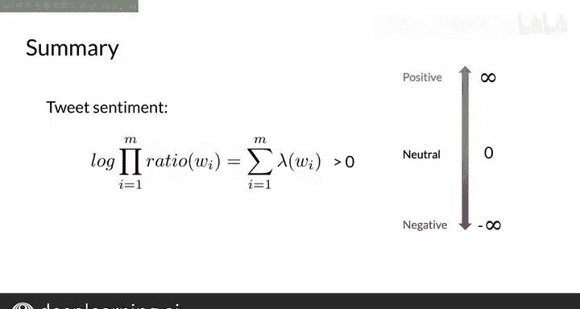

#  022：对数似然与情感推断 🧮

在本节课中，我们将继续学习如何利用对数似然进行情感推断。我们将学习如何根据已计算出的λ值（情感权重）来预测一条推文的情感倾向，并理解其背后的决策逻辑。

---

在上一节中，我们学习了如何计算每个单词的λ值。本节中，我们来看看如何利用这些λ值来对一条新推文进行情感分类。

推断过程的核心是计算整条推文的**对数似然**。其公式为：

**对数似然 = Σ λ_word** （对推文中的每个单词求和）

以下是具体步骤：

1.  **遍历推文中的每个单词**。
2.  **查找该单词在λ字典中对应的值**。如果单词不在字典中（例如中性词或未登录词），则其λ值视为0。
3.  **将所有单词的λ值相加**，得到最终的对数似然分数。

让我们通过一个例子来具体说明。

假设我们有一条推文：“I am happy learning”。我们已经从训练数据中得到了以下λ字典（部分）：
*   `happy`: λ = 2.2
*   `learning`: λ = 1.1
*   `I`, `am`: λ = 0 （中性词）

现在，计算这条推文的对数似然：
*   单词 `I`: λ = 0
*   单词 `am`: λ = 0
*   单词 `happy`: λ = 2.2
*   单词 `learning`: λ = 1.1

**对数似然 = 0 + 0 + 2.2 + 1.1 = 3.3**

---

得到对数似然分数后，我们如何判断情感呢？

决策规则非常简单：
*   如果 **对数似然 > 0**，则推文为**积极**情感。
*   如果 **对数似然 < 0**，则推文为**消极**情感。
*   如果 **对数似然 = 0**，则为中性。

这个规则源于之前概率乘积的阈值（>1为积极）。因为1的对数为0，所以将对数域的决策阈值设为了0。

在我们的例子中，对数似然为3.3，大于0，因此我们判断这条推文的情感是积极的。可以看到，这个分数完全由带有积极情感的单词“happy”和“learning”决定，中性词没有贡献。

---

让我们快速回顾一下本节的核心内容。

你学会了通过以下方式预测推文情感：
1.  对推文中出现的每个单词，从λ字典中取出其对应的λ值。
2.  将所有λ值求和，得到该推文的**对数似然**分数。
3.  根据**决策阈值0**进行判断：分数大于0为积极，小于0为消极。

这种方法简洁有效，突出了关键词汇对整体情感判断的巨大影响力。

---

恭喜！现在你已经很好地理解了如何计算对数似然以及如何进行情感推断。

在接下来的课程中，我们将进入下一个重要环节：学习如何从头开始**训练一个朴素贝叶斯模型**，即如何从原始数据中计算出我们刚才使用的λ字典。