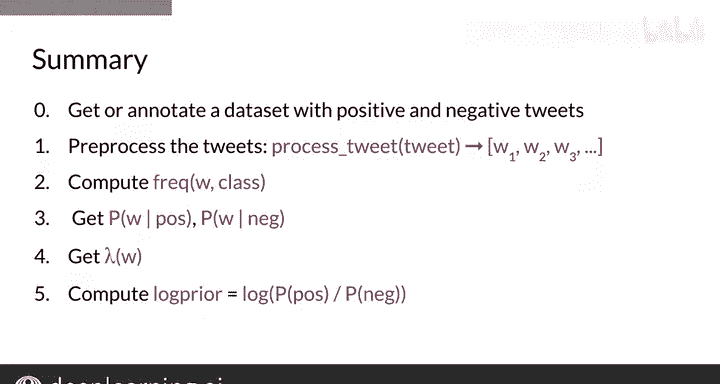

#  023：22_训练朴素贝叶斯模型 🧠

在本节课中，我们将学习如何为情感分析任务训练一个朴素贝叶斯分类器。与逻辑回归或深度学习不同，朴素贝叶斯的训练不涉及梯度下降，而是基于对语料库中词频的统计。我们将一步步构建一个用于推文情感分析的模型。

## 概述 📋

训练朴素贝叶斯模型的核心在于利用已标注的数据（正面和负面推文）计算词汇在不同类别下的条件概率。整个过程可以分解为几个清晰的步骤，从数据收集到最终模型参数的估计。

## 训练步骤详解

### 第一步：数据收集与标注

任何监督式机器学习项目的第一步都是收集用于训练和测试模型的数据。对于推文情感分析，这一步涉及获取一个推文语料库，并将其分为两组：正面推文和负面推文。

### 第二步：文本预处理

预处理步骤对模型成功至关重要，它包含五个子步骤。以下是具体操作：

1.  将文本转换为小写。
2.  移除标点符号、URL和用户提及（handles）。
3.  移除停用词。
4.  词干提取，即将单词还原为其基本形式。
5.  分词，将文档分割成单个单词或词元。

在本周的练习中，实现这个处理流程相对简单。但在实际项目中，文本的收集和处理可能会占据项目的大量时间。

### 第三步：计算词频与条件概率

一旦获得处理后的干净推文语料库，就可以开始计算每个单词在每个类别（正面/负面）中的频率，就像上周所做的那样。这个过程会产生一个频率表。

在同一过程中，可以计算每个语料库中的总词数。从这个频率表中，使用拉普拉斯平滑公式可以得到条件概率，即 **P(单词 | 类别)**。

**公式**：
`P(word | class) = (freq(word, class) + 1) / (N_class + V)`

其中，`V` 是词汇表中唯一单词的数量。注意，`V` 只计算表中出现的单词，而非原始语料库的总词数。这将为每个类别中的每个单词生成一个条件概率表，该表只包含大于0的值。

### 第四步：计算 Lambda 分数

接下来，计算每个单词的 Lambda 分数。该分数是正负面条件概率比值的对数。

**公式**：
`λ(word) = log( P(word | positive) / P(word | negative) )`

### 第五步：估计对数先验

为了估计对数先验，需要统计正面和负面推文的数量。对数先验是正面推文数量与负面推文数量比值的对数。

**公式**：
`log prior = log( D_pos / D_neg )`

在接下来的练习中，我们将使用一个平衡的数据集，因此对数先验等于0。但对于不平衡的数据集，这一项将变得重要。

## 总结 ✨

本节课中，我们一起学习了训练朴素贝叶斯模型可以划分为六个逻辑步骤：

1.  获取或标注包含正面和负面推文的数据集。通常，如果推文与你最终模型要使用的语境相匹配，效果会更好。
2.  处理原始文本，获得干净、标准化的词元语料库。
3.  计算每个单词在每个类别中的词频。
4.  使用拉普拉斯平滑公式计算每个单词的条件概率。
5.  计算每个单词的 Lambda 因子。
6.  估计模型的对数先验，即在你的账户中看到一条正面推文的可能性有多大。

现在，你已经了解了如何构建应用朴素贝叶斯所需的概率表。接下来，我们将要做一件令人兴奋的事情：对句子进行分类。