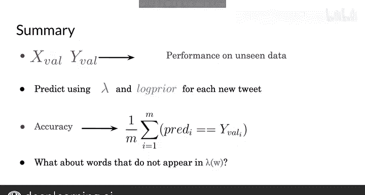

#  024：测试朴素贝叶斯模型 🧪

在本节课中，我们将学习如何将训练好的朴素贝叶斯分类器应用到真实的测试数据上，并评估其性能。这个过程与本周第一个视频中的操作类似，但我们会涵盖一些特殊的边界情况。


---

## 模型测试流程概述

一旦你训练好了模型，下一步就是对其进行测试。你需要使用之前推导出的条件概率，来预测新的、未见过的推文的情感倾向。之后，你将评估模型的性能，评估方式与上周进行逻辑回归评估时类似，即使用带有标注的测试数据集。

## 预测新推文的情感

基于已有的计算，你已拥有一张表格，其中包含词汇表中每个独特单词的对数似然（λ）分数。结合你对数先验的估计，你现在可以预测新推文的情感了。

假设有一条新推文：“I pass the NLP interview.”。你可以使用模型来预测这是一条积极还是消极的推文。

以下是预测步骤：

首先，你必须对文本进行预处理：去除标点符号、对单词进行词干提取、并进行分词，以生成一个单词向量，如下所示：

```
[‘i’， ‘pass’， ‘the’， ‘nlp’， ‘interview’]
```

接着，你在对数似然表格中查找向量中的每个单词。如果单词在表格中找到（例如 ‘i‘、’pass‘、’the‘、’nlp‘），则将所有对应的 λ 值求和。

那些没有出现在 λ 表格中的值（例如 ‘interview‘），被视为中性词，对总分没有贡献。你的模型只能为它以前见过的单词给出分数。

现在，你加上对数先验，以考虑数据集中类别的平衡或不平衡情况。因此，这个总分加起来是 0.48。

记住，如果这个分数大于 0，那么这条推文的情感是积极的。所以，是的，在你的模型中和现实生活中，通过 NLP 面试都是一件非常积极的事情。你刚刚预测了一条新推文的情感，这很棒！😊

---

## 在未见数据上评估性能

现在，是时候在未见数据上测试你的分类器性能了，就像你在上一个模块中对不同场景所做的那样。让我们快速回顾一下应用于朴素贝叶斯的这个过程。

本周的作业包含一个验证集。这些数据在训练期间被预留出来，由一组原始推文（即 X_val）及其对应的情感标签（Y_val）组成。

你需要实现一个准确率函数，以衡量你训练好的模型（由 λ 表格和对数先验表示）在这些数据上的性能。

以下是评估步骤：

首先，像之前一样，计算 X_val 中每个条目的分数。

然后，判断每个分数是否大于 0。这将生成一个由 0 和 1 组成的向量，分别表示验证集中每条推文的预测情感是消极还是积极。

有了这个新的预测向量，你就可以计算模型在验证集上的准确率了。

具体做法是，将你的预测结果与验证数据 Y_val 中每个观测值的真实标签进行比较。

如果值相等，即你的预测正确，你将得到值 1；如果错误，则得到 0。

在将每个预测值与验证集的真实标签进行比较之后，你可以通过将这个向量的总和除以验证集中的样本数量来计算准确率。

这与你为逻辑回归所做的完全一样。

---

## 本节总结

在本节中，我们一起回顾了测试朴素贝叶斯模型性能所做的一切。

你使用验证集，利用新训练的模型来预测未见推文的情感分数。

然后，你将预测结果与验证集中提供的真实标签进行比较，从而得到模型正确预测的推文百分比。



你还了解到，未出现在 λ 表格中的单词被视为中性词。

现在，你已经知道如何应用朴素贝叶斯方法来测试示例了。在本周结束的练习中，你将使用它来对推文进行分类。接下来，我将向你展示它还能做些什么。