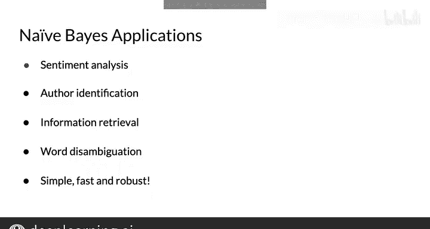

#  025：24_朴素贝叶斯的应用 📊

在本节课中，我们将学习朴素贝叶斯方法在自然语言处理中的多种实际应用场景。我们将看到，这个基于概率的简单模型不仅能用于情感分析，还能解决作者识别、垃圾邮件过滤、信息检索和词义消歧等问题。

---

## 朴素贝叶斯公式回顾 🔍

上一节我们介绍了朴素贝叶斯的基本原理，本节中我们来看看它的具体应用。朴素贝叶斯方法的核心是估计每个类别的概率，它通过计算类别与文本中词语的联合概率来实现。

朴素贝叶斯公式是**先验概率**与**似然概率**乘积的比值：

`P(Class | Words) ∝ P(Class) * ∏ P(Word | Class)`

这个基于条件概率的比值，其用途远不止于情感分析。

---

## 主要应用领域 📈

以下是朴素贝叶斯方法在自然语言处理中的几个常见应用领域。

### 1. 作者识别

如果你有两个由不同作者撰写的大型文本语料库，你可以训练一个模型来识别新文档的作者。

例如，如果你有一些莎士比亚的作品和一些海明威的作品，你可以为每个词语计算其λ值，以预测一个新词语更可能被莎士比亚使用，还是被海明威使用。这种方法使你能够确定作者身份。

### 2. 垃圾邮件过滤

利用来自发件人、主题和内容的信息，你可以判断一封电子邮件是否是垃圾邮件。这是朴素贝叶斯最早期的应用之一。

### 3. 信息检索

在数据库检索中，可以根据查询中的关键词集，来过滤相关与不相关的文档。

在这种情况下，你只需要计算给定查询下每个文档的似然概率。你无法预先知道相关或不相关文档的具体样貌，因此可以计算数据集中每个文档的似然概率，然后根据似然值对文档进行排序。

你可以选择保留前M个结果，或者保留似然概率大于某个特定阈值的结果。

### 4. 词义消歧

词义消歧旨在根据上下文明确词语的含义。假设在文本中，一个给定的词只有两种可能的解释。

例如，你不知道所读文本中的“bank”一词是指河岸还是指金融机构。为了消除这个词的歧义，你需要计算文档在指向每种可能含义时的得分。

在这种情况下，如果文本涉及的是河流概念而非金钱概念，那么相应的得分就会大于一。

---

## 总结与展望 🎯

本节课中我们一起学习了朴素贝叶斯规则的广泛应用。

贝叶斯规则及其朴素近似法在情感分析、作者识别、信息检索和词义消歧等领域有着广泛的应用。它是一种流行的方法，因为训练、使用和解释都相对简单。

在接下来的课程中，你将再次使用贝叶斯规则和朴素贝叶斯方法。现在，你已经做好了充分准备。

正如本视频所示，朴素贝叶斯可以用于许多分类任务。接下来，我将向你展示朴素贝叶斯方法所基于的假设。