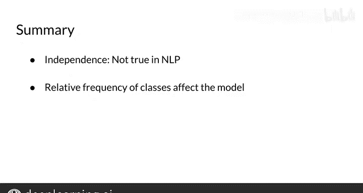

#  026：朴素贝斯的假设 🧠

在本节课中，我们将深入探讨朴素贝斯方法背后的核心假设。我们将了解这些假设是什么，它们为何重要，以及当这些假设在现实数据中不成立时，可能会对模型结果产生何种影响。

---

## 朴素贝斯的核心假设

上一节我们介绍了朴素贝斯的基本概念，本节中我们来看看支撑该方法的两个主要假设。

朴素贝斯是一个非常简单的模型，因为它不需要设置任何自定义参数。该方法之所以被称为“朴素”，正是源于它对数据所做的假设。

以下是该方法依赖的两个关键假设：

1.  **特征独立性假设**：模型假设与每个类别相关的预测变量或特征是相互独立的。
2.  **训练集分布假设**：模型假设训练数据集的分布能够代表真实世界的分布。

---

## 假设一：特征独立性

让我们深入探讨第一个假设，即特征之间的独立性，并看看它如何影响你的结果。

为了说明特征独立性意味着什么，请看以下句子：
> “It is sunny and hot in the Sahara desert.”

朴素贝斯假设一段文本中的单词是彼此独立的。但正如你所见，实际情况通常并非如此。例如，单词“sunny”和“hot”经常像在这个例子中一样同时出现。结合起来看，它们也可能与它们所描述的事物（如海滩或沙漠）相关。

因此，句子中的单词并不总是相互独立的，但朴素贝斯假设它们是。这可能导致在使用朴素贝斯时，低估或高估单个单词的条件概率。

例如，如果你的任务是补全句子：
> “It’s always cold and snowy in ______.”

朴素贝斯可能会为“spring”、“summer”、“fall”和“winter”分配相等的概率。尽管从上下文来看，“winter”显然是最有可能的选项。

在这个专业化的后续课程中，你将接触到一些更复杂的方法来处理这个问题。

---

## 假设二：训练集分布

现在，我们来看看第二个关于数据分布的假设。

朴素贝斯的另一个问题在于它依赖于训练数据集的分布。一个好的数据集应包含与随机样本相同比例的正向和负向推文。然而，大多数可用的标注语料库都是人工平衡的，就像你将用于作业的数据集一样。

在真实的推文流中，正向推文往往比负向推文出现得更频繁。原因之一是负向推文可能包含被平台禁止或被用户屏蔽的内容，例如不当或冒犯性词汇。如果假设现实世界的行为与你的训练语料库一致，这可能导致模型过于乐观或过于悲观。

关于这一点，本模块的最后一个视频会有更多讨论，该视频将分析朴素贝斯中误差的来源。

---

## 总结与回顾

本节课中我们一起学习了朴素贝斯方法的核心假设。

让我们快速回顾一下所有这些新信息：
*   朴素贝斯中的**独立性假设**很难保证，但尽管如此，该模型在某些情况下仍然表现良好。
*   对于本模块的作业，为了获得准确的结果，你的训练数据集中正向和负向推文的相对频率需要保持平衡。

现在，你已经理解了朴素贝斯方法背后的假设。如果它对某些句子表现不佳该怎么办呢？在下一个视频中，我将展示在这种情况下该如何处理。