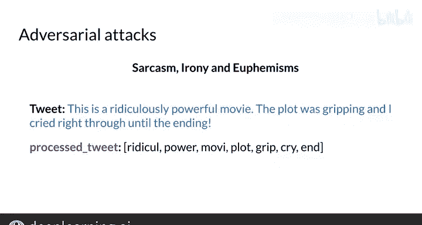

#  027：错误分析 🔍

在本节课中，我们将学习如何分析自然语言处理模型中的错误。无论使用何种NLP方法，总会遇到模型预测出错的情况。我们将探讨导致错误的几个常见原因，并学习如何系统地检查和理解这些错误。

## 检查预处理后的文本

上一节我们介绍了错误分析的重要性，本节中我们来看看第一个常见错误来源：文本预处理。分析NLP系统错误时，一个主要的考虑因素是查看经过预处理后的文本实际是什么样子。

请看这条推文：
> “My beloved grandmother 😔”

这里的表情符号“😔”对推文的情感非常重要，因为它表明了悲伤的情绪。但如果预处理步骤移除了所有标点符号和表情，处理后的推文将只剩下：
> “beloved grandmother”

这看起来就像一条非常积极的推文。而“My beloved grandmother!”则表达了截然不同的情感。

因此，请务必检查预处理后的实际文本内容。问题不仅限于标点符号。

请看这个句子：
> “This is not good, your attitude is not even close to being nice.”

如果移除了“not”和“this”等中性词，剩下的内容是：
> “good attitude close nice”

从这组词来看，分类器可能会推断出非常积极的情感。我们稍后会讨论如何处理否定词和词序问题。

以下是检查预处理文本的关键点：
*   始终检查移除标点、表情、停用词等之后的文本。
*   确认重要的情感指示符（如否定词、强调符号）是否被意外移除。
*   确保模型能够从处理后的文本中获得准确的解读。

## 词序的重要性

预处理流程并非唯一的潜在问题来源。词序对句子含义的影响同样至关重要。

请看这两条推文：
1.  “I am happy because I did not go.” （积极情感）
2.  “I am not happy because I did not go.” （消极情感）

在这个例子中，“not”的位置对情感判断至关重要。但朴素的词袋模型可能会忽略词序，导致分类错误。

因此，词序有时和拼写一样重要。在后续课程中，我们将看到更多处理这类问题的方法。

## 朴素贝叶斯的局限性：对抗性攻击

另一个与朴素贝叶斯模型相关的问题被称为“对抗性攻击”。这个术语描述了一些常见的语言现象，如讽刺、反语和委婉语。人类能轻易理解这些，但机器却很不擅长。

请看这条推文：
> “This is a ridiculously powerful movie. The plot was gripping, and I cried right through until the ending.”

这实际上是一条较为积极的影评。但如果对其进行预处理，可能会得到一系列看似消极的词汇列表。然而，作者实际上是用这些词来描述一部他喜欢的电影。如果对这个词列表使用朴素贝叶斯分类，模型很可能会给出非常消极的分数，而不考虑上下文。

## 总结与展望

本节课中我们一起学习了如何分析NLP模型中的错误。我们了解到，错误可能源于预处理步骤丢失语义、词序对含义的影响，以及模型（如朴素贝叶斯）难以处理讽刺等语言现象。

尽管朴素贝叶斯方法基于独立性假设可能导致错误，但它仍然是一个强大的基线模型。它依赖于词频统计，简单有效。在下周的课程中，我们将学习如何使用词向量来获得更好的结果。