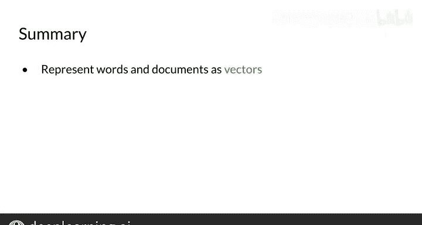

#  030：29_向量空间模型 🧠📊

## 概述

在本节课中，我们将要学习向量空间模型。这是一种将单词和文档表示为向量的方法，能够捕捉单词之间的相对含义和依赖关系。我们将了解这类模型的基本思想、优势以及在自然语言处理中的多种应用。

---

## 向量空间模型简介

上一节我们介绍了朴素贝叶斯分类算法，本节中我们来看看向量空间模型。首先，我将向你介绍向量模型背后的基本思想。

你将看到它们的优势，以及它们在自然语言处理中的一些应用。

假设你有两个问题。第一个是“你要去哪里？”，第二个是“你来自哪里？”。

这两个句子除了最后一个词外，其他单词完全相同。然而，它们的意思不同。

另一方面，假设你还有另外两个问题，它们的用词完全不同，但两个句子的意思相同。

向量空间模型将帮助你识别第一对问题或第二对问题在含义上是否相似，即使它们不共享相同的单词。它们可以用于问答、释义和摘要任务中的相似性识别。

向量空间模型还能让你捕捉单词之间的依赖关系。

考虑这个句子：“你用碗吃麦片。”。在这里，你可以看到“麦片”和“碗”这两个词是相关的。

现在，看看另一个句子：“你买东西，别人卖东西。”。这句话的意思是，因为有人买东西，所以有人卖东西。句子的后半部分依赖于前半部分。

使用基于向量的模型，你将能够捕捉到这种以及许多其他类型的不同单词集合之间的关系。

向量空间模型被用于信息提取，以回答“谁、什么、哪里、如何”等类型的问题。它们也被用于机器翻译、聊天机器人编程以及许多其他应用中。

最后，我想与你分享著名英国语言学家约翰·弗斯的一句名言：“观其伴，知其义。”这是自然语言处理中最基本的概念之一。

当使用向量空间模型时，表示是通过识别文本中每个单词周围的上下文来构建的，这捕捉了相对含义。

---

## 总结

本节课中我们一起学习了向量空间模型。你了解了向量空间模型，并看到了这些模型在不同类型应用中的使用。

在下一个视频中，你将从头开始构建它们，特别是你将看到如何使用共现矩阵来构建它们。