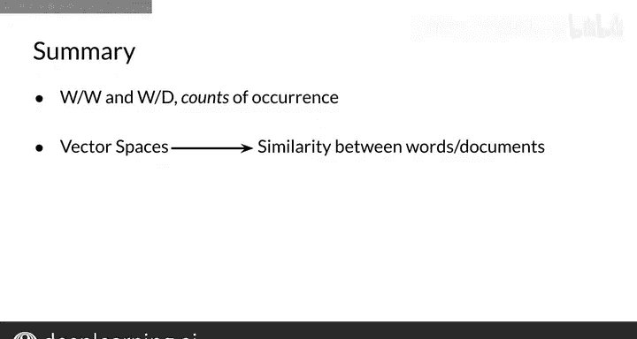

#  031：词对词与词对文档向量构建 🧮

在本节课中，我们将学习如何基于共现矩阵来构建向量空间模型。具体来说，我们将探讨两种不同的设计方法：词对词设计和词对文档设计，并了解如何将单词或文档编码为向量。最后，我们还将看到如何在向量空间中衡量单词或文档之间的相似性。

---

## 基于共现矩阵构建向量空间

根据你试图解决的具体任务，可以有几种不同的向量空间设计方法。你还会看到如何将单词或文档编码为向量。

### 词对词设计

为了使用词对词设计获得向量空间模型，你需要构建一个共现矩阵，并从中提取语料库中单词的向量表示。

两个不同单词的**共现**，是指它们在语料库中在特定单词距离 **K** 内一起出现的次数。例如，假设你的语料库包含以下两个句子：
*   "I like simple data."
*   "Data is raw material."

如果设定 **K=2**，那么与单词 "data" 对应的共现矩阵行将按以下方式填充数值：
*   对于 "simple" 列，数值为 **2**。因为 "data" 和 "simple" 在第一个句子中距离为1个词，在第二个句子中距离为2个词。
*   对于 "raw" 列，数值为 **1**。
*   对于 "like" 和 "I" 列，数值均为 **0**。

因此，单词 "data" 的向量表示将是 **[2, 1, 1, 0, 0]**。

通过词对词设计，你可以得到一个包含 **N** 个元素的向量表示，其中 **N** 的取值范围在1到整个词汇表大小之间。

### 词对文档设计

词对文档设计的过程非常相似。在这种情况下，你需要统计词汇表中的单词在属于特定类别的文档中出现的次数。

例如，你可能有一个包含不同主题文档的语料库，如娱乐、经济和机器学习。

以下是统计单词在不同类别文档中出现次数的示例：

| 单词 | 娱乐类文档 | 经济类文档 | 机器学习类文档 |
| :--- | :---: | :---: | :---: |
| **data** | 500 | 6620 | 9320 |
| **film** | 7000 | 4000 | 1000 |

一旦你为多组文档或单词构建了表示，你就得到了你的向量空间。让我们以上一个表格为例。

你可以从表格的行中获取单词 "data" 和 "film" 的表示。然而，我们也可以通过查看列来获取每个文档类别的表示。因此，这个向量空间将有两个维度：单词 "data" 的出现次数和单词 "film" 的出现次数。

以下是每个文档类别的向量表示：
*   **娱乐类**：`[500, 7000]`
*   **经济类**：`[6620, 4000]`
*   **机器学习类**：`[9320, 1000]`

在这个空间中，很容易看出经济类和机器学习类文档彼此之间的相似度，远高于它们与娱乐类文档的相似度。

---

## 向量关系与相似性

在向量空间中，你可以找到单词和向量之间的关系，也称为它们的**相似性**。

接下来，你将学习使用**余弦相似度**和**欧几里得距离**来比较向量表示，以获取它们之间的角度和距离。

---

## 总结

本节课中，我们一起学习了通过两种不同的设计来构建向量空间：**词对词**和**词对文档**。这两种方法分别通过统计单词的共现次数或单词在文档语料中的出现次数来实现。

我们还了解到，在向量空间中，你可以确定不同类型文档（或单词）之间的关系，例如相似性。

现在，你对这些向量空间越来越熟悉了。你已经看到了几种可用于解决特定任务的可能设计，也了解了如何将单词或文档编码为向量。在下一个视频中，你将学习一种新的相似性度量方法——**欧几里得距离**，它将允许你比较两个向量。