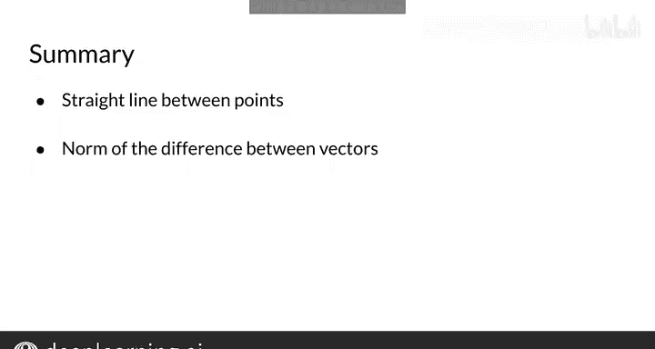

#  032：31_欧几里得距离 📏


## 概述

在本节课中，我们将要学习欧几里得距离。这是一种相似性度量方法，用于衡量两个点或两个向量在空间中的远近程度。我们将从二维空间的例子开始，然后将其推广到更高维度的向量空间。

## 欧几里得距离简介

欧几里得距离是一种相似性度量。这个度量标准允许你识别两个点或两个向量彼此之间的距离。

上一节我们介绍了文档向量的概念，本节中我们来看看如何计算两个文档向量之间的欧几里得距离，并将这个概念推广到更高维度的向量空间。

## 二维空间中的例子

让我们使用之前见过的两个语料库向量。在那个例子中，有两个维度：单词“data”和“film”在语料库中出现的次数。语料库A是娱乐语料库，语料库B是机器学习语料库。现在，我们将这些向量表示为向量空间中的点。

欧几里得距离是连接这两个点的直线段的长度。要得到这个值，你应该使用以下公式。

以下是计算步骤：
1.  计算两个向量在水平方向（第一个维度）上的差值，并将其平方。
2.  计算两个向量在垂直方向（第二个维度）上的差值，并将其平方。
3.  将这两个平方值相加。
4.  对总和取平方根。

这个公式是勾股定理的一个例子。如果你计算方程中的每一项，你应该得到这个表达式。最后，得到一个大约等于10667的欧几里得距离。你可以暂停视频来检查这个过程。

## 推广到高维空间

当你处理更高维度时，欧几里得距离的计算并不复杂很多。让我们通过一个使用以下共现矩阵的例子来逐步讲解。

假设你想知道单词“ice cream”的向量V和单词“boba”的向量表示W之间的欧几里得距离。首先，你需要获取它们每个维度之间的差值，将这些差值平方，然后求和，最后对结果取平方根。

这个过程是上一张幻灯片中方法的推广。这是你在一个n维向量空间中获取向量表示之间欧几里得距离的公式。

如果你还记得代数知识，这个公式被称为你所比较向量之间差值的范数。

## Python代码实现

让我们看一下在Python中实现欧几里得距离的方法。如果你有两个像前面例子中的向量表示，你可以使用numpy的`linalg`模块来获取它们之间差值的范数。

以下是实现代码：
```python
import numpy as np

# 定义两个向量
v = np.array([...])  # 向量V的值
w = np.array([...])  # 向量W的值

# 计算欧几里得距离（即差值的L2范数）
euclidean_distance = np.linalg.norm(v - w)
print(euclidean_distance)
```
如果你在Python中实现这段代码，你应该得到这些结果。`norm`函数适用于n维空间。

## 核心要点与总结



本节课中我们一起学习了欧几里得距离。主要的收获是：
*   欧几里得距离本质上是连接两个向量的直线长度。
*   要得到欧几里得距离，你必须通过计算你所比较向量之间差值的范数。
*   通过使用这个度量标准，你可以了解两个文档或单词的相似程度。

## 下节预告

现在你已经学习了欧几里得距离，在下一个视频中，我将展示一种不同类型的相似性函数。具体来说，我将展示余弦相似性函数，它是最流行的相似性函数之一。下个视频见。