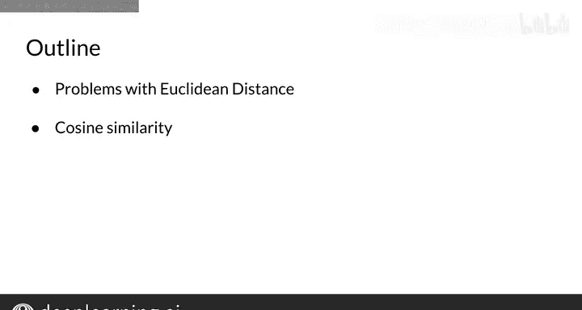
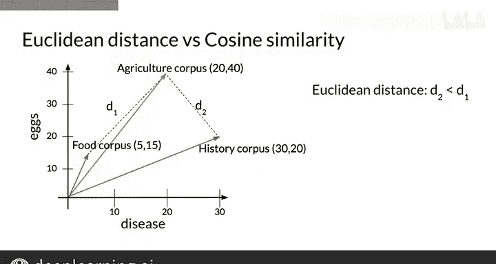
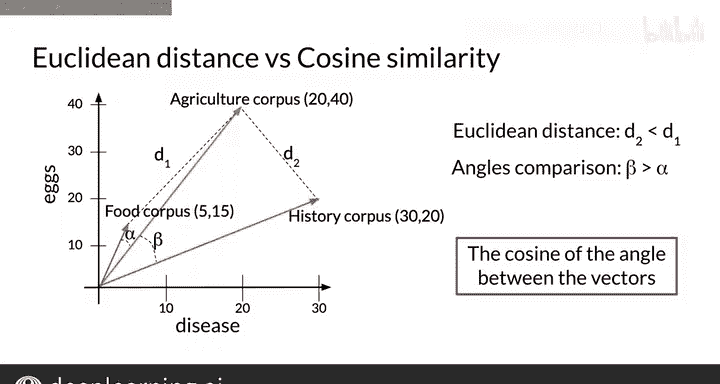
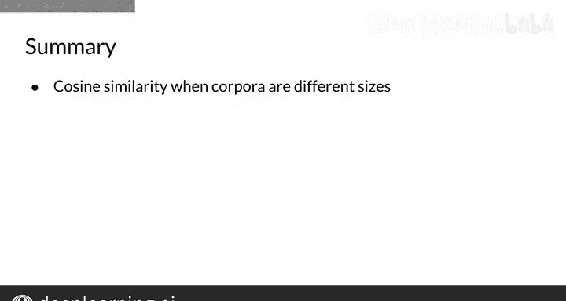

#  033：32_余弦相似度直觉 🧠

在本节课中，我们将要学习**余弦相似度**。这是一种用于衡量两个向量之间相似程度的函数。它通过计算两个向量之间夹角的余弦值来判断它们是否接近。本节中，你将了解到使用**欧几里得距离**在比较文档或语料库的向量表示时可能存在的问题，以及**余弦相似度**指标如何帮助你克服这些问题。

---

## 欧几里得距离的局限性 🚧

上一节我们介绍了相似度函数的概念，本节中我们来看看欧几里得距离在特定场景下的不足。

为了说明欧几里得距离可能存在的问题，让我们看一个例子。假设我们处在一个向量空间中，语料库由单词“疾病”和“鸡蛋”的出现次数来表示。

以下是三个语料库的向量表示：
*   **食品语料库**：与食品相关的文本。
*   **农业语料库**：与农业相关的文本。
*   **历史语料库**：与历史相关的文本。

每个语料库都包含与其主题相关的文本，但它们的总单词数各不相同。事实上，农业和历史语料库的单词数量相近，而食品语料库的单词数量相对较少。

定义食品与农业语料库之间的欧几里得距离为 **d1**，农业与历史语料库之间的欧几里得距离为 **d2**。如图所示，距离 **d2** 小于距离 **d1**。这似乎表明，农业和历史语料库比农业和食品语料库更相似。

---

## 余弦相似度的引入 📐

鉴于欧几里得距离的上述问题，我们需要一种更稳健的相似度衡量方法。

另一种确定向量间相似度的常用方法是计算它们**夹角**的**余弦值**。如果夹角很小，余弦值将接近1；随着夹角接近90度，余弦值将接近0。

如图所示，食品与农业语料库之间的夹角 **α**，小于农业与历史语料库之间的夹角 **β**。在这个特定案例中，这些夹角的余弦值比它们的欧几里得距离更能代表这些向量表示之间的相似性。

以下是余弦相似度的核心公式：

**余弦相似度公式**：
`similarity = cos(θ) = (A·B) / (||A|| * ||B||)`
其中 `A·B` 是向量的点积，`||A||` 和 `||B||` 是向量的模（长度）。

---

## 余弦相似度的优势与总结 🎯

现在，你已经了解了使用余弦相似度作为比较两个向量表示相似性指标背后的主要直觉。

请记住，与欧几里得距离相比，该指标的主要优势在于它**不受表示之间大小差异的影响**。因此，即使两个文档的大小差异很大，你也能获得有意义的相似度比较结果。

本节课中我们一起学习了：
1.  **欧几里得距离的局限性**：在比较大小差异显著的文档向量时可能产生误导。
2.  **余弦相似度的原理**：通过计算向量夹角的余弦值来衡量相似度，其值域为[-1, 1]，值越接近1表示越相似。
3.  **余弦相似度的核心优势**：对向量的绝对大小不敏感，只关注它们的方向，因此更适合比较文本等长度不一的数据。

如果你有两个大小非常不同的文档，那么使用欧几里得距离并不理想。余弦相似度利用文档向量之间的夹角，因此不依赖于语料库的大小。