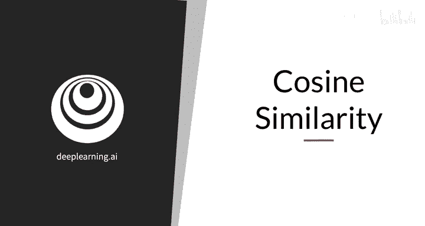
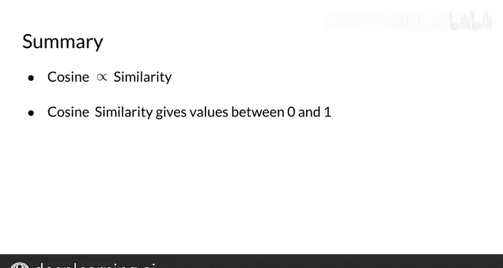

#  034：33_余弦相似度 📐

在本节课中，我们将学习如何计算两个向量之间的余弦相似度。这是一种衡量向量方向相似程度的指标，在自然语言处理中常用于比较词向量或文档向量的相似性。

我们将首先回顾两个核心概念：向量的点积和范数（或称为模长）。掌握了这两项计算后，你就能轻松计算出余弦相似度。

---

## 计算余弦相似度 📏

上一节我们介绍了使用两个向量之间夹角的余弦值作为相似性度量的直观理解。本节中，我们将深入解释并展示如何具体计算这个余弦相似度指标。

首先，你需要从代数中回忆一些定义。

**向量的范数**（或称模长）写作 **||v||**，其定义为向量各元素平方和的平方根。用公式表示为：

`norm(v) = sqrt(v1² + v2² + ... + vn²)`

**两个向量的点积**，是它们在向量空间每个维度上对应元素乘积的总和。对于向量 **v** 和 **w**，其点积公式为：

`dot_product(v, w) = v1*w1 + v2*w2 + ... + vn*wn`

---

## 余弦相似度公式推导 🔄

现在，让我们看看如何用点积和范数来计算余弦相似度。

假设有两个向量 **v** 和 **w**，它们之间的夹角为 **β**。根据定义，夹角 **β** 的余弦值等于两个向量的点积除以它们范数的乘积。公式如下：

`cos(β) = (v · w) / (||v|| * ||w||)`

这个值就是**余弦相似度**。它的范围在 -1 到 1 之间，但对于我们目前所见的、所有维度均为正值的向量空间（如词频向量），其值介于 **0** 和 **1** 之间。

---

## 实例计算 🧮

让我们回顾上一节中的一个例子。在这个向量空间中，语料库的表示由单词“disease”和“x”的出现次数构成。

*   农业语料库表示为向量 **v**。
*   历史语料库表示为向量 **w**。

根据上述公式，余弦相似度的计算表达式如下：

`cos(β) = (v1*w1 + v2*w2) / (sqrt(v1²+v2²) * sqrt(w1²+w2²))`

将向量表示中的实际数值代入，你会在分子中得到两个单词出现次数的乘积之和，在分母中得到两个语料库向量范数的乘积。最终，你应该会得到一个约为 **0.87** 的余弦相似度值。

你可以暂停视频，自己动手计算一下。

---

## 如何解读相似度得分？ 🤔

那么这个指标告诉我们关于两个向量相似性的什么信息呢？以下是关键解读：

当两个向量在向量空间中**方向相同**时，它们之间的夹角为 **0** 度。余弦值等于 **1**（因为 cos(0) = 1）。

当两个向量**方向垂直（正交）**时，夹角为 **90** 度。余弦值等于 **0**。在我们目前所见的向量空间中，这表示它们**最大程度地不相似**。

由此可见，**两个向量夹角的余弦值越接近 1，它们的方向就越接近**。

---

## 核心要点总结 ✅

本节课中，我们一起学习了如何计算任意一对向量之间的余弦相似度。

重要的结论是：
*   这个度量指标与所比较向量的**方向相似性**成正比。
*   对于目前所见的向量空间，余弦相似度的取值范围在 **0** 到 **1** 之间。
*   一个向量与自身的余弦相似度为 **1**。
*   两个垂直向量的余弦相似度为 **0**。
*   **相似度越高，得分越高**。

现在，你已经掌握了计算和解读余弦相似度的基本方法，这是比较文本表示相似性的一个强大工具。