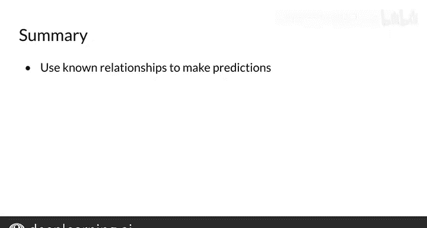

#  035：在向量空间中操作词 🧮

## 概述

在本节课中，我们将学习如何通过简单的向量算术（如向量加法和减法）来操作词向量。你将能够利用已知的词向量关系，预测未知的关系，例如根据已知的首都-国家关系，推断出未知国家的首都。

---

## 在向量空间中操作词向量

上一节我们介绍了词向量的基本概念。本节中，我们来看看如何通过向量运算来推断词与词之间的关系。

假设我们有一个包含国家及其首都城市向量的向量空间。我们知道美国的首都是华盛顿特区，但不知道俄罗斯的首都。我们可以利用华盛顿特区和美国之间的已知向量关系来推断俄罗斯的首都。

### 计算关系向量

首先，我们需要找到华盛顿特区向量和美国向量之间的关系。这可以通过计算两个向量的差来实现：

**关系向量 = 华盛顿特区向量 - 美国向量**

这个差值向量指明了在向量空间中，从一个国家向量移动到其首都向量所需的方向和距离。

### 应用关系进行预测

接下来，要找到俄罗斯的首都，我们将俄罗斯的向量加上刚才计算得到的关系向量：

**预测的首都向量 = 俄罗斯向量 + 关系向量**

计算后，我们可能得到一个具体的向量坐标，例如 `(10, 4)`。

### 寻找最相似的词

然而，在词向量集合中，可能没有城市的向量恰好等于 `(10, 4)`。因此，我们需要找到与这个预测向量最相似的现有词向量。

以下是两种常用的相似度计算方法：

*   **欧几里得距离**：计算两个向量点之间的直线距离。距离越小，相似度越高。
    *   **公式**：`distance = sqrt((x1 - x2)^2 + (y1 - y2)^2)`
*   **余弦相似度**：计算两个向量之间夹角的余弦值。值越接近1，相似度越高。
    *   **公式**：`similarity = (A · B) / (||A|| * ||B||)`

通过比较，我们发现莫斯科的向量与预测向量 `(10, 4)` 最相似。这样，我们就利用已知的“美国-华盛顿特区”关系，成功预测了俄罗斯的首都是莫斯科。

---

## 向量空间表示的重要性

现在，你掌握了一个通过已知词关系来推断未知关系的简单流程。这个流程成功的关键在于，我们使用的词向量空间必须能够捕捉词语之间的相对语义关系。

在自然语言处理中，语义相近的词（例如出现在句子相似位置的词）其向量编码也会相似。当我们将所有向量绘制在二维平面上时，可以看到它们会形成聚类。

你可以利用这种编码的一致性来识别模式。例如，如果你有“医生”这个词，通过计算余弦相似度来寻找最接近的词，你可能会得到“医生们”、“护士”、“心脏病专家”、“外科医生”等。

---

## 总结

本节课中，我们一起学习了如何通过向量加减法来操作词向量，并利用已知的语义关系进行推断。我们了解了**关系向量**的计算方法，以及使用**欧几里得距离**或**余弦相似度**来寻找最相似词向量的过程。理解词向量如何捕捉语义关系，是进行更复杂自然语言处理任务的基础。

在下一课中，你将学习如何将这些高维向量可视化在二维平面上。