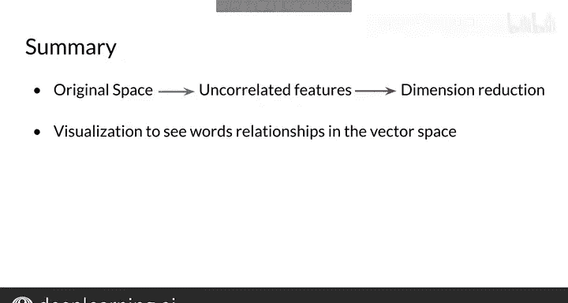

#  036：可视化与PCA 📊


## 概述

在本节课中，我们将要学习如何将高维度的词向量进行降维和可视化。你将了解到主成分分析（PCA）这一算法的基本概念、动机及其在自然语言处理中的应用，特别是用于检查词向量是否捕捉到了词语之间的语义关系。

---

## 可视化高维词向量的动机 🎯

上一节我们介绍了词向量的基本概念。本节中我们来看看为什么需要将它们可视化。

我们最终得到的词向量通常具有非常高的维度。我们需要找到一种方法，将这些向量的维度降低到二维，以便能够在XY坐标轴上绘制出来。主成分分析（PCA）算法可以帮助我们实现这一目标。

你将使用主成分分析来可视化那些维度高于你目前所见过的、可以绘制的向量表示。

为了开始，我将为你提供一些关于可视化词向量表示的动机直觉。你将亲眼看到主成分分析是什么，以及它如何用于降维。

想象一下，你的词语在向量空间中有如下表示。在这个场景中，你的向量空间维度高于2。你知道词语“石油”和“天然气”，以及“城市”和“城镇”是相关的，并且你想看看这种关系是否被你的词语表示所捕捉到。

那么，你如何可视化你的词语，以便看到这种关系和其他可能的关系呢？

---

## 降维：PCA的作用 ✨

上一节我们提出了可视化高维数据的需求。本节中我们来了解解决这个问题的关键工具。

当你的词语表示存在于高维空间时，降维是完成此任务的完美选择。你可以使用像PCA这样的算法，来获得一个维度更少的向量空间表示。

如果你想可视化你的数据，你可以得到一个具有三个或更少特征的简化表示。

如果你对数据执行主成分分析并获得一个二维表示，你就可以绘制出词语的可视化图。在这种情况下，你可能会发现你最初的表示捕捉到了“石油”和“天然气”以及“城市”和“城镇”之间的关系。因为在你的二维空间中，它们似乎与相关的词语聚集在一起。

你甚至可以发现词语之间你未曾预料到的其他关系，这是一个有趣且有用的可能性。

---

## PCA算法的工作原理 ⚙️

现在你知道了PCA能帮助你实现什么，让我们详细了解一下它是如何工作的。为了简单起见，我将从一个二维向量空间开始讲解。

假设你希望你的数据用一个特征来表示。使用PCA，你首先会找到一组不相关的特征，然后将你的数据投影到一个一维空间，同时尽可能多地保留信息。

正如你所见，这个过程相当直接。

接下来，你将亲自了解这个算法如何工作的细节，包括如何获得不相关的特征。你还将学习如何将数据投影到低维空间进行表示，同时尽可能多地保留信息。

以下是PCA工作流程的核心步骤：

1.  **数据标准化**：确保每个特征的平均值为0。
    ```python
    # 示例：数据标准化
    X_normalized = X - np.mean(X, axis=0)
    ```
2.  **计算协方差矩阵**：找出特征之间的关系。
    ```python
    # 示例：计算协方差矩阵
    cov_matrix = np.cov(X_normalized, rowvar=False)
    ```
3.  **计算特征值和特征向量**：这些决定了主成分（新特征轴）的方向和重要性。
    ```python
    # 示例：计算特征值和特征向量
    eigenvalues, eigenvectors = np.linalg.eig(cov_matrix)
    ```
4.  **选择主成分**：根据特征值大小，选择最重要的k个特征向量作为新的坐标轴。
5.  **转换数据**：将原始数据投影到选定的主成分上，得到降维后的新数据。
    ```python
    # 示例：将数据投影到前两个主成分上
    principal_components = eigenvectors[:, :2]
    X_pca = X_normalized.dot(principal_components)
    ```

---

## 总结与回顾 📝



本节课中我们一起学习了主成分分析（PCA）这一用于降维的算法。它能为你的数据找到不相关的特征，对于可视化数据以检查你的词向量表示是否捕捉到了词语之间的关系非常有帮助。

你学习了如何使用PCA来可视化高维分量。因此，给定任何D维向量，你都可以将其转换为二维，然后创建一个图表。

在下一个视频中，我们将详细讲解这个算法实际是如何工作的。