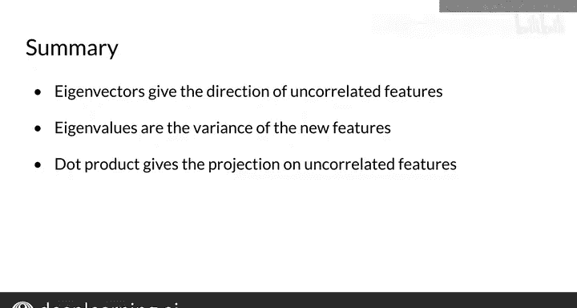

#  037：主成分分析（PCA）算法 📊

在本节课中，我们将学习特征值与特征向量的概念，并了解如何利用它们来降低特征的维度。首先，我们会介绍如何为数据获取不相关的特征，然后讲解如何在尽可能保留原始词嵌入信息的同时，降低词表示的维度。

---

## 获取不相关特征

上一节我们介绍了降维的目标。本节中，我们来看看如何为数据获取一组不相关的特征。以下是实现此目标所需的三个步骤：

1.  **均值归一化数据**：首先，对数据进行中心化处理，使其均值为零。
2.  **计算协方差矩阵**：接着，计算数据集的协方差矩阵。
3.  **执行奇异值分解**：最后，对协方差矩阵进行奇异值分解，得到三个矩阵。

奇异值分解得到的第一个矩阵（通常记为 **U**）的列向量就是特征向量，第二个矩阵（通常记为 **S**）的对角线元素就是特征值。许多编程库已内置了奇异值分解的实现，因此你无需关心其内部计算细节。

---

## 将数据投影到新特征空间

在获得了特征向量和特征值之后，下一步是将原始数据投影到新的、维度更低的特征空间中。

我们使用 **U** 表示特征向量矩阵，**S** 表示特征值矩阵。首先，计算词嵌入矩阵与 **U** 矩阵前 **n** 列的**点积**，其中 **n** 是你希望最终保留的维度数。为了可视化，通常选择二维。

此外，你可以计算新向量空间所保留的方差百分比，以评估信息保留程度。一个重要的注意事项是，特征向量和特征值应按特征值**降序**排列，这能确保从原始嵌入中保留尽可能多的信息。不过，大多数程序库会自动为你完成排序。

---

## 核心概念总结

本节课中我们一起学习了主成分分析的核心步骤与原理：

*   对归一化数据的协方差矩阵进行分解，得到的**特征向量**指明了不相关特征的方向。
*   与这些特征向量关联的**特征值**，则表明了数据在这些新特征方向上的方差大小。
*   通过计算词嵌入与特征向量矩阵的**点积**，可以将数据投影到你选择的、任意维度的新向量空间中。

你现在已经准备好在本周的作业中实现PCA，以可视化词表示了。祝你顺利，并享受学习的乐趣！😊

---

恭喜你，现在你已经掌握了PCA的所有知识，并了解了实现它所需的全部步骤。下周，我们将学习向量空间，并展示如何利用它们构建一个简单的机器翻译系统。