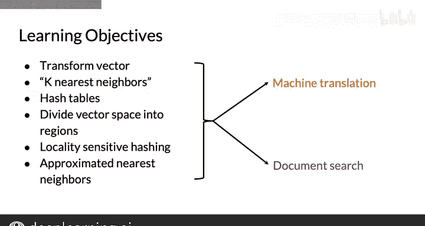

#  040：第39讲 概述 🎯

在本节课中，我们将一起学习本课程最后一周的核心内容。我们将了解如何实现机器翻译和文档搜索这两项实用的自然语言处理任务，并预览本周将练习的关键技能。

---

恭喜你坚持到本课程的最后一周。

现在我将告诉你接下来要学习的内容。

在本课程的第四周，也是最后一周，你将学习如何实现机器翻译，例如将英文单词“Hello”翻译成法文单词“Bonjour”。

你还将学习如何实现文档搜索。例如，给定一个文档（如句子“can I get a refund”），你可以搜索相似的文档，例如“what‘s your return policy”或“may I get my money back”。

你将学习一套可以同时应用于这两项实用NLP任务的技能。

以下是本周课程和作业中你将练习的技能预览。如果现在不理解其中某些术语的含义，请不要担心，在进入作业之前，你将学习并练习每一项内容。

以下是本周你将学习的关键技能：

*   **向量变换**：你将学习变换向量（如词向量）意味着什么。
*   **K近邻算法**：你将学习如何实现K近邻算法，这是一种搜索相似项的方法。
*   **哈希表**：你将学习哈希表，它将帮助你将词向量分配到不同的子集中。
*   **向量空间划分**：你将学习如何将向量空间划分为不同的区域。
*   **局部敏感哈希**：最后，你将学习如何实现局部敏感哈希，这有助于你执行近似最近邻搜索，这是一种高效的相似词向量搜索方法。

通过练习如何查找相似的词向量，你将有效地掌握如何实现机器翻译和文档搜索。

这是非常令人兴奋的内容，我们希望你会非常喜欢本周的学习。

---

现在你已经对即将学习的内容和本周的学习目标有了一个概述，我们可以正式开始学习了。