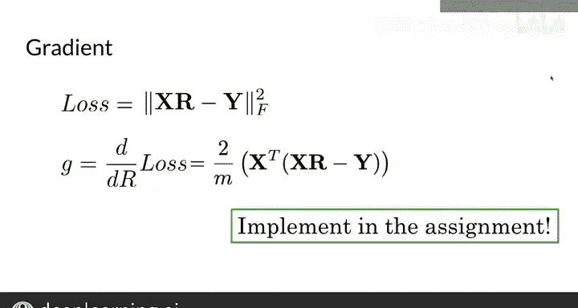

#  041：词向量转换 🔄


## 概述

在本节课中，我们将要学习如何利用词向量来实现两种不同语言之间单词的对齐，从而构建一个基础的翻译程序。我们将从机器翻译的概述开始，逐步讲解如何使用矩阵转换词向量，并最终通过优化算法找到一个合适的转换矩阵。

---

## 机器翻译概述

上一节我们介绍了词向量及其捕获单词重要属性的能力。本节中，我们来看看如何利用词向量进行机器翻译。

以英法翻译为例，将英文单词翻译成法文单词的一种方法是生成一个包含英文单词及其对应法文单词的详尽列表。若由人工完成，需要精通双语的人员来制作此列表。若希望机器学会此任务，则需要计算与英文和法文相关的词嵌入。

接下来，获取特定英文单词（例如“cat”）的英文词嵌入，然后找到一种方法将该英文词嵌入转换为在法文词向量空间中具有意义的词嵌入。随后，将转换后的词向量与法文词向量空间中最相似的词向量进行匹配，这些最相似的单词即为翻译的候选词。如果机器表现良好，它可能会找到法文单词“chat”（猫）。

为了实现这种转换，我们需要找到一个能够执行此转换的矩阵。

---

## 使用矩阵转换向量

为了理解如何使用矩阵转换向量，我们可以尝试以下代码（本讲义的配套笔记本中也包含此代码）：

```python
import numpy as np

# 定义矩阵R
R = np.array([[2, 0], [0, -2]])
# 定义向量x
x = np.array([[3, 4]])
# 使用numpy.dot进行矩阵乘法
result = np.dot(x, R)
```

执行上述代码后，`result` 是另一个二维向量，这与我们之前看到的结果一致。请亲自尝试运行此代码。

既然我们知道可以存在一个矩阵将英文词向量转换为相关的法文词向量，那么如何定义这个转换矩阵（我们将其表示为 **R**）呢？

---

## 寻找转换矩阵 R

我们可以从一个随机选择的矩阵 **R** 开始，然后观察它在尝试翻译矩阵 **X** 中的英文向量时的表现，并将其与实际的、存储在矩阵 **Y** 中的法文词向量进行比较。

为了使此方法有效，首先需要获取一个英文单词及其对应法文翻译的子集，获取它们各自的词向量，并将这些词向量分别堆叠在矩阵 **X** 和 **Y** 中。此处的关键是保持行对齐或对齐词向量。这意味着如果矩阵 **X** 的第一行包含单词“cat”，那么矩阵 **Y** 的第一行应包含法文单词“chat”。

你可能会问，既然我已经有了英文单词及其法文翻译，为什么还需要训练一个模型来做这件事？为什么不直接将此信息保存在像Python字典这样的键值映射中？好处在于，你只需收集这些单词的一个子集来寻找转换矩阵。如果它工作良好，那么该模型可用于翻译原始训练集中未包含的单词。因此，你只需要在英法词汇的一个子集上进行训练，而非整个词汇表。

---

## 优化矩阵 R

让我们看看如何找到一个好的矩阵 **R**。首先，我们将翻译结果 **X** × **R** 与 **Y** 中的实际法文词嵌入进行比较。我们通过计算 **X** × **R** - **Y** 来实现这一点。目前，你可以将其视为衡量尝试翻译与法文实际向量之间差距的一种度量。

如果你从一个随机矩阵 **R** 开始，可以在循环中逐步改进这个矩阵 **R**。以下是优化步骤：

1.  通过计算损失函数对矩阵 **R** 的导数来获取梯度。
2.  通过减去梯度（由学习率 α 加权）来更新矩阵 **R**。

你可以选择固定循环次数，或在每次迭代时检查损失值，当损失低于某个阈值时跳出循环。

---

## 弗罗贝尼乌斯范数

现在，让我们解释双竖线符号的含义。这是衡量矩阵大小或范数的一种方法。让我们看一个计算此范数的例子，然后了解通用公式。

假设 **X** × **R** - **Y** 的结果是一个矩阵 **A**。在此示例中，我们假设词典中只有两个单词（即矩阵的行数），且词嵌入是二维的（即矩阵的列数）。因此，矩阵 **X**、**R**、**Y** 和 **A** 都是 2×2 矩阵。

如果矩阵 **A** 如下所示：
```
A = [[2, 2],
     [2, 2]]
```
那么计算其范数时，我们计算 2² + 2² + 2² + 2²，然后取平方根，得到 4。

以下是实际公式：取矩阵中的所有元素，平方它们并求和。这个范数带有下标 **F**，因为它被称为**弗罗贝尼乌斯范数**。

现在，让我们用代码计算弗罗贝尼乌斯范数：

```python
import numpy as np

A = np.array([[2, 2], [2, 2]])
# 计算弗罗贝尼乌斯范数
norm_F = np.sqrt(np.sum(np.square(A)))
```

尝试自己运行一下。请注意，在实践中，最小化弗罗贝尼乌斯范数的平方更为简便。换句话说，我们可以通过取平方来抵消平方根。稍后我将解释为什么使用范数的平方更容易处理。

回到矩阵 **A** 的例子，弗罗贝尼乌斯范数的平方就是 2² + 2² + 2² + 2²，然后我们取平方根，但随后通过对该和进行平方来抵消它。因此，弗罗贝尼乌斯范数的平方是 16。

---

## 计算损失函数的梯度

损失定义为弗罗贝尼乌斯范数的平方。梯度是损失对矩阵 **R** 的导数。其公式如下：

**梯度 = (2/m) * (Xᵀ (X R - Y))**

其中，标量 **m** 是用于训练的子集中的行数或单词数。

如果你还记得微积分，当你把 **R** 视为单个变量而非矩阵，且 **X** 和 **Y** 是常数时，这个公式可能看起来很熟悉。如果你不认识这个公式，也不必担心，你不需要在这里掌握微积分；如果需要，你可以在网上查找这些导数。

回到为什么使用弗罗贝尼乌斯范数的平方有帮助：对这个表达式求导比处理弗罗贝尼乌斯范数中的平方根更容易。你将在作业中实现这个公式。

---



## 总结

本节课中，我们一起学习了如何利用词向量和矩阵转换来实现跨语言单词对齐的基础翻译。我们了解了机器翻译的基本流程，探索了如何使用和优化转换矩阵 **R**，并介绍了用于衡量误差的弗罗贝尼乌斯范数及其在梯度计算中的应用。通过仅需一个矩阵，我们就能学习将一种语言的词向量与另一种语言对齐。接下来，我们将学习K近邻算法来进一步完善翻译过程。