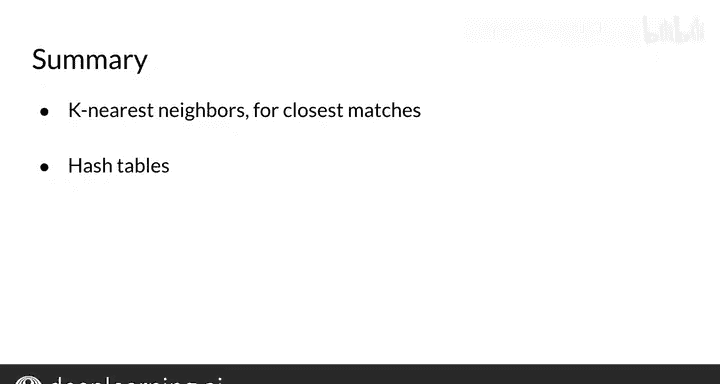

#  042：K近邻算法与哈希表简介

## 概述 📖

在本节课中，我们将要学习一个自然语言处理中的关键操作：如何为一个向量寻找最相似的邻居。这个操作是许多NLP技术的基础构建模块。我们首先会从一个生活化的例子入手，理解寻找“最近邻居”的需求，然后引出一种能极大提升搜索效率的数据结构——哈希表。

## 从翻译任务到寻找相似向量 🔍

在上一节视频中，实现单词翻译的一个关键操作是寻找与某个向量最相似的“邻居”。

本节中我们来看看这个操作本身。请注意，一个英文单词的词向量经过 **R** 矩阵变换后，会进入法文词向量空间。

但这个变换后的向量，并不一定与法文词向量空间中的任何一个现有向量完全相同。

你需要在实际的法文词向量中进行搜索，以找到一个与你通过变换生成的向量相似的法文单词。

你可能会找到像“Salu”或“Bonjou”这样的词，可以将它们作为英文单词“hello”的法文翻译返回。

那么问题来了：**如何找到相似的词向量？**

## 一个生活化的类比：寻找附近的朋友 🗺️

为了理解如何寻找相似向量，让我们看一个相关的问题：**如何找到住在你附近的朋友？**

假设你正在美国旧金山拜访你亲爱的朋友Andrew。你也想在周末拜访其他朋友，最好是那些住得近的。

以下是实现此目标的一种方法：
1.  遍历你的通讯录，针对每一位朋友。
2.  获取他们的地址，计算他们与旧金山的距离。
3.  根据距离对朋友进行排序，然后按亲近程度排名。

请注意，如果你有很多朋友（我相信你肯定有），这将是一个非常耗时的过程。有没有更高效的方法呢？

你可能会注意到，其中两位朋友住在另一个大洲，而第三位朋友住在美国。你是否可以只搜索住在美国的那部分朋友呢？

你可能已经意识到，为了找到离你最近的朋友，或许没有必要遍历通讯录里的所有人。

你可能想过，如果你能以某种方式筛选出所有在某个大区域（例如北美）的朋友，那么你就可以只在这个朋友子集中进行搜索。

如果有一种方法能将地理空间分割成不同的区域，你就可以只在这些区域内进行搜索。

## 引入高效的数据结构：哈希表 🪣

当你思考如何高效地组织数据集的子集时，你可能会想到将数据放入不同的“桶”中。

如果你想到了“桶”，那么你肯定会想了解**哈希表**。

哈希表是任何涉及数据处理的工作中都很有用的工具。

你将在下一个视频中学习哈希表。

## 总结 ✨

本节课中我们一起学习了：
1.  如何使用K近邻算法来翻译单词，即使变换后的向量与目标语言中的词嵌入并不完全匹配。
2.  引入了哈希表这一有用的数据结构，它能够将数据分到不同的“桶”中，为下一节视频中学习如何实现快速近似搜索奠定了基础。

---

准备好了吗？现在你将学习哈希技术，这是一种比简单线性搜索高效得多的查询查找方法。😊