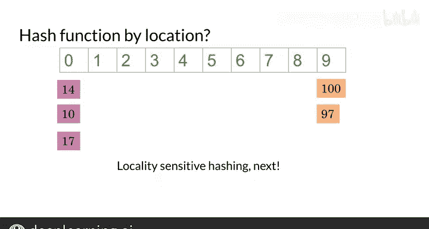

#  043：哈希表与哈希函数 🗃️


在本节课中，我们将要学习哈希表和哈希函数的基本概念。你将了解如何将数据项分组到不同的“桶”中，以及如何通过一个简单的数学运算（哈希函数）来决定每个数据项的归属。我们还会通过一个简单的代码示例来演示如何构建一个基础的哈希表。

---

## 概述

想象你有一个带多个抽屉的柜子。你可能希望将相似的对象放在同一个抽屉里，例如，所有纸质文件放在一起，所有钥匙放在一起，所有书籍放在一起。在计算机科学中，哈希表就实现了类似的功能：它将数据项（例如单词向量）根据某种规则分配到不同的“桶”中。

上一节我们介绍了数据分组的基本想法，本节中我们来看看如何用数学和代码来实现它。

---

## 哈希表与哈希函数

假设你有几个数据项，你想根据某种相似性将它们分组到桶里。一个桶可以容纳多个数据项，并且每个数据项总是被分配到同一个桶。

例如，一些蓝色的椭圆形最终进入1号桶，一些灰色的矩形进入2号桶，一些品红色的三角形则被分配到3号桶。

现在，让我们思考如何用单词向量来实现这一点。首先，我们假设单词向量只有一维，而不是300维。因此，每个单词由一个单独的数字表示，例如100、141、710和97。

你需要找到一种方法，为每个向量赋予一个哈希值。哈希值是一个键，它指明了该向量应该被分配到哪个桶。分配哈希值的函数被称为哈希函数。

在这个例子中，这里有一个哈希表，它是一组桶的集合。本例中，哈希表有10个桶。请注意，单词向量100和10被分配到了0号桶。单词向量14被分配到了4号桶。单词向量17和97被分配到了7号桶。你注意到规律了吗？

以下公式就是用于将单词向量分配到各自桶中的哈希函数：
`hash_value = vector_value % 10`

模运算符（`%`）用于计算除以10后的余数。这个余数就是哈希值，它告诉我们单词向量应该存储在哪里。例如，14除以10的余数是4，所以它进入4号桶。

---

## 构建基础哈希代码

现在，让我们构建一个基础的哈希代码。以下是定义一个函数的代码，该函数接收一个值列表（你可以将每个值视为一个一维向量）和桶的数量。

```python
def basic_hash_table(value_l, n_buckets):
    # 定义哈希函数：使用模运算符
    def hash_function(value, n_buckets):
        return int(value) % n_buckets

    # 创建哈希表（一个字典，键是桶编号，值是空列表）
    hash_table = {i: [] for i in range(n_buckets)}

    # 对每个值计算哈希值，并将其添加到对应的桶中
    for value in value_l:
        hash_value = hash_function(value, n_buckets)
        hash_table[hash_value].append(value)

    return hash_table
```

请注意，这是一个字典推导式。键是整数（桶编号），值是一个空列表，你将用它作为存储的桶。对于每个单词向量，计算其哈希值，然后将其追加到相应的列表中。

与本讲座配套的笔记本中可以看到返回的哈希表。你会发现，这个哈希表与上一张幻灯片中看到的完全相同。

---

## 哈希表的局限性

现在，让我们再看一下这个基础哈希表。回想一下，你最初的目标是将相似的单词向量放入同一个桶中。但在这里，看起来彼此接近的数字并没有在同一个桶里。例如，10、14和17在不同的桶中。

理想情况下，你希望有一个哈希函数，能将相似的单词向量放入同一个桶，就像这样。为了实现这一点，你需要使用一种称为“局部敏感哈希”的方法。

“局部”是位置的另一种说法。“敏感”是在意的另一种说法。因此，局部敏感哈希是一种非常在意根据数据项在向量空间中的位置来分配它们的哈希方法。



你将在下一节课中学习局部敏感哈希。

---

## 总结


本节课中我们一起学习了许多新术语：哈希值、哈希函数和桶。你也看到了如何构建一个哈希表的代码，这相当于我在视频开头提到的那个柜子。在下一个视频中，我们将探讨局部敏感哈希。