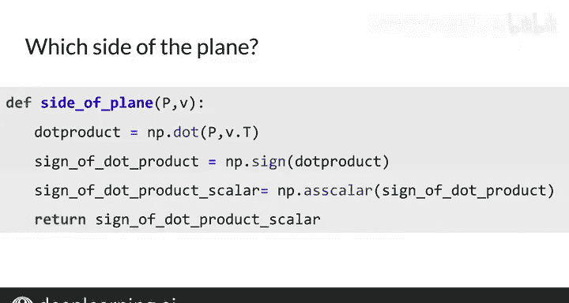

#  044：吴恩达《自然语言处理》P44 - 局部敏感哈希 🧭


在本节课中，我们将要学习一种名为**局部敏感哈希**的关键方法，它能有效降低在高维空间中寻找k个最近邻的计算成本。我们将从哈希的基本概念讲起，逐步理解其如何对数据点的位置敏感，从而进行高效分组。

---

## 什么是哈希与平面划分？ 📐

上一节我们介绍了课程目标，本节中我们来看看哈希的基本思想以及如何用“平面”来划分空间。

首先，假设你使用的词向量只有两个维度。我们将每个向量视为一个点（而非箭头）。假设你想找到一种方法，知道这些蓝点彼此接近，而这些灰点也彼此相关。

以下是如何开始划分空间：

首先，使用这些虚线来划分空间，我将其称为“平面”。稍后我会解释为何称它们为平面。注意蓝色平面如何将空间分割成位于其上或其下的向量。蓝色向量恰好都位于蓝色平面的同一侧。类似地，灰色向量恰好位于灰色平面的上方。

看起来，平面可以帮助我们根据向量的位置将它们分到不同的子集中。这正是你想要的：一个对它所分配项的位置敏感的哈希函数。你正在逐步接近**局部敏感哈希**。

---

## 为什么称其为“平面”？ ✈️

现在，让我们看看为什么我称这些虚线为“平面”。

在二维空间中，一个平面就是这条洋红色的线。它实际上代表了所有可能位于该平面上的向量。换句话说，这些向量会与该平面平行，例如这个蓝色向量或这个橙色向量。

你可以用一个单独的向量来定义一个平面。这个洋红色的向量垂直于该平面，被称为该平面的**法向量**。法向量垂直于平面上任何向量。

在三维空间中思考可能更有帮助：想象一张纸放在桌上，在纸上画一些向量。然后垂直握住一支铅笔置于纸的上方。纸上的任何向量都与这支铅笔垂直。

---

## 如何用数学判断向量位于平面的哪一侧？ ➕➖

我们回到二维空间。从视觉上你能看出一个向量位于平面的哪一侧，但如何用数学方法实现呢？

以下是三个示例向量：蓝色、橙色和绿色。平面的法向量标记为 **P**。

让我们关注向量 **V1**。如果你计算 **P** 与 **V1** 的点积，结果是 **3**。稍后我会解释为什么这样做。

现在，看向量 **V2**。计算 **P** 与 **V2** 的点积，结果是 **0**。

最后，看向量 **V3**。计算 **P** 与 **V3** 的点积，结果是 **-3**。

所以点积结果分别是 **3**、**0** 和 **-3**。你是否注意到这些符号与它们相对于红色平面的位置之间的关系？

当点积为正时，向量位于平面的一侧。如果点积为负，向量位于平面的另一侧。如果点积为 **0**，向量就在平面上。

---

## 点积的几何意义是什么？ 📏

为了可视化点积，想象其中一个向量（例如 **P**）是地球的表面。重力将所有物体垂直拉向地球表面。

接下来，假设你站在向量 **V1** 的末端。你将一根绳子系在石头上，让重力将石头拉向向量 **P** 的表面。绳子垂直于向量 **P**。现在，如果你画一个与 **P** 方向相同、但终点在石头处的向量，你就得到了向量 **V1** 在向量 **P** 上的**投影**。

该投影向量的大小或长度等于 **V1** 和 **P** 的点积。此外，如果你有另一个绿色向量并将其投影到向量 **P** 上，投影向量将与 **P** 平行但方向相反。点积将是一个负数。

这意味着点积的符号指示了投影相对于紫色法向量的方向。因此，点积的正负可以告诉你向量 **V1** 或 **V2** 位于平面的哪一侧。

---

## 用代码判断向量位于平面的哪一侧 💻

以下是使用代码检查向量位于平面哪一侧的方法。

函数 `side_of_plane` 接收法向量 **P** 和一个向量 **V**。它使用 `numpy.dot` 计算点积，然后使用 `numpy.sign` 获取符号：如果点积为正则返回 **+1**，为负则返回 **-1**，为零则返回 **0**。

```python
import numpy as np

def side_of_plane(P, v):
    dot_product = np.dot(P, v)
    sign = np.sign(dot_product)
    # 如果点积为0，sign会返回0，我们直接将其作为标量返回
    return sign if sign != 0 else 0.0
```

请注意函数中 `numpy.asscalar` 的用法（如果向量可以表示为单个标量，此函数会检索该标量）。请你自己尝试运行它。



---

## 本节总结 📝

本节课中我们一起学习了**局部敏感哈希**的初步概念。我们通过可视化了解了如何使用平面划分空间，并通过点积的数学原理来判断向量位于平面的哪一侧。核心在于，**两个向量投影的符号可以告诉你一个点位于直线的哪一部分**（例如，上方或下方）。

在下一节视频中，你将学习如何将这个概念与多个平面结合，以更好地近似数据点可能位于的位置。