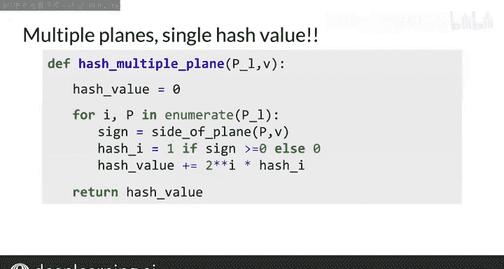

#  045：多平面哈希法 🧩


在本节课中，我们将学习如何结合多个平面来为数据点生成一个单一的哈希值。这种方法能帮助我们将向量空间划分为多个区域，从而更高效地识别和定位数据。

---

在上一节中，我们介绍了如何通过计算向量与平面法向量的点积符号，来确定向量相对于该平面的位置。本节中，我们将看看如何利用多个平面的信息，为向量空间中的数据生成一个哈希值。

为了将向量空间划分为易于管理的区域，我们需要使用多个平面。对于每个平面，我们可以确定一个向量位于该平面的正侧还是负侧。这样，每个平面都会产生一个信号。我们需要找到一种方法，将这些信号组合成一个单一的哈希值。这个哈希值将定义向量空间内的一个特定区域。

以下是生成哈希值的具体步骤：

首先，对于每个平面，计算向量与该平面法向量的点积。根据点积的符号，分配一个中间哈希值：
*   如果点积符号大于或等于0，则中间哈希值设为 **1**。
*   如果点积符号小于0，则中间哈希值设为 **0**。

然后，使用以下公式将所有中间哈希值组合成最终的单一哈希值：
`hash = (2^0 * h1) + (2^1 * h2) + (2^2 * h3) + ... + (2^(n-1) * hn)`
其中，`h1`, `h2`, ..., `hn` 是每个平面对应的中间哈希值。

让我们通过一个例子来理解这个过程。假设有一个向量，它与三个平面的点积结果如下：
*   与平面1的点积为 **3**（符号为正），中间哈希值 `h1 = 1`。
*   与平面2的点积为 **-5**（符号为负），中间哈希值 `h2 = 0`。
*   与平面3的点积为 **2**（符号为正），中间哈希值 `h3 = 1`。

根据组合公式，最终哈希值为：
`hash = (2^0 * 1) + (2^1 * 0) + (2^2 * 1) = 1 + 0 + 4 = 5`

这样，我们就得到了一个代表该向量所在区域的哈希值 **5**。多个平面帮助我们细分了向量空间，而单一的哈希值则让我们知道该将向量分配到哪个“桶”中。

---

现在，让我们看看如何在代码中实现这个逻辑。给定一个平面列表和一个向量，我们可以按以下步骤计算哈希值：

```python
def hash_multi_plane(planes, v):
    hash_value = 0
    for i, plane in enumerate(planes):
        # 计算点积的符号
        dot_product = np.dot(v, plane)
        # 根据符号分配中间哈希值
        if dot_product >= 0:
            h = 1
        else:
            h = 0
        # 将中间哈希值加权后累加到最终哈希值
        hash_value += np.power(2, i) * h
    return hash_value
```

在这段代码中，我们初始化哈希值为0。然后遍历每个平面，计算向量与平面法向量的点积符号，并据此设置中间哈希值 `h`。接着，将 `h` 乘以 `2` 的 `i` 次方（`i` 是平面的索引），并累加到总哈希值中。最后返回计算出的哈希值。如果你在课程笔记中运行这段代码，将会得到与前面例子相同的结果。

---



本节课中，我们一起学习了**多平面哈希法**。我们了解了如何利用多个平面为数据点生成一个唯一的哈希值，从而将高维向量空间有效地划分为不同的区域。这种方法的核心在于组合每个平面对向量位置的判断（正侧或负侧），通过加权求和得到一个单一的标识符。这是实现**局部敏感哈希**的关键一步，它将为后续加速最近邻搜索的计算奠定基础。

接下来，你将会看到这种方法如何具体应用于加速关键的最近邻计算。让我们进入下一个视频。