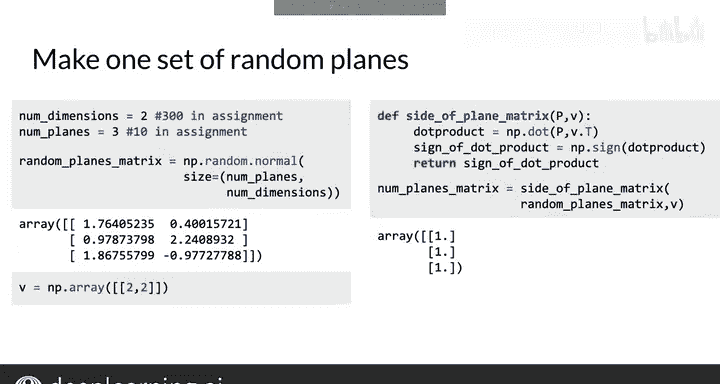

#  046：近似最近邻 🎯


## 概述

在本节课中，我们将学习如何利用上一节介绍的局部敏感哈希技术，构建一个比暴力搜索快得多的算法来寻找近似最近邻。我们将探讨如何通过多组随机平面来更稳健地划分向量空间，并最终在代码中实现这一过程。

---

## 从单组到多组随机平面

上一节我们介绍了如何使用一组随机平面来划分向量空间。然而，一组平面（例如下图中的三个平面）的划分方式可能并非最优。


我们无法确定哪一组平面是划分向量空间的最佳方式。那么，为什么不创建多组随机平面呢？这样，我们就可以将向量空间划分到多个独立的哈希表集合中。

你可以将其想象成创建了多个“宇宙”副本。利用所有这些不同的随机平面集合，可以帮助我们找到一组高质量的、可能成为最近邻的候选向量。

## 多组平面的工作原理

假设我们有一个向量空间，中间的红点代表一个英语单词转换成的法语词向量。我们的目标是找到其他可能相似的法语词向量。

*   第一组随机平面可能帮助我们确定，这个红点向量和这些绿点向量被分配到了同一个哈希“口袋”中。
*   另一组完全不同的随机平面可能帮助我们确定，这些蓝点向量与红点向量在同一个哈希“口袋”中。
*   第三组随机平面可能帮助我们确定，这些橙点向量与红点向量在同一个哈希“口袋”中。

通过为局部敏感哈希使用多组随机平面，我们就有了一种更稳健的方法来搜索向量空间，以找到可能成为最近邻的候选向量集合。

## 近似最近邻的概念

这种方法被称为**近似最近邻**。因为你并非搜索整个向量空间，而只是它的一个子集。所以，你找到的不是绝对精确的最近邻，而是**近似**的最近邻。

你牺牲了一些搜索精度，以换取搜索效率的大幅提升。

## 在代码中创建随机平面

接下来，我们看看如何在代码中创建一组随机平面。假设你的词向量是二维的，并且你想生成三个随机平面。

你可以使用 `numpy.random.normal` 来生成一个3行2列的矩阵，如下所示：

```python
import numpy as np

# 假设向量维度为2，生成3个随机平面（法向量）
planes = np.random.normal(size=(3, 2))
```

然后，创建一个向量 `v`，并针对每个随机平面，判断该向量位于平面的哪一侧。

```python
v = np.array([1, 2])  # 示例向量
```

请注意，我们无需使用 `for` 循环逐个处理平面，而可以使用 `numpy` 的向量化操作一步完成。让我们调用这个函数：

```python
# 计算向量v与每个平面法向量的点积
dot_products = np.dot(planes, v)
# 判断符号，得到中间哈希值（1表示正侧，0表示负侧）
hash_values = (dot_products > 0).astype(int)
```

结果是向量 `v` 位于这三个随机平面中每一个的正侧。




## 组合哈希值

你已经了解了如何将这些中间哈希值组合成一个单一的哈希值。请务必查看课程配套的笔记本，以查看所有代码并练习这最后一步。

## 总结

本节课中，我们一起学习了如何利用局部敏感哈希技术高效计算近似最近邻。我们看到，通过使用多组随机平面，可以更可靠地在庞大的向量空间中筛选出候选邻居，从而在可接受的精度损失下，获得比朴素搜索快得多的速度。这个强大的工具可以用于许多与向量相关的任务。在下一个视频中，我将向你展示如何将其应用于搜索任务。