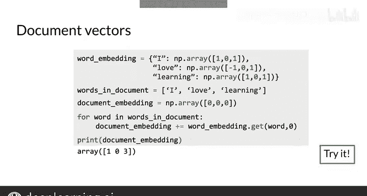

#  047：文档搜索 📄🔍


在本节课中，我们将学习如何利用词向量和快速K近邻算法，在一个大型文档集合中搜索与查询相关的文本片段。核心思想是将文档和查询都转化为向量，并通过计算向量间的相似度来找到最相关的文档。

---

## 从词向量到文档向量

上一节我们介绍了词向量的概念。本节中我们来看看如何将整个文档表示为一个向量，这是进行文档搜索的基础。

假设我们有一个由三个单词组成的文档：“I love learning”。为了将这个文档表示为向量，我们可以采用以下方法：

1.  首先，获取文档中每个单词的词向量。例如，单词“I”、“love”、“learning”各自都有一个向量表示。
2.  然后，将这些词向量相加。
3.  所有词向量的和就构成了该文档的向量，其维度与单个词向量相同（本例中为三维）。

用公式可以表示为：
**文档向量 = Σ(单词向量)**

## 实现文档向量化

以下是实现上述文档向量化过程的代码示例。我们首先创建一个微型的词嵌入字典，然后遍历文档中的每个单词，累加其对应的向量。

```python
# 微型词嵌入字典示例
word_embeddings = {
    "I": [1, 0, 0],
    "love": [0, 1, 0],
    "learning": [0, 0, 1],
    "you": [1, 1, 0],
    "hate": [-1, 0, 0]
}

def document_to_vector(document, embeddings):
    """
    将文档转换为向量。
    参数:
        document: 字符串，代表文档内容。
        embeddings: 字典，单词到向量的映射。
    返回:
        doc_vector: 列表，文档的向量表示。
    """
    # 将文档按空格分割成单词列表
    words = document.split()
    # 初始化文档向量为零向量，维度与词向量相同
    doc_vector = [0] * len(next(iter(embeddings.values())))
    # 遍历每个单词，累加其向量
    for word in words:
        if word in embeddings:
            word_vec = embeddings[word]
            # 将词向量加到文档向量上
            doc_vector = [doc_vector[i] + word_vec[i] for i in range(len(doc_vector))]
    return doc_vector

# 示例用法
doc = "I love learning"
doc_vec = document_to_vector(doc, word_embeddings)
print(f"文档 '{doc}' 的向量表示为：{doc_vec}")
```

## 执行文档搜索

获得文档的向量表示后，就可以应用K近邻算法进行搜索了。以下是执行搜索的基本步骤：

1.  **预处理**：将文档库中的所有文档都转换为向量，并存储起来。
2.  **查询处理**：将用户的查询文本同样转换为向量。
3.  **相似度计算**：计算查询向量与每个文档向量之间的相似度（例如，使用余弦相似度或欧氏距离）。
4.  **结果排序**：根据相似度对文档进行排序，返回最相关的K个文档作为搜索结果。

> 通过这种方法，语义相近的文档在向量空间中的位置也会接近，从而使得K近邻搜索能够找到含义相似的文本。

---

## 课程总结



本节课中我们一起学习了文档搜索的基本原理。我们了解到，可以将文本（无论是单词、句子还是整篇文档）嵌入到向量空间中，使得语义相似的文本在向量空间中也彼此接近。利用快速K近邻算法，我们可以高效地找到与给定查询最相关的文档。虽然这只是文本嵌入的基础方法，但这种将文本转化为向量并进行相似度比较的核心结构，在现代自然语言处理中会反复出现。