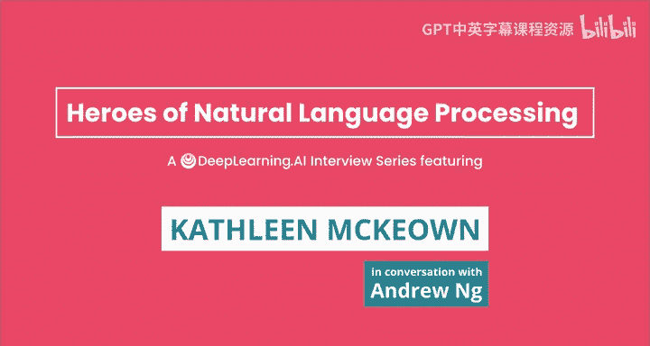
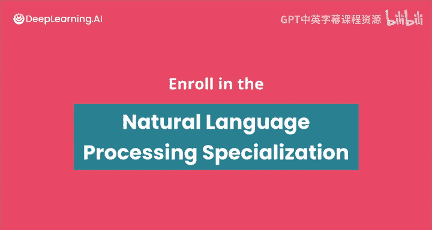

#  049：从比较文学到NLP前沿——Kathleen McKeown的跨学科研究之旅 🧠

在本节课中，我们将跟随哥伦比亚大学计算机科学教授、数据科学与工程研究所创始主任Kathleen McKeown，了解她如何从比较文学专业的学生成长为自然语言处理领域的先驱。我们将探讨她的研究历程、对跨学科工作的看法，以及她对当前NLP研究方向的见解。

## 从比较文学到计算语言学 📚

上一节我们介绍了Kathleen McKeown的背景，本节中我们来看看她独特的学术转型之路。

Kathleen McKeown在布朗大学本科期间，主修了比较文学，同时也修读了数学课程。她对比较文学的兴趣日益浓厚，部分原因是受到了授课教师的深刻影响。

临近毕业时，她找到了一份程序员的工作，但觉得非常枯燥。她认为，如果每周要工作40小时，她希望从事自己真正热爱的事情。

当时，她的一位语言学专业的朋友向她介绍了计算语言学。于是，她在接下来的一年里，花了大量时间在图书馆阅读关于人工智能和自然语言处理的资料。

当她第二年申请研究生时，她明确知道自己想从事这个领域，因为它将她对语言的兴趣和数学结合了起来。

## 自学之路与克服“冒名顶替综合症” 💪

上一节我们了解了Kathleen McKeown的转型契机，本节中我们来看看她如何克服初入新领域的挑战。

她完全是自学，在阅读方向上没有任何指导。最初，她只是根据那位朋友的一些建议开始阅读，然后通过追踪参考文献来深入学习。

当她进入研究生阶段，由于本质上转换了领域，她感到非常害怕。她确信自己是个“冒名顶替者”，懂得不够多，并担心很快会被发现她其实不该在那里。

但随着时间的推移，她克服了这种感觉，并认识到事实并非如此，人们会重视她的贡献。

对于今天可能面临类似处境的学习者，她给出了以下建议：

以下是Kathleen McKeown给初学者的建议：
*   **主动交流**：与他人交流，特别是与同行讨论他们正在做的事情和兴趣点，这非常有用。
*   **选择差异化问题**：在当今深度学习和神经网络的世界里，建议选择与其他人研究方向不同的问题，开辟新的方向，选择新的任务。
*   **利用在线资源**：参加在线阅读小组，观看在线视频和课程（如吴恩达的课程），这有助于了解领域动态并与他人建立联系。

她提到自己当时非常幸运，申请了宾夕法尼亚大学，而那时她并不知道那里是自然语言处理最好的地方。她认为，虽然每个成功者都有运气的成分，但充分的准备能让你在好运降临时抓住机会。

## 当前研究方向：文本摘要与跨学科应用 ✨

上一节我们探讨了学习路径，本节中我们来看看Kathleen McKeown当前激动人心的研究工作。

文本摘要是她近年来工作的主要部分。她的团队研究了各种不同体裁的文本摘要，从小说到电子邮件。

她特别兴奋的一个研究方向是与亚马逊研究人员合作、并在ACL上发表的小说章节摘要工作。这是一个非常新颖的任务，极具挑战性，属于深度摘要。

小说章节比当前大多数摘要研究所基于的新闻文章要长得多，这对当前的神经模型是一个挑战。一个主要问题是输入（19世纪小说）和输出（用现代语言写的摘要）之间存在极大量的**意译**。目前没有模型能够处理这种程度的意译。

她总体上对这类高度抽象摘要非常感兴趣，即摘要句子使用的词汇和句法结构与输入文档完全不同。这与当前绝大多数基于新闻摘要的研究非常不同，而新闻摘要流行主要是因为那里有现成的数据。

她研究的其他领域还包括在线个人叙述的摘要（语言非常非正式，而摘要更正式）、辩论摘要，以及过去做过的电子邮件摘要。

## 如何选择研究课题与挑战现状 🧭

上一节我们介绍了她的具体研究，本节中我们来看看她选择研究课题的哲学。

她选择研究小说摘要任务，部分源于早期与一位对创意写作非常感兴趣的学生的合作。为了说服他攻读博士学位，他们选择了一个他感兴趣的主题：创意语言的分析与生成。那时，她感觉自己的工作完成了一个循环，因为她与一位比较文学教授合作，回到了她的比较文学根源。

当后来她去亚马逊时，她知道因为Kindle和亚马逊平台上有大量小说，她认为没有什么比能够总结小说更有趣的项目了。

她选择研究课题的核心原则是：**选择一个重要的任务**。例如，当前大多数文本摘要工作都集中在所谓的新闻单文档摘要上，即输入一篇新闻文章，生成其摘要。这主要是因为那里有现成的数据（如CNN/Daily Mail语料库、纽约时报语料库等）。

但问题在于，这并非我们真正需要的任务。人们早就知道，新闻文章的开头部分（导语）可以很好地作为文档摘要。事实上，多年来都很难超越导语的摘要效果。人们研究这个问题，主要是因为那里有数据，有排行榜，人们喜欢竞争并超越排行榜。

她更喜欢选择前人未曾涉足的方向，选择一个如果解决就能真正帮助他人、成为有用应用的任务。这也是为什么她研究诸如灾难背景下的个人叙述摘要（以便浏览人们经历灾难后的体验摘要），或者当前的小说章节摘要工作。

在深度学习时代，结果产出非常快，每个人都致力于解决相同的问题以超越现有技术水平，很难成为第一个达到目标的人。如果选择不同的方向，没有其他人研究，你将成为第一个提出解决方案的人。她喜欢在自己的研究中成为某个问题的先行者。

## 跨学科研究与社会影响 🌍

上一节我们讨论了研究选题，本节中我们来看看Kathleen McKeown如何通过跨学科研究产生社会影响。

她非常享受跨学科研究，认为这是她最喜欢的研究类型。与其他领域的人交流，能让研究者从狭窄的技术领域中跳出来，获得对研究和世界的不同视角。

她目前正与社会工作领域的研究人员合作，并开始邀请一位研究非裔美国人方言的语言学家参与。他们正在研究人们对当今重大事件（例如“黑人的命也是命”运动和COVID-19疫情）的反应中表达了什么，以及表达了何种情绪。

这项工作的自然语言方向目标是：理解人们如何用非裔美国人方言表达不同类型的情感，这与用标准美式英语表达有何不同，并研究语言甚至表达内容上的差异。这有助于开发**无偏见的算法**。目前大多数自然语言系统都是在来自新闻（如《华尔街日报》）的语言上训练的。

这项工作还想研究创伤的影响。有时创伤不是个人的，而是看到与自己相似的人遭遇不幸所产生的。他们希望研究这种情绪是如何表达的，以及不同类型情感的强度等。

她认为，NLP和AI研究人员可以在这些最重要的社会问题和议题中发挥积极作用。这类工作也能吸引学生，尤其是不同类型的学生进入该领域与她合作。

## NLP领域的演变与未来展望 🔮

上一节我们看到了NLP的社会应用，本节中我们来看看Kathleen McKeown眼中NLP领域的演变。

当她刚开始进入这个领域时（1982年获得博士学位），该领域有一些显著特征。其一是**高度跨学科**。在开发NLP系统时，他们大量借鉴了语言学、哲学、心理学和认知科学的研究。她在宾夕法尼亚大学时，经常与语言学、哲学等系的教师互动。

第二个特征是**借鉴其他领域的理论**。他们借鉴语言学的理论，例如关注焦点及其在话语过程中的变化如何影响语言选择（如使用代词还是完整名词短语，使用何种句法结构使概念在话语中更突出）。他们也借鉴哲学理论，如关于意图的理论和关于会话含义的理论，并研究如何将这些理论体现在自然语言处理方法中。

对于当前最令她兴奋的NLP技术或方向，她提到了以下几点：

以下是Kathleen McKeown看好的NLP未来方向：
*   **真正抽象的、使用极端意译的摘要**。
*   **分析来自多元社区的语言**（如黑人社区，以及其他社区）。
*   **处理数据偏见**。
*   **获取副语言意义**，即关于情感、意图的语用信息。
*   **更多关于事件的工作**，理解发生了什么事件并能够跟踪它们。

回顾她最喜欢的论文，她提到了三个时期的成果。早期关于语言生成中词汇选择的工作，探讨了来自话语、词汇、句法、语义等不同部分的约束如何影响选择，并提到了“浮动约束”的例子。她认为**控制**是当前使用深度学习方法进行语言生成和摘要中所缺失的——如何控制输出内容并确保其符合我们的意图。

另一项较近的工作是“Newsblaster”（大约15年前），这是一个真实世界的问题，他们与记者合作，开发了一个能够识别当天发生的事件并为每个事件生成摘要的测试平台，还研究了如何随时间跟踪事件。这个平台为她的学生解决困难的研究问题提供了一个共同的应用场景。

## 总结与寄语 🌟

本节课中，我们一起学习了Kathleen McKeown教授从比较文学到NLP领军人物的非凡旅程。我们探讨了她自学克服挑战的经历、她选择新颖且有意义的研究课题（如小说摘要、多元社区语言分析）的哲学、她对跨学科合作价值的强调，以及她对NLP领域从理论驱动到数据驱动演变过程的观察。

她总结道，自然语言处理今天是一个令人兴奋的领域，深度学习带来了巨大的进步和准确性的显著提高，但仍有许多方向有待探索。她希望看到更多跨学科工作被重新引入，希望人们更多地关注数据本身和输出内容，而不仅仅是数字指标。她认为该领域有许多令人兴奋的方向，并希望看到更多人加入。

---
**课程资源**：更多NLP思想领袖的访谈，请查看Deeplearning.AI的YouTube频道，或在Coursera上注册NLP专项课程。