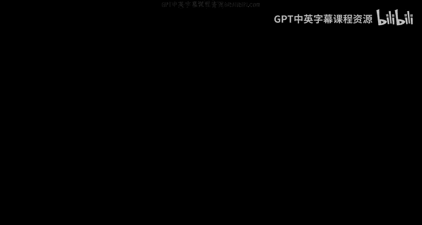
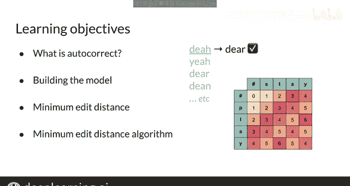

#  052：自动校正概述 🧠

在本节课中，我们将学习自动校正的基本概念。自动校正功能常见于手机和文字处理软件中，它能将拼写错误的单词自动修正为正确的形式。我们将了解其工作原理，并学习构建自动校正模型所需的关键步骤。

## 自动校正简介

上一节我们介绍了本周的学习目标，本节中我们来看看自动校正的具体含义。

自动校正功能你可能已经在手机或文字处理软件中使用过。但自动校正究竟是什么？根据上下文，它的具体含义可能略有不同。本周你将学习这些细微差别。

## 学习目标

以下是本周你将掌握的内容：

*   从概念上理解自动校正。
*   练习构建一个执行自动校正的模型。
*   学习自动校正的每个步骤和关键概念，为后续的解码任务做准备。

## 关键概念：最小编辑距离

在执行自动校正时，你需要能够量化两个字符串之间的距离或差异，即需要改变多少个字母才能将一个字符串转换为另一个字符串。

为此，你将学习如何测量**最小编辑距离**。

## 核心技术：动态规划

你将实现一种非常有趣的算法来解决最小编辑距离问题，这种算法称为**动态规划**。

动态规划是一个非常重要的概念，在技术面试中会反复出现。

## 课程安排与总结

在课程结束时，你将展示新学到的技能，并在本周的作业中应用所有这些技术。

首先，让我们在下一个视频中开始学习自动校正的概述。

本节课中我们一起学习了自动校正的基本概念、学习目标，并介绍了最小编辑距离和动态规划这两个核心技术。这些知识将为我们后续构建自动校正模型打下坚实的基础。