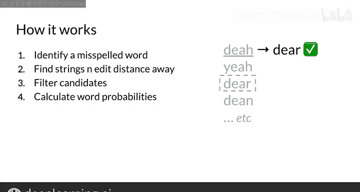

#  053：自动纠错模型详解 🛠️

在本节课中，我们将学习自动纠错的基本原理与实现步骤。自动纠错是一种将拼写错误的单词转换为正确单词的应用程序，常见于手机、平板电脑和文档编辑器中。

## 什么是自动纠错？ 🤔

自动纠错是一种应用程序，能够将拼写错误的单词更改为正确的单词。例如，当输入句子“H birthday the friend”时，自动纠错会将拼写错误的单词“the”修正为可能原本想输入的单词“dear”。

但如果你输入的是“deer”而不是“dear”，虽然单词拼写正确，但上下文可能不匹配。本周课程中，我们暂不处理这种上下文错误，因为它属于更复杂的问题。我们将专注于修正拼写错误的单词。

## 自动纠错的工作原理 📝


自动纠错主要包含四个关键步骤：

1.  **识别错误单词**：通过拼写错误识别。
2.  **查找编辑距离相近的字符串**：找到与输入字符串编辑距离为1、2、3或任意n的字符串。编辑距离越小，字符串与输入字符串越相似。
3.  **筛选正确拼写的真实单词**：从候选字符串中筛选出实际存在的、拼写正确的单词。
4.  **计算单词概率并选择最可能候选词**：计算每个候选词在上下文中出现的概率，并选择概率最高的单词作为替换。

## 编辑距离与字符串相似性 📏

编辑距离是衡量两个字符串相似度的指标，定义为将一个字符串转换为另一个字符串所需的最少单字符编辑操作次数。操作包括插入、删除、替换和交换相邻字符。

**编辑距离公式**：
```
编辑距离 = 最小编辑操作次数
```

## 实现自动纠错的详细步骤 🔧

上一节我们概述了自动纠错的工作原理，本节我们将深入探讨每个步骤的具体实现细节。

### 步骤一：识别错误单词

识别错误单词通常通过检查单词是否存在于预定义的词典中来实现。如果单词不在词典中，则被视为拼写错误。


### 步骤二：查找编辑距离相近的字符串


为了找到与错误单词编辑距离相近的候选字符串，我们可以使用动态规划算法计算编辑距离。以下是查找编辑距离为1的字符串的示例代码：

```python
def generate_edit_one(word):
    letters = 'abcdefghijklmnopqrstuvwxyz'
    splits = [(word[:i], word[i:]) for i in range(len(word) + 1)]
    deletes = [L + R[1:] for L, R in splits if R]
    inserts = [L + c + R for L, R in splits for c in letters]
    replaces = [L + c + R[1:] for L, R in splits if R for c in letters]
    return set(deletes + inserts + replaces)
```

### 步骤三：筛选正确拼写的单词

从候选字符串中筛选出实际存在于词典中的单词。这可以通过查询词典来实现。

### 步骤四：计算单词概率并选择最可能候选词

计算每个候选词在语料库中出现的概率，选择概率最高的单词作为最终纠正结果。概率计算公式为：

```
P(word) = 单词在语料库中的出现次数 / 语料库总单词数
```

## 优化编辑距离计算 ⚡

现在我们已经了解了自动纠错的基本实现步骤。在本周的编程练习中，你将亲自实现自动纠错模型，并看到其良好的效果。接下来，我将介绍如何加速编辑距离的计算。

为了提高编辑距离的计算效率，可以使用动态规划算法，并通过矩阵存储中间结果，避免重复计算。以下是一个简单的动态规划实现示例：



```python
def edit_distance(word1, word2):
    m, n = len(word1), len(word2)
    dp = [[0] * (n + 1) for _ in range(m + 1)]
    for i in range(m + 1):
        dp[i][0] = i
    for j in range(n + 1):
        dp[0][j] = j
    for i in range(1, m + 1):
        for j in range(1, n + 1):
            if word1[i - 1] == word2[j - 1]:
                dp[i][j] = dp[i - 1][j - 1]
            else:
                dp[i][j] = min(dp[i - 1][j], dp[i][j - 1], dp[i - 1][j - 1]) + 1
    return dp[m][n]
```

## 总结 📚

本节课我们一起学习了自动纠错模型的基本原理与实现步骤。自动纠错通过识别错误单词、查找编辑距离相近的字符串、筛选正确拼写的单词以及计算单词概率来选择最可能的候选词，从而实现对拼写错误的自动修正。通过优化编辑距离计算，我们可以提高自动纠错模型的效率。希望这些知识能帮助你更好地理解和实现自动纠错功能。