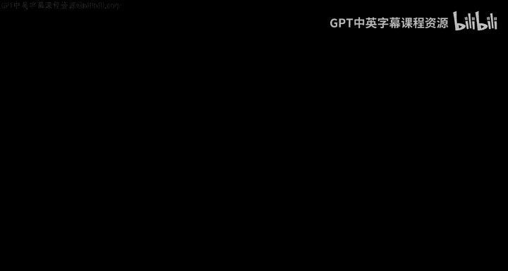
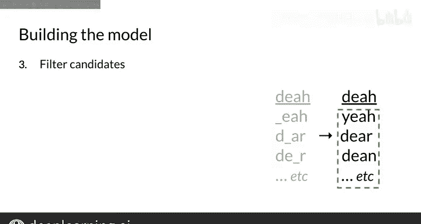

#  054：构建自动纠错模型 🛠️

在本节课中，我们将深入学习构建自动纠错模型所需的四个核心步骤。我们将详细探讨如何识别拼写错误、生成候选词、筛选候选词，并为下一节课的概率计算步骤打下基础。

---

## 概述：自动纠错的四个步骤

在上一节视频中，我们简要提到了实现自动纠错所需的四个步骤。现在，我们将深入探讨这些步骤。你已经了解了自动纠错模型内部的这四个步骤，是时候详细研究每一步了。你将在本周的作业中实现这些步骤。

## 第一步：识别拼写错误的单词 ✅

当遇到一个字符串时，如何判断它是否拼写错误？如果拼写正确，你会在字典中找到它。如果找不到，那么它很可能是一个拼写错误的单词。

**核心逻辑**：如果一个单词不在给定的字典中，就将其标记为需要纠正。

需要注意的是，我们目前不寻找上下文错误，只寻找拼写错误。课程后期会探讨更复杂的技术，例如通过观察周围单词来识别可能不正确的词。但目前，通过明显的拼写错误快速识别单词是一个简单而有效的模型。

例如，单词 “dear” 会顺利通过这个过滤器，因为它的拼写是正确的，无论上下文看起来如何。

## 第二步：查找编辑距离内的字符串 🔍

当提到编辑距离时，我指的是一个距离为 n 的编辑，例如距离为1、距离为2，依此类推。

**编辑** 是一种对字符串执行以将其更改为另一个字符串的操作类型。
**编辑距离** 计算这些操作的数量，因此编辑距离告诉你一个字符串与另一个字符串相差多少次操作。

现在，考虑以下几种编辑操作：

以下是四种基本的编辑操作：

1.  **插入操作**：在任何位置向字符串添加一个字母。
    *   例如：从单词 “to” 开始，在末尾插入 “p” 得到 “top”；在中间插入 “w” 得到 “two”。
2.  **删除操作**：移除一个字母。
    *   例如：从单词 “hat” 开始，删除末尾的 “t” 得到 “ha”；删除开头的 “a” 得到 “at”；删除中间的 “a” 得到 “ht”。
3.  **交换操作**：交换两个相邻的字母。
    *   例如：字符串 “eta”，交换 “t” 和 “a” 得到 “eat”；交换 “e” 和 “t” 得到 “tea”。
    *   注意：这里只交换彼此相邻的两个字母，不包括交换不相邻的字母（例如交换 “e” 和 “a” 得到 “ate”）。
4.  **替换操作**：将一个字母更改为另一个字母。
    *   例如：单词 “jaw”，将 “w” 替换为 “r” 得到 “jar”；将 “j” 替换为 “p” 得到 “paw”。

使用这四种编辑操作（插入、删除、交换、替换），你可以修改任何字符串。通过组合这些编辑，你可以找到所有可能距离原始输入字符串 n 次编辑的字符串列表。对于自动纠错，n 通常为 1 到 3 次编辑。

你将在本周的编程练习中实现这些编辑操作，并组合编辑以获得距离原始输入字符串两次编辑距离的列表。

## 第三步：筛选候选词 🎯

请注意，生成的许多字符串看起来并不像实际的单词。为了筛选这些字符串并保留那些是真实单词的，你只希望考虑候选列表中真实且拼写正确的单词。

因此，再次将其与已知的字典或词汇表进行比较，就像第一步一样。这一次，如果字符串没有出现在字典中，就将其从候选列表中移除。当你只剩下一个仅包含实际单词的列表时，这就是一个良好的进展。

以上是构建自动纠错模型的前三个步骤。

---

## 总结与预告

在本节课中，我们一起学习了实现自动纠错的前三个步骤：识别拼写错误的单词、查找编辑距离内的字符串、筛选出真实的单词候选词。

在下一节课中，你将看到第四个也是最后一个步骤：**计算概率**。这将帮助我们最终从多个正确的候选词中选出最可能的那一个。