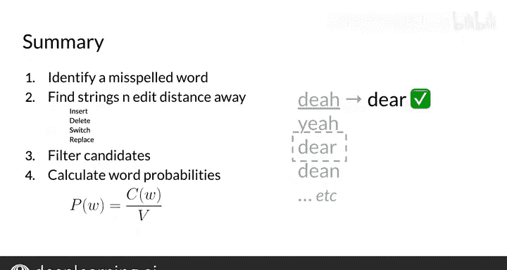

#  055：构建模型II 🧠

## 概述

在本节课中，我们将学习如何为自动纠错功能计算每个候选单词的概率，并从中选出最可能的正确单词。我们将通过一个简单的例子，理解如何基于词频和语料库大小来计算单词概率。

---

## 计算单词概率

上一节我们介绍了如何生成并筛选出候选的正确单词列表。本节中，我们来看看如何计算这些候选单词的概率，从而确定最可能的替换词。

自动纠错需要知道哪个候选词更常见。例如，在给定的文本中，单词 “and” 通常比单词 “amd” 更常见。这个“常见程度”就是单词在语料库中出现的概率。

为了更好地理解，请看这个例句：
`I am happy because I am learning`

要计算句子中某个单词的概率，你需要先计算词频。此外，你还需要统计整个文本或语料库中的总单词数。

通常，一个语料库会大得多。为了保持示例简单，我们假设语料库就是这个句子本身。

以下是该句子的词频统计：
*   单词 “I” 出现两次。
*   单词 “am” 出现两次。
*   其他单词各出现一次。

语料库中的总单词数是 7。语料库中任何单词的概率等于该单词出现的次数除以总单词数。其**公式**为：
`P(word) = count(word) / total_words_in_corpus`

例如，单词 “am” 出现了两次，语料库大小为 7，因此其概率为 2/7。

对于自动纠错，你只需找到概率最高的候选词，并将其选为替换词。

---

## 自动纠错流程总结

本节课中我们一起学习了实现自动纠错的完整流程。以下是其步骤总结：

1.  **输入待纠正的单词**：例如拼写错误的单词 “B D E A H”。
2.  **检查拼写**：通过与已知单词词典对比，确认该词为拼写错误。
3.  **生成编辑字符串**：创建所有与输入词编辑距离为 n 的字符串列表。
4.  **筛选候选词**：过滤上述字符串列表，只保留词典中存在的实际单词。
5.  **计算单词概率**：为每个候选词计算其在给定语料库中的概率。
6.  **选择替换词**：选择概率最高的单词作为自动纠错的替换词。

这个过程涵盖了很多内容，但将其分解为一步步后，你就能很好地理解如何实现自动纠错。这对完成本周的编程作业将非常有帮助。

此外，你现在也理解了编辑和编辑距离的概念，以及如何用它们来衡量单词之间的相似性。

---

## 下节预告

你已经看到了实现自动纠错所需的四个步骤。接下来，我们将学习如何评估两个字符串（例如，一个有拼写错误的单词和一个正确的单词）之间的相似性。这是一个在自然语言处理中非常常见的度量方法。😊