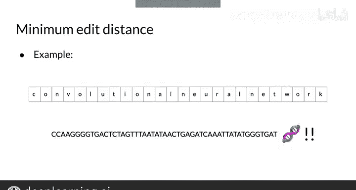

#  056：最小编辑距离 📏

在本节课中，我们将学习“最小编辑距离”这一概念。这是一个用于衡量两个字符串（或文档）之间相似度的算法。我们将了解它的定义、应用场景、计算方式，以及如何通过动态规划高效地求解它。

---

## 概述与应用

最小编辑距离有广泛的应用。它允许你实现拼写纠正、文档相似度计算、机器翻译、DNA序列比对等功能。

上一节我们介绍了编辑距离的基本概念，本节中我们来看看它的具体应用场景。

以下是其主要应用领域：
*   **拼写纠正**：判断用户输入的词与词典中哪个词最相似。
*   **文档相似度**：比较两段文本的差异。
*   **机器翻译**：评估不同翻译结果与源文本的对应关系。
*   **DNA测序**：比对基因序列，找出差异。

---

## 什么是编辑距离？

如果你有两个单词、字符串甚至整个文档，并想评估它们的相似程度，最小编辑距离可以做到这一点。

给定两个字符串，**最小编辑距离**是指将一个字符串转换为另一个字符串所需的最少操作次数。它在自然语言处理中有许多应用，例如拼写纠正、文档相似度和机器翻译。在计算生物学和DNA测序中也能找到它的身影。

---

## 编辑操作类型

为了计算最小编辑距离，你将使用三种类型的编辑操作。这些都是你已经知道的操作：**插入**、**删除**和**替换**。

例如，将单词 `play` 转换为 `stay`，需要的最少编辑次数是多少？
1.  将 `P` 替换为 `S`。
2.  将 `L` 替换为 `T`。
3.  `A` 和 `Y` 保持不变。

因此，总编辑次数为 **2**。

---

## 操作成本

到目前为止，我们假设所有编辑操作的成本相同，即成本为1。但现在，我们将为每种操作类型考虑不同的成本。

我们将使用这些成本来计算编辑距离，现在它代表的是**总编辑成本**。我们的目标就是最小化这个总成本。它简单地等于所执行编辑操作的成本之和。

以下是通常设定的成本：
*   **插入** 成本为 **1**。
*   **删除** 成本为 **1**。
*   **替换** 成本为 **2**。（这很直观，因为替换可以看作先删除再插入）

用这个成本体系重新计算上面的例子：我们进行了两次替换操作，每次成本为2，因此总编辑距离为 **4**。

---

## 为什么需要高效算法？

这是一个相对简单的例子，仅通过观察就能找到最小编辑距离。但想象一下，要计算更长的字符串、大型语料库文本甚至DNA序列之间的操作次数。

你可以尝试用暴力方法解决这些问题，一次增加一个编辑距离，并枚举所有可能性，直到一个字符串变成另一个。但这可能会花费非常、非常长的时间。事实上，用这种方式解决，计算复杂度会随着每个字符串长度的增加而呈指数级增长。

一个快得多的方法是使用**表格法**，我们接下来将实现它。

---

## 动态规划方法

我提到的表格法可以加速枚举所有可能的字符串和编辑操作。在此过程中，你还将学习一个称为**动态规划**的新概念。

我们将在下一个视频中详细了解它。

---

## 总结

本节课中我们一起学习了**最小编辑距离**。我们了解了它的定义、在NLP及其他领域的多种应用，以及计算时使用的三种基本编辑操作（插入、删除、替换）。我们还引入了操作成本的概念，并认识到对于复杂问题，需要使用基于动态规划的高效算法（表格法）来求解，而不是低效的暴力枚举。