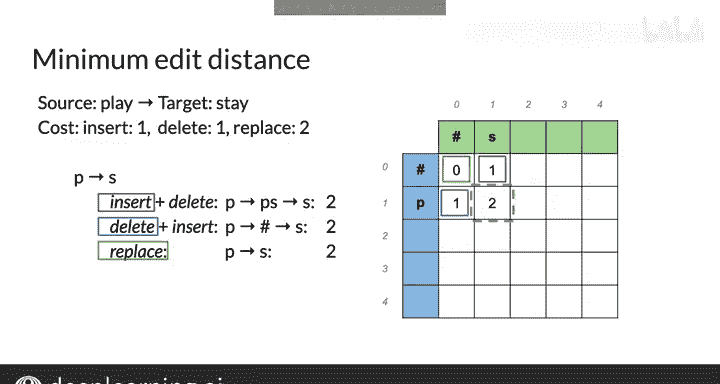

#  057：吴恩达《自然语言处理》P57 - 最小编辑距离算法 🧮


在本节课中，我们将学习动态规划的一个核心应用：**最小编辑距离算法**。该算法用于计算将一个单词（源单词）转换为另一个单词（目标单词）所需的最少编辑操作次数。我们将通过一个具体的例子，从零开始构建一个距离矩阵，并理解其背后的计算逻辑。

---

## 概述

最小编辑距离是衡量两个字符串相似度的经典方法。其核心思想是，通过插入、删除和替换字符这三种基本操作，计算将源字符串转换为目标字符串所需的最小代价。我们将使用动态规划来高效地解决这个问题。

---

## 构建距离矩阵

首先，我们需要将问题形式化。假设源单词是 **play**，目标单词是 **stay**。我们创建一个矩阵，并在每个字符串的开头添加一个空字符串占位符（用 `#` 表示）。矩阵的行对应源单词的字符（包括空字符），列对应目标单词的字符。

矩阵中的元素 `D[i][j]` 表示将源单词的前 `i` 个字符转换为目标单词的前 `j` 个字符所需的最小编辑距离。例如，`D[2][3]` 表示将 **PL** 转换为 **STA** 的最小距离。

我们的目标是填充整个矩阵 `D`，最终右下角的元素 `D[m][n]` 就是两个完整字符串之间的最小编辑距离。计算过程从最短的子字符串（左上角）开始，逐步扩展到完整的字符串。

---

## 编辑操作及其代价

在开始计算之前，我们需要定义每种编辑操作的代价。这是算法的基础：

*   **插入**：在源字符串中插入一个字符，代价为 **1**。
*   **删除**：从源字符串中删除一个字符，代价为 **1**。
*   **替换**：将源字符串中的一个字符替换为目标字符，代价为 **2**。

---

## 初始化矩阵

我们从最简单的子问题开始：将空字符串转换为空字符串。

*   **将空字符串转换为空字符串**：不需要任何操作，距离为 **0**。因此，`D[0][0] = 0`。

接下来，我们填充第一列和第一行，这些是基础情况。

*   **将源单词转换为空字符串**：只能通过不断删除字符来实现。例如，将 **P** 转换为空字符串需要 1 次删除，所以 `D[1][0] = 1`。将 **PL** 转换为空字符串需要 2 次删除，所以 `D[2][0] = 2`，依此类推。
*   **将空字符串转换为目标单词**：只能通过不断插入字符来实现。例如，将空字符串转换为 **S** 需要 1 次插入，所以 `D[0][1] = 1`。将空字符串转换为 **ST** 需要 2 次插入，所以 `D[0][2] = 2`，依此类推。

初始化后，矩阵的边界就被确定了，这为计算内部单元格提供了必要的依赖项。

---

## 计算内部单元格：核心递推公式

对于矩阵中的任何一个内部单元格 `D[i][j]`，其值取决于其左方、上方和左上方三个相邻单元格的值。这对应了到达当前状态的三种可能路径：

1.  **从上方来 (`D[i-1][j]`)**：这表示我们通过 **删除** 源字符串的第 `i` 个字符，达到了当前状态。总代价是上方单元格的代价加上删除操作的代价（1）。
    *   公式：`cost_delete = D[i-1][j] + 1`
2.  **从左方来 (`D[i][j-1]`)**：这表示我们通过 **插入** 目标字符串的第 `j` 个字符，达到了当前状态。总代价是左方单元格的代价加上插入操作的代价（1）。
    *   公式：`cost_insert = D[i][j-1] + 1`
3.  **从左上方来 (`D[i-1][j-1]`)**：这表示我们通过 **替换**（或不替换）源字符串的第 `i` 个字符为目标字符串的第 `j` 个字符，达到了当前状态。如果两个字符相同，则无需替换，代价为0；如果不同，则进行替换，代价为2。
    *   公式：`cost_replace = D[i-1][j-1] + (0 if source[i] == target[j] else 2)`

**单元格 `D[i][j]` 的值就是这三条路径代价中的最小值**。用代码表示这个核心逻辑如下：

```python
if source[i-1] == target[j-1]:
    replace_cost = 0
else:
    replace_cost = 2

D[i][j] = min(
    D[i-1][j] + 1,      # 删除
    D[i][j-1] + 1,      # 插入
    D[i-1][j-1] + replace_cost # 替换或不替换
)
```

---

## 示例演算：计算 P -> S

让我们应用这个公式来计算第一个内部单元格 `D[1][1]`，即如何将 **P** 转换为 **S**。

我们有三个依赖项：
*   上方 (`D[0][1]`): 将空字符串转换为 **S** 的代价是 **1**（插入S）。
*   左方 (`D[1][0]`): 将 **P** 转换为空字符串的代价是 **1**（删除P）。
*   左上方 (`D[0][0]`): 将空字符串转换为空字符串的代价是 **0**。

计算三条路径的代价：
1.  **路径1（从上到下）**：先得到 **S**（代价1），再删除 **P**（代价1）。总代价 = `1 + 1 = 2`。
2.  **路径2（从左到右）**：先删除 **P**（代价1），再插入 **S**（代价1）。总代价 = `1 + 1 = 2`。
3.  **路径3（对角线）**：直接将 **P** 替换为 **S**。因为字符不同，替换代价为2。总代价 = `0 + 2 = 2`。

三条路径的代价都是2。因此，`D[1][1] = 2`。这意味着将 **P** 转换为 **S** 的最小编辑距离是2。

通过这种方式，我们可以系统地填充整个矩阵，每一个新单元格的计算都依赖于之前已经计算好的结果，这正是动态规划“利用子问题解”的精髓。



---

## 总结

本节课我们一起学习了**最小编辑距离算法**。我们首先定义了插入、删除和替换操作的代价。然后，我们通过初始化边界和利用核心递推公式，一步步构建了动态规划矩阵。这个矩阵的右下角元素最终给出了两个单词之间的最小编辑距离。在下一节课中，我们将看到如何利用这个填好的表格，快速回溯出具体的编辑操作序列。